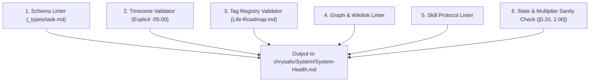

# /doctor (Chrysalis System Integrity & Diagnostic Suite)

## Supported Commands & Triggers
* `/doctor` — Executes the full 6-point system integrity check and outputs results to `System/System-Health.md`.
* `/doctor --health` (or `/health`) — Diagnostic overview displaying system health status.
* `/doctor --integrity` (or `/integrity`) — Strict invariant validation pass with auto-heal execution.



---

## The 6-Point Integrity & Diagnostic Suite

### 1. Schema & Frontmatter Linter
* Scan all active task files in `chrysalis/TaskNotes/Tasks/*.md` and `chrysalis/TaskNotes/Archive/*.md`.
* Validate required fields: `title`, `status`, `dateCreated`, `priority`, `urgency_tier`, `timeEstimate`, `modality`, `tags`.
* Validate enums:
  - `status`: `todo | in-progress | done | archived`
  - `priority`: `urgent | high | normal | low | none`
  - `modality`: `analytical | kinetic | synthesis | administrative`
* **Auto-Heal:** If `dateCreated` is missing but `created` exists, inject `dateCreated` matching `created`. If `modality` is missing, infer and inject appropriate modality.

### 2. Timezone & Temporal Compliance Linter
* Scan all ISO timestamps across frontmatter (`dateCreated`, `created`, `scheduled`, `startedAt`, `completedAt`).
* Verify strict local serialization (`"-05:00"`).
* **Auto-Heal:** Replace raw UTC `"Z"` strings with resolved local `"-05:00"` strings.
* Flag overdue `status: todo` tasks that require rollover review.

### 3. Tag Registry & Strategic Pillar Validator
* Cross-check all `#pillar-X/*` tags on tasks against `tag_registry` in `chrysalis/System/Life-Roadmap.md`.
* Flag unregistered, misspelled, or orphaned tags for user review.

### 4. Graph & Wikilink Resolution Linter
* Scan `Dashboard.md`, `Projects/`, and `Slipbox/` for broken wikilinks (`[[Note-Name]]`) or invalid relative paths.
* Verify that project wikilinks on tasks point to existing `Projects/*/Roadmap.md` files.

### 5. Skill Protocol & Dependency Linter
* Validate that all files in `chrysalis/.agent/skills/*/SKILL.md` contain valid YAML frontmatter (`name`, `description`, `trigger`, `reads`, `writes`).
* Verify that all internal inter-skill execution references point to existing `.agent/skills/` paths.

### 6. Dynamic State & Multiplier Sanity Check
* Verify YAML syntax in `chrysalis/System/Scheduling-Memory.md`.
* Enforce invariant bounds: clamp all `tag_multipliers` and `learning_weights` strictly within $[0.20, 2.00]$.
* Verify that relative offsets in `diurnal_baselines` parse cleanly as valid time deltas.

---

## Output & Diagnostic Ledger Generation

### Step 1: Health Ledger Update (Mandatory Tool Call)
Format and write diagnostic results, error counts, and auto-heal actions to `chrysalis/System/System-Health.md`:

```markdown
---
type: system_health_report
id: chrysalis-system-health
last_audit: "YYYY-MM-DDTHH:mm:ss.SSSSSS-05:00"
health_status: "HEALTHY" # HEALTHY | DEGRADED | CRITICAL
errors_count: 0
warnings_count: 0
---

# 🩺 Chrysalis System Health & Integrity Ledger

> **System Health Status:** 🟢 HEALTHY  
> **Last Diagnostic Pass:** YYYY-MM-DDTHH:mm:ss-05:00  
> **Errors:** 0 • **Warnings:** 0  

---

## 🔍 Diagnostic Linter Results

| Linter Domain | Status | Details |
| :--- | :---: | :--- |
| **1. Schema & Frontmatter** | 🟢 PASS | X/X tasks strictly valid |
| **2. Timezone Compliance** | 🟢 PASS | X/X timestamps explicitly using -05:00 |
| **3. Strategic Tag Registry** | 🟢 PASS | All tags matched against Life-Roadmap.md |
| **4. Graph & Wikilink Resolution** | 🟢 PASS | All project roadmap links and dashboard targets valid |
| **5. Skill Runbooks & Dependencies** | 🟢 PASS | X/X skills strictly verified |
| **6. Dynamic State & Multipliers** | 🟢 PASS | All multipliers within [0.20, 2.00] |

---

## 🛠️ Auto-Heal & Warning Log
*<Log of any auto-heal repairs applied or warnings flagged>*
```

### Step 2: Chat Summary Output
Output a clean, concise diagnostic table to chat highlighting health status, resolved auto-heals, or critical items needing user attention.
