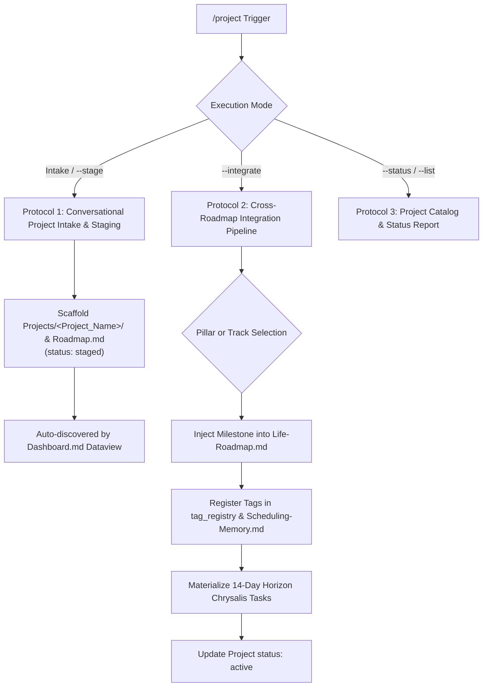

> Paths below are relative to the explicitly selected vault. The default layout keeps System, Projects, and Slipbox at the root and operational task folders under chrysalis/. For an existing encapsulated vault, resolve the corresponding resource under chrysalis/; never create a competing copy. See ARCHITECTURE.md.


# /project (Chrysalis Project Staging & Strategic Integration Engine)

## Supported Commands & Triggers
* `/project` (or `/project --stage` / `/stage --project`) — Initiates conversational intake and synthesizes a new project roadmap in `Projects/<Project_Name>/Roadmap.md`.
* `/project --integrate [project-id]` (or `/integrate --project [project-id]`) — Promotes an incubated/staged project roadmap into `System/Life-Roadmap.md` and dynamic memory.
* `/project --status` (or `/project --list`) — Scans all project dossiers in `Projects/` and displays active, staged, paused, and archived projects.



---

## Protocol 1: Conversational Project Intake & Staging (`/project` or `/project --stage`)

Execute interactive project synthesis when the user describes an emergent, unindexed project:

### Step 1: Interactive Scoping & Requirements Intake
If the user provides raw notes or a project name, prompt for or extract the following core parameters:
1. **Title & Identifier:** Clean descriptive title and lowercase kebab-case `project_id` (e.g., `chrysalis-development`).
2. **Objective & Scope:** 1–2 sentence statement of purpose, technical/creative boundaries, and exit criteria.
3. **Pillar Association Intent:**
   * Does this project naturally serve an existing Strategic Pillar in `Life-Roadmap.md` (e.g., `pillar-1`)?
   * Or is it currently an independent exploration / side project (`pillar: "unassigned"` or `"staged"`)?
4. **Estimated Horizon Window:** Target date range (`YYYY-MM-DD → YYYY-MM-DD`).
5. **Milestone Breakdown:** 2–4 sequential milestones with concrete deliverables, estimated modalities (`analytical`, `kinetic`, `synthesis`, `administrative`), and proposed tags.

### Step 2: Directory Scaffolding & Roadmap Generation (Physical Tool Call)
> [!CAUTION]
> **Anti-Simulation Law:** You MUST execute `write_to_file` to physically create the project folder and `Roadmap.md` on disk.

1. **Create Project Folder:** `Projects/<Project_Folder_Name>/`
2. **Initialize Subdirectories:** Based on the project archetype, create relevant subfolders (e.g., `Docs/`, `Notes/`, `Exports/`, `Deliverables/`).
3. **Generate Project Roadmap (`Projects/<Project_Folder_Name>/Roadmap.md`):**
   Strictly serialize frontmatter matching the Chrysalis project schema:

```yaml
---
type: project_roadmap
project_id: "{{project_slug}}"
title: "{{Project Title}}"
pillar: "{{pillar_tag_or_unassigned}}" # e.g. pillar-1, unassigned, staged
status: "staged" # staged, active, paused, complete, archived
horizon_window: "YYYY-MM-DD → YYYY-MM-DD"
last_updated: "YYYY-MM-DDTHH:mm:ss-05:00"
tags:
  - {{tag_or_subtag}}
---

# 🚀 {{Project Title}}

## 1. Project Objective & Scope
{{Detailed objective and exit criteria}}

---

## 2. Deliverables & Milestone Breakdown

### Milestone 1: {{Milestone Title}} ({{Timeline}})
- [ ] {{Deliverable 1}} (`#{{tag}}`)
- [ ] {{Deliverable 2}} (`#{{tag}}`)

### Milestone 2: {{Milestone Title}} ({{Timeline}})
- [ ] {{Deliverable 3}} (`#{{tag}}`)

---

## 3. Reference Files, Contacts & Slipbox Notes
- Main Directory: `Projects/{{Project_Folder_Name}}/`
- Reference Research Zettels:
  - [[Related-Note]]
```

### Step 3: Confirmation & Next Steps
1. Report creation of the project dossier with a clickable file link to `Projects/<Project_Folder_Name>/Roadmap.md`.
2. Confirm that the project is now tracked on `Dashboard.md` under the Projects Dataview query.
3. Prompt the user:
   > *"Project staged! Would you like to keep this incubating in `Projects/` as an off-peak/support track, or promote it directly into `System/Life-Roadmap.md` via `/project --integrate`?"*

---

## Protocol 2: Cross-Roadmap Integration Pipeline (`/project --integrate [project-id]`)

Promote an incubating or staged project into active strategic execution:

### Step 1: Validation & Pillar Resolution
1. Read `Projects/<Project_Folder>/Roadmap.md`. Validate frontmatter and extract milestones, reference Zettels, and tags.
2. Read `System/Life-Roadmap.md`.
3. If `pillar` is `unassigned` or `staged`, prompt the user to designate the target Strategic Pillar (e.g. `Pillar 1`, `Pillar 2`) or create a designated Parallel Project Track in `Life-Roadmap.md`.

### Step 2: Strategic Life-Roadmap Insertion (Physical Tool Call)
1. In `System/Life-Roadmap.md`:
   * Append a new milestone under the target Pillar (e.g. `### Milestone M1.6: <Project Title> (<Timeline>)`).
   * Insert the objective, horizon window, and key results checklist annotated with `#pillar-X/<subtag>`.
   * **Tag Registry Synchronization:** Ensure all project tags are registered under the respective pillar in `tag_registry` in frontmatter.
2. Update `System/Scheduling-Memory.md`:
   * For any new tags, initialize `tag_multipliers` at baseline `1.00`.
   * Initialize `inferred_task_pool.learning_weights` at baseline `1.00`.

### Step 3: Project Roadmap State Mutation
1. In `Projects/<Project_Folder>/Roadmap.md`:
   * Update `status: "active"`.
   * Update `pillar: "pillar-X"` (or designated track).
   * Update `last_updated: "YYYY-MM-DDTHH:mm:ss-05:00"`.
   * Link to the milestone in `Life-Roadmap.md`.

### Step 4: 14-Day Horizon Task Note Materialization (Hypergraph Linked)
1. Scan the project's milestones for deliverables falling within the next 14 calendar days.
2. If any imminent deliverables do not yet have corresponding `.md` task notes in `chrysalis/Tasks/` (or `TaskNotes/Tasks/`):
   * Materialize task notes in `chrysalis/Tasks/YYYYMMDD-<slug>.md` (or `TaskNotes/Tasks/YYYYMMDD-<slug>.md`) strictly conforming to the Universal Chrysalis Task Frontmatter Schema:
     - `status: todo`, `scheduled: null`, explicit local timezone `"-05:00"`
     - `project_ref: "[[Projects/{{project_slug}}/Roadmap]]"`
     - `linked_zettels: ["[[related-zettel-id]]"]` (extracted from Section 3 of parent project roadmap)
     - `googleCalendarEventId: null` (ready for Model C Android calendar sync)

### Step 5: Verification & Ledger Reporting
1. Execute `/doctor --integrity` to verify zero broken links, schema compliance, and tag registry alignment.
2. Output a summary report of the integrated project, new milestones, and materialized tasks.

---

## Protocol 3: Project Catalog & Status (`/project --status` or `/project --list`)

1. Scan all files matching `Projects/*/Roadmap.md`.
2. Extract `project_id`, `title`, `pillar`, `status`, `horizon_window`, and deliverable completion ratios (`[x]` vs `[ ]`).
3. Render a structured Markdown table:

| Project Title | ID | Pillar | Status | Horizon Window | Progress |
| :--- | :--- | :---: | :---: | :---: | :---: |
| **ACC CAD Certification** | `cad-certification-2026` | `pillar-1` | `active` | 2026-09-15 → 2026-10-31 | 0/6 |
| **Academic Recovery** | `academic-recovery-2026` | `pillar-1` | `active` | 2026-09-01 → 2026-09-14 | 1/8 |
| **Austin Drafting Outreach** | `austin-drafting-outreach` | `pillar-2` | `staged` | 2026-11-15 → 2026-12-15 | 0/7 |
| **Chrysalis Development** | `chrysalis-development` | `staged` | `staged` | 2026-09-01 → 2026-10-31 | 4/12 |
