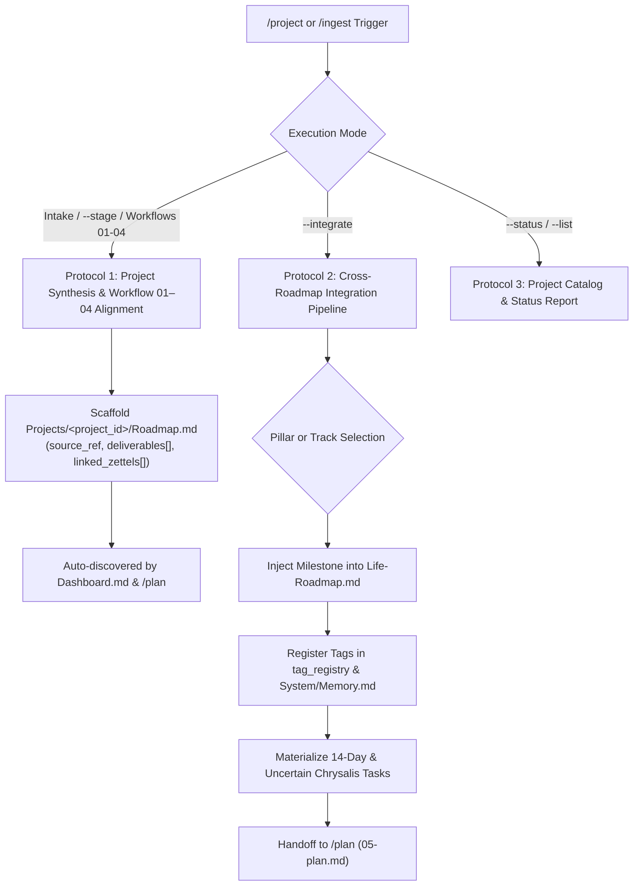

> Paths below are relative to the explicitly selected vault. The default layout keeps System, Projects, and Slipbox at the root and operational task folders under TaskNotes/. See ARCHITECTURE.md.


# /project (Chrysalis Project Staging & Strategic Integration Engine)

## Supported Commands & Triggers
* `/project` (or `/project --stage` / `/stage --project`) — Initiates conversational or source-driven (`/ingest`) intake and synthesizes/reconciles a project roadmap in `Projects/<project_id>/Roadmap.md` aligned with `System/Workflows/01-capture.md` through `04-organize.md`.
* `/project --integrate [project-id]` (or `/integrate --project [project-id]`) — Promotes an incubated/staged project roadmap into `System/Life-Roadmap.md` and dynamic memory, and hands off 14-day tasks to `/plan`.
* `/project --status` (or `/project --list`) — Scans all project dossiers in `Projects/` and displays active, staged, paused, and archived projects.


```mermaid
graph TD
    Trigger["/project or /ingest Trigger"] --> Mode{Execution Mode}
    Mode -->|"Intake / --stage / Workflows 01-04"| P1["Protocol 1: Project Synthesis & Workflow 01–04 Alignment"]
    Mode -->|"--integrate"| P2["Protocol 2: Cross-Roadmap Integration Pipeline"]
    Mode -->|"--status / --list"| P3["Protocol 3: Project Catalog & Status Report"]

    P1 --> Scaffold["Scaffold Projects/&lt;project_id&gt;/Roadmap.md<br>(source_ref, deliverables[], linked_zettels[])"]
    Scaffold --> LiveDash["Auto-discovered by Dashboard.md & /plan"]

    P2 --> PillarSelect{"Pillar or Track Selection"}
    PillarSelect --> PillarInject["Inject Milestone into Life-Roadmap.md"]
    PillarInject --> TagSync["Register Tags in tag_registry & System/Memory.md"]
    TagSync --> HorizonIngest["Materialize 14-Day & Uncertain Chrysalis Tasks"]
    HorizonIngest --> HandOffPlan["Handoff to /plan (05-plan.md)"]
```

---

## Protocol 1: Project Intake, Source Alignment (`Workflows 01–04`) & Staging (`/project` or `/project --stage`)

Execute project synthesis either when invoked directly by the user in chat or when called by [`/ingest`](../ingest/SKILL.md) during `System/Workflows/01-capture.md` through `04-organize.md`:

### Step 0: Alignment with `System/Workflows/01-capture.md` – `04-organize.md` & `/ingest`
* **Zero Local Binary Storage (No `Resources/` Folder):** All original binary/source files live in Google Drive (`Chrysalis-Media-Locker/`) to keep the vault pure Markdown. Never create a `Projects/<project_id>/Resources/` subfolder in the vault. External syllabi, specifications, and handouts are always translated into `Sources/{source_id}.md` via `/ingest` and linked into `Roadmap.md` via `source_ref` and `source_checksum`.
* **Workflows `01`–`04` Execution:**
  1. **`01-capture`:** Source is quarantined in `Sources/{source_id}.md` with a 64-character hex `sha256`.
  2. **`02-extract`:** 100% of deliverables across the full timeline are extracted into the `deliverables` YAML array (with `due: null, date_uncertain: true` for any TBD or ambiguous dates).
  3. **`03-review`:** If `Projects/{project_id}/Roadmap.md` already exists, `helpers.mdbase_helper.reconcile_syllabus()` diffs the incoming deliverables against the existing ledger (`added`, `modified`, and `dropped` $\to$ `status: archived`) and presents the `PlanProposal` at `APPROVAL_GATE`.
  4. **`04-organize`:** Serializes `Projects/{project_id}/Roadmap.md` with bidirectional links to `Sources/{source_id}.md` and `Slipbox/{YYYYMMDDHHmmss}-{slug}.md` (`/zettel`), and partitions tasks via `filter_horizon_deliverables(horizon_days=14)` before `/plan` (`05-plan.md`).

### Step 1: Interactive Scoping & Requirements Intake
If the user describes an emergent project without an external source document, prompt for or extract the following core parameters:
1. **Title & Identifier:** Clean descriptive title and lowercase kebab-case `project_id` (e.g., `compiler-engineering-2026`).
2. **Objective & Scope:** 1–2 sentence statement of purpose, technical/creative boundaries, and exit criteria.
3. **Pillar Association Intent:**
   * Does this project naturally serve an existing Strategic Pillar in `Life-Roadmap.md` (e.g., `pillar-1`)?
   * Or is it currently an independent exploration / side project (`pillar: "unassigned"` or `"staged"`)?
4. **Estimated Horizon Window:** Target date range (`YYYY-MM-DD → YYYY-MM-DD`).
5. **Master Deliverable Breakdown:** Sequential milestones and concrete deliverables (`id`, `title`, `due`, `date_uncertain`, `tier: 1..4`), estimated modalities (`analytical`, `kinetic`, `synthesis`, `administrative`), and proposed tags.

### Step 2: Directory Scaffolding & Roadmap Generation (Physical Tool Call)
> [!CAUTION]
> **Anti-Simulation Law:** You MUST execute `write_to_file` / `mdbase_create_record` to physically create `Projects/<project_id>/Roadmap.md` on disk. Never create a `Resources/` subfolder inside `Projects/<project_id>/`.

1. **Create Project Folder:** `Projects/<project_id>/` (containing `Roadmap.md`; do **not** create `Resources/`).
2. **Generate Project Roadmap (`Projects/<project_id>/Roadmap.md`):**
   Strictly serialize frontmatter matching `_types/project.md` and `Projects/_templates/Project-Template.md`:

```yaml
---
type: project_roadmap
project_id: "{{project_slug}}"
title: "{{Project Title}}"
status: "staged" # staged, active, paused, complete, archived
pillar: "{{pillar_tag_or_unassigned}}" # e.g. pillar-1, unassigned, staged
horizon_window: "YYYY-MM-DD → YYYY-MM-DD"
last_updated: "YYYY-MM-DDTHH:mm:ss-05:00"
source_ref: "[[Sources/{{source_id}}]]" # or null if conversational intake
source_checksum: "{{64_char_sha256_or_null}}"
tags:
  - "{{tag_or_subtag}}"
linked_zettels:
  - "[[{{YYYYMMDDHHmmss}}-{{zettel_slug}}]]"
deliverables:
  - id: "deliverable-1"
    title: "{{Deliverable 1 Title}}"
    due: "YYYY-MM-DD" # or null if date_uncertain: true
    date_uncertain: false
    status: todo # todo, in-progress, done, archived
    task_ref: "[[TaskNotes/Tasks/YYYYMMDD-{{task_slug}}]]" # or null if >14d out of horizon
    tier: 2
---

# 🚀 {{Project Title}}

## 1. Project Objective & Scope
{{Detailed objective and exit criteria}}

---

## 2. Master Deliverable Ledger
- [ ] **deliverable-1**: {{Deliverable 1 Title}} (Due: YYYY-MM-DD) (`#{{tag}}`)

---

## 3. Reference Files & Slipbox Grounding
- Provenance Source: `[[Sources/{{source_id}}]]` (Original binary stored in Google Drive)
- Reference Research Zettels:
  - [[{{YYYYMMDDHHmmss}}-{{zettel_slug}}]]
```

### Step 3: Confirmation & Next Steps
1. Report creation of the project dossier with a clickable file link to `Projects/<project_id>/Roadmap.md`.
2. Confirm that the project is now tracked on `Dashboard.md` under the Projects Dataview query.
3. Prompt the user:
   > *"Project staged! Would you like to keep this incubating in `Projects/` as an off-peak/support track, or promote it directly into `System/Life-Roadmap.md` via `/project --integrate` and schedule active sprints via `/plan`?"*

---

## Protocol 2: Cross-Roadmap Integration Pipeline (`/project --integrate [project-id]`)

Promote an incubating or staged project into active strategic execution:

### Step 1: Validation & Pillar Resolution
1. Read `Projects/<Project_Folder>/Roadmap.md`. Validate frontmatter and extract milestones, reference Zettels, and tags.
2. Read `System/Life-Roadmap.md`.
3. If `pillar` is `unassigned` or `staged`, prompt the user to designate the target Strategic Pillar (e.g. `Pillar 1`, `Pillar 2`) or create a designated Parallel Project Track in `Life-Roadmap.md`.

### Step 2: Strategic Life-Roadmap Insertion (Physical Tool Call)
1. In `System/Life-Roadmap.md`:
   * Append a new milestone under the target Pillar (e.g. `### Milestone M1.6: <Project Title> (<Timeline>)`).
   * Insert the objective, horizon window, and key results checklist annotated with `#pillar-X/<subtag>`.
   * **Tag Registry Synchronization:** Ensure all project tags are registered under the respective pillar in `tag_registry` in frontmatter.
2. Update `System/Memory.md`:
   * Add the approved project link to `active_horizons.active_projects` without duplicates.
   * Preserve the shared `cognitive_modality_defaults`; new project tags do not create separate multiplier tables.

### Step 3: Project Roadmap State Mutation
1. In `Projects/<Project_Folder>/Roadmap.md`:
   * Update `status: "active"`.
   * Update `pillar: "pillar-X"` (or designated track).
   * Update `last_updated: "YYYY-MM-DDTHH:mm:ss-05:00"`.
   * Link to the milestone in `Life-Roadmap.md`.

### Step 4: 14-Day Horizon Task Note Materialization (Hypergraph Linked)
1. Scan the project's milestones for deliverables falling within the next 14 calendar days.
2. If any imminent deliverables do not yet have corresponding `.md` task notes in `TaskNotes/Tasks/`:
   * Materialize task notes in `TaskNotes/Tasks/YYYYMMDD-<slug>.md` strictly conforming to the Universal Chrysalis Task Frontmatter Schema:
     - `status: todo`, `scheduled: null`, explicit local timezone `"-05:00"`
     - `project_ref: "[[Projects/{{project_slug}}/Roadmap]]"`
     - `linked_zettels: ["[[related-zettel-id]]"]` (extracted from Section 3 of parent project roadmap)
     - `googleCalendarEventId: null` (ready for TaskNotes Google Calendar sync)

### Step 5: Verification & Ledger Reporting
1. Execute `/doctor --integrity` to verify zero broken links, schema compliance, and tag registry alignment.
2. Output a summary report of the integrated project, new milestones, and materialized tasks.

---

## Protocol 3: Project Catalog & Status (`/project --status` or `/project --list`)

1. Scan all files matching `Projects/*/Roadmap.md`.
2. Extract `project_id`, `title`, `pillar`, `status`, `horizon_window`, and deliverable completion ratios (`[x]` vs `[ ]`).
3. Render a structured Markdown table:

| Project Title | ID | Pillar | Status | Horizon Window | Progress |
| :--- | :--- | :---: | :---: | :---: | :---: |
| **Compiler Engineering** | `compiler-engineering-2026` | `pillar-1` | `active` | 2026-09-15 → 2026-10-31 | 0/6 |
| **Distributed Key-Value Store** | `distributed-kv-store` | `pillar-1` | `active` | 2026-09-01 → 2026-09-14 | 1/8 |
| **Algorithmic Trading Engine** | `trading-engine` | `pillar-2` | `staged` | 2026-11-15 → 2026-12-15 | 0/7 |
| **Library Modernization** | `library-modernization` | `staged` | `staged` | 2026-09-01 → 2026-10-31 | 4/12 |
