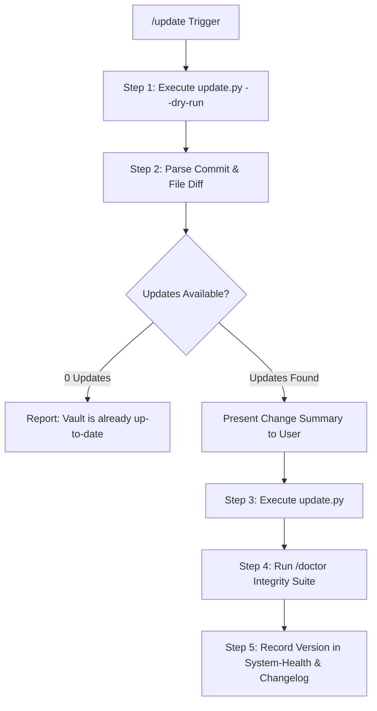

# /update (Chrysalis Upstream Synchronization Engine)

## Supported Commands & Triggers
* `/update` — Performs dry-run inspection, reports available upstream updates, and prompts or executes the update.
* `/update --check` (or `/update --dry-run`) — Inspects upstream changes without applying modifications.
* `/update --force` (or `/update --yes`) — Automatically downloads upstream changes and runs `/doctor`.



---

## Execution Protocol

### Step 1: Pre-Flight Upstream Inspection
Execute physical tool call to check upstream state:
```bash
python3 update.py --dry-run
```
Extract the upstream commit hash, timestamp, and the count/list of modified framework files.

### Step 2: User Presentation & Confirmation
Display the findings to the user:
* **Upstream Version:** Latest commit hash and subject.
* **Component Summary:** Number of updated skills, workflows, views, or system specs.
* **Safety Confirmation:** Remind the user that personal tasks, roadmaps, and telemetry are untouched.
* If invoked with `--check` or `--dry-run`, stop here.
* If invoked with `/update`, proceed to execute or prompt confirmation.

### Step 3: Physical Update Synchronization
Execute physical tool call:
```bash
python3 update.py
```
> [!CAUTION]
> **Anti-Simulation Law:** You MUST execute `run_command` to invoke `update.py`. Never merely claim files were updated.

### Step 4: Automated Integrity Gate (`/doctor`)
Immediately trigger `/doctor` to run the 6-point integrity audit:
1. Universal TaskNotes Frontmatter Linter
2. Timezone & Temporal Compliance Linter
3. Tag Registry & Strategic Pillar Validator
4. Graph & Wikilink Resolution Linter
5. Skill Protocol & Dependency Linter
6. Dynamic State & Multiplier Sanity Check

### Step 5: Ledger Update
Append an entry into `System/Changelog.md` and `System/System-Health.md` recording:
* Date and ISO timestamp
* Upstream commit hash
* Count of updated components
* Health status post-update (e.g., `HEALTHY`)
