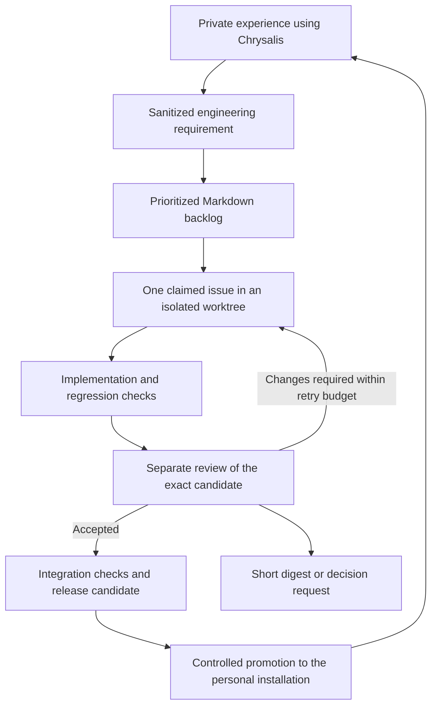

# Background development — engineering reference

For numbered setup steps and copy-and-paste instructions, use the [beginner walkthrough](BACKGROUND-DEVELOPMENT.md). This document retains the technical design and optional deployment choices.

The [automated background role policy](AGENT-WORKFLOW.md#automated-background-development) governs this loop: Antigravity implements and repairs; Codex independently reviews and handles assigned escalations; scripts coordinate. Ordinary interactive development normally stays in Antigravity, including architecture and debugging, with Codex used selectively. Dated setup claims below are historical; check the current handoff before repeating a milestone.

## The intended experience

Use the personal vault to pursue the Life Roadmap. Let a development process turn a small, prioritized engineering backlog into tested improvements. Review a short digest and the decisions that change how the product works. Routine investigation, implementation, tests, review feedback, and release preparation should proceed within a standing scope.

Start with one scheduled developer, automated checks, a separate review pass, and a stable release channel. Add concurrency only when one complete loop works reliably. The [review](REVIEW-2026-09-15.md) explains the current defects; the [backlog](BACKLOG.md) supplies the work.

**Current state:** the review, backlog, and prompt templates exist. No scheduler, background worker, CI workflow, automatic merge policy, or deployment job was enabled by this review. Application defects remain open.

## How the pieces fit



A worktree is a separate working folder attached to the same Git repository. It lets a background task edit code without interfering with the files open in your normal development session. A release candidate is a named version that has passed its checks and is ready to try in the personal installation.

There are two separate loops: engineering improves the framework; the installed framework supports daily life. The framework operates directly on local Markdown files conforming to mdbase v0.3 specifications without requiring a background gateway daemon.

## 1. Establish a source baseline once

The checkout currently contains valuable uncommitted work and five test failures. Resolve **B00** before recurring implementation. An agent can perform the repair and prepare the reviewed checkpoint; you do not need to transfer files or run the tests manually.

Use this initial work order in the source project:

> Implement B00 in Development/BACKLOG.md. Read the shared engineering instructions and verify the actual dirty diff. Preserve unrelated work. Reconcile the full task schema and mailbox destination contract, add the focused regression coverage, and run the required checks. Update the handoff and prepare the result for a separate review. Report the exact candidate and remaining failures. Do not publish or deploy it.

After the repair and review, create the audited source checkpoint according to the publishing policy selected for this setup. Record its commit. The current uncommitted files must be included deliberately; a plain worktree created from the old HEAD will not contain them.

The green baseline makes future failures attributable. It does not mean the outstanding calendar and runtime findings are fixed.

## 2. Make validation a single repeatable operation

Implement **B01** so each proposed change automatically runs the same checks. Its local milestone enables the beginner setup; hosted CI is a later milestone that must be verified before relying on it for automatic remote integration. Continuous integration, or CI, runs these checks for a candidate independently of the implementing chat.

Use the setup command in a fresh development checkout with Python 3.14 available:

```bash
bash Development/scripts/setup-dev.sh
```

The existing check commands are documented in [TESTING.md](TESTING.md). The validation entry point should collect their exit codes, keep readable logs, and fail when a required check fails. It should also run the privacy audit against all candidate additions and changes. No personal vault path or calendar credential belongs in this environment.

For each small change, run the relevant regression test and subsystem checks. Before integration or release, require the complete applicable suite and candidate privacy review. Re-run when code changes or a failure leaves uncertainty; avoid repeatedly running unchanged successful suites simply to occupy the worker.

Configure the repository's required checks when publishing is enabled. Agent-written test reports are useful explanations; the gate should use actual command results. Changing the tests or workflow must not let a candidate remove the checks that govern its own acceptance.

## 3. Pick where background development runs

### Recommended starting point: Codex in the desktop app

The desktop app supports scheduled local-project work in isolated worktrees and shows results in Scheduled. Local runs require the computer to remain on, the app running, and the project accessible. Codex CLI itself does not have the Scheduled management interface. [Official scheduled-task documentation](https://learn.chatgpt.com/docs/automations).

Configure the source project with a worktree setup step invoking `bash Development/scripts/setup-dev.sh`. Codex local environments can run setup on worktree creation and store their configuration under the project's `.codex` directory. Review and allowlist the specific generated configuration before sharing it. [Official local-environment documentation](https://learn.chatgpt.com/docs/environments/local-environment).

Proposed starting settings, to use after B02 passes its rehearsal:

| Setting | Starting choice | Why |
| --- | --- | --- |
| Name | Chrysalis development | Recognizable run history |
| Project | Source checkout | Keeps engineering ownership clear |
| Execution | Isolated worktree | Preserves foreground work |
| Frequency | Once daily at a quiet local time | Limits interruptions and overlapping work |
| Work in progress | One issue | Keeps recovery and review simple |
| Model/effort | Existing defaults initially | Adjust after measuring actual results |
| Code access | Workspace writes and specific verified tool allowances | Supports the tested toolchain |
| Delivery | Local candidate and concise digest initially | Establishes the loop before publishing |

Use the [builder prompt](_templates/background-builder.prompt.md). Test one run before enabling recurrence. The setup pass must verify the account/client actually exposes Scheduled and that the environment can run every required command without an unanswered prompt.

**Scheduling a prompt is only the trigger.** B02 must still supply durable task ownership, resume behavior, validation receipts, and the handoff to a separate reviewer. A new worktree's copy of BACKLOG.md cannot tell whether another worktree already claimed an item. Keep the authoritative queue outside disposable worktrees, in private Markdown, with one dispatcher controlling its updates.

### Alternative: a CLI runner that does not need an open app

Use this route when the development host should work while the desktop app is closed. A Linux service/timer can launch a bounded command; the wrapper must implement B02's locking, queue, time limit, recovery, and digest behavior. Run it on the development host with source and synthetic fixtures available.

The runner must resolve and privately pin the verified Antigravity CLI for implementation and the Codex CLI for review. Check each installed interface, authentication, project/worktree selection and scoped permissions before a synthetic rehearsal. A desktop launcher called `agy` is not interchangeable with the headless agent CLI. See the [beginner setup](BACKGROUND-DEVELOPMENT.md#step-4--connect-antigravity-implementation-to-codex-review) for this verification and the [official Codex non-interactive documentation](https://learn.chatgpt.com/docs/non-interactive-mode) for its reviewer interface.

After claiming a worktree, supply the complete assignment required by the [builder template](_templates/background-builder.prompt.md) to Antigravity. Use unique retained output locations, inspect the actual candidate, run trusted validation, then give the unchanged result and receipts to a separate Codex review invocation. A successful process exit alone does not mean the issue is complete. Preserve interrupted work and report unavailable authentication or tools without silently changing providers. A different interactive provider choice does not reconfigure this background loop.

### Later: hosted checks and agent work

GitHub Actions can carry source-only validation and release preparation once workflows are added. The official Codex action can also run a stored prompt; its documented API-key setup uses a GitHub secret. Use trusted triggers and separate ordinary test setup from agent credentials. This adds hosted execution and usage to configure. [Official Codex GitHub Action documentation](https://learn.chatgpt.com/docs/github-action).

Keep private runtime data and credentials off public CI runners. GitHub can carry code changes and build artifacts while the engineering backlog remains Markdown. Personal task management remains in the vault.

## 4. Automate the complete small-change loop

Implement B02 with these transitions:

1. **Select:** Read the authoritative backlog, current baseline, and previous run. Claim one ready issue whose dependencies are complete. If another run owns it, exit or resume through the dispatcher.
2. **Prepare:** Create or resume that issue's worktree. Verify its baseline and install the documented development environment.
3. **Implement:** Reproduce the reported behavior with synthetic data, make the bounded change, and add a meaningful regression test when appropriate.
4. **Validate:** Execute the required checks and audit the candidate. Preserve the patch and failures if the run cannot finish.
5. **Review:** Freeze a commit or content-identified diff. Start a separate invocation with the [review prompt](_templates/background-review.prompt.md). It examines both behavior and the evidence.
6. **Repair:** Return actionable findings to the builder, with at most two attempts per run. Any changed code needs fresh validation and review.
7. **Integrate:** Apply the configured branch/merge policy, recheck the integrated revision, update the backlog and handoff, and retain the receipts.
8. **Summarize:** Explain the practical improvement, remaining issue, and whether anything needs a decision.

Use an enforced per-run time limit and a configured daily usage budget. A reasonable initial time-box to evaluate is 45 minutes; this is a proposed limit, not a measured requirement. Set monetary limits using the account's actual billing arrangement. Exhausting a budget should save progress and defer work, not discard the candidate or start another repair loop.

A trustworthy completion record names the issue, baseline, candidate revision, commands and exit codes, review verdict, integrated revision, and deployment status. “Agent finished” is insufficient.

## 5. Give routine work standing scope

The setup should establish the policy once so every small change does not become another interruption. This table is a recommended policy to configure, not a record of permissions already installed:

| Work | Default handling after setup |
| --- | --- |
| Inspect source, reproduce defects, update bounded code/docs/tests | Automatic within a ready issue |
| Run checks, investigate failures, address review feedback | Automatic within the attempt and usage budgets |
| Prepare local commits, handoffs, release notes and artifacts | Automatic after candidate audit |
| Push a branch or open a draft PR | Automatic once that repository publishing scope is configured |
| Integrate small approved classes of change | Eligible for automatic merge after independent checks/review are proven |
| New architecture, dependency/service choice, product tradeoff | Batch into a concise decision request |
| Constitutions, runtime skill behavior, personal schema migration | Explicitly scoped engineering review under existing rules |
| Deploy to personal runtime | Initially a reviewed release batch; later eligible changes under a tested promotion policy |

Protect the release policy and required checks from being weakened by a patch seeking acceptance. The existing [Development Constitution](Development-Constitution.md) places `/evolve` in interactive development and requires skill backups; a scheduled developer should not use it to rewrite its operating rules.

Development does not need direct access to Life-Roadmap.md. Translate an inconvenience into a sanitized requirement, such as “capture survives a restart” or “calibration preserves the selected wake time.” If stronger separation is needed, use a dedicated development account/container with no personal vault mount or runtime credentials. Workspace-write limits writes; it is not a general guarantee that other readable files are hidden.

## 6. Deliver improvements without disrupting daily life

Implement B11 as a stable release channel:

1. Name the exact reviewed revision and produce the appropriate framework/mobile/service artifacts.
2. Run checks, a synthetic installation/upgrade, and a rollback rehearsal.
3. Prepare release notes in terms of the user's workflow, plus any migration or action needed.
4. Preview deployment against the selected runtime and resolve managed-file conflicts.
5. Promote the reviewed candidate, run the affected workflow, and record the result. Roll back framework changes if verification fails.

The existing updater supports preview and rollback, so this can build on current tooling. For example, from a reviewed release checkout with the target vault explicitly selected:

```bash
python3 update.py --source . --target ../vault --dry-run
```

Actual promotion removes `--dry-run` only when the configured release policy permits it. Never automatically deploy the moving development checkout. Updater backups cover managed framework files; personal note backups, phone app installation, and service restart have separate lifecycles. Doctor alone is not yet a sufficient smoke test; verify the affected behavior identified in the release.

Start with a weekly release batch. Once several releases complete without manual recovery, broaden automatic promotion for small compatible changes. Treat new private-state migrations and new integrations as separate release decisions.

## 7. Keep your involvement small and useful

Proposed digest, with synthetic example content:

> **Improved:** Offline capture now preserves a damaged queue for recovery.\
> **Verified:** Regression checks and separate review passed.\
> **Delivery:** Included in the next release candidate.\
> **Next:** Calendar refresh preservation.\
> **Decision needed:** None.

Keep the full logs available without making them the main report. Repeated unchanged blockers should not generate repeated requests. Interrupt only for a new decision, missing access that prevents useful progress, or a confirmed regression affecting the installed workflow. Review product priorities and the release batch at a cadence that fits daily life.

Measure whether maintenance time and recovery steps decrease. If the automation mainly generates more proposals, unresolved branches, or alerts, reduce its work in progress and finish delivery before expanding it.

## First setup sequence

1. **B00:** Repair, review and checkpoint the current source.
2. **B01:** Establish repeatable local validation; track hosted CI separately until verified.
3. **B02:** Run one complete builder/checker/reviewer rehearsal and enable one daily worker.
4. **B03/B04/B06:** Let that worker handle mailbox/calendar preservation and stronger diagnostics in bounded issues.
5. **B11:** Introduce reviewed release batches so completed source work reaches daily use.

The other backlog items then make the daily experience progressively more seamless. This ordering turns the review into sustained engineering work while keeping the personal installation on a known version.
