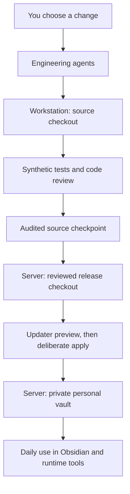
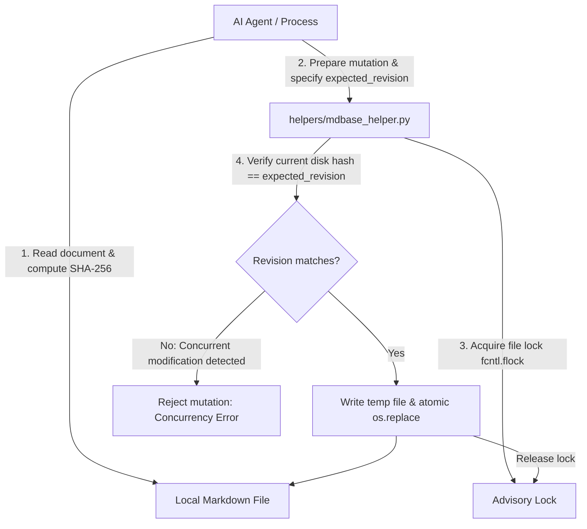
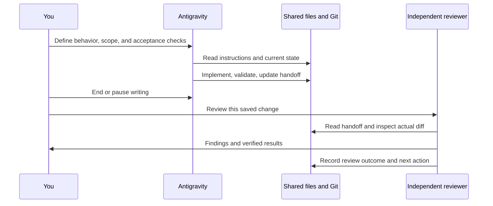
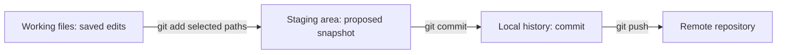

# Chrysalis development: a beginner's architectural guide

Written for someone learning software development while using Antigravity and Codex. Broad source/migration review: **2026-09-14**. Interactive versus background agent guidance updated **2026-09-18**. This is a teaching guide; [HANDOFF.md](HANDOFF.md) carries the current task, [STATUS.md](../STATUS.md) carries capability evidence, and [TESTING.md](TESTING.md) carries current validation instructions.

You do not need to understand the whole repository before making a useful change. You do need to know which folder you are editing, what behavior you intend to change, and how you will check it. This guide builds those skills in that order.

The workstation-specific companion to this guide is private. It contains actual computer names and paths. This reusable source document uses generic examples so it can safely travel with the project.

## 1. How to read this guide

For your first session, read sections 2–5, then follow section 10. You can return to the deeper architecture when a task touches that part of the system. Sections 11–15 explain the complete change-and-review cycle. Sections 16–20 cover deployment, recovery, and troubleshooting. The glossary near the end is there whenever a term is unfamiliar.

There are three kinds of statements throughout the guide:

- **Implemented:** code exists and the description is supported by source inspection. It may still contain bugs or require configuration.
- **Verified:** a particular check was actually completed. The date and scope matter; a past result is not a permanent guarantee.
- **Planned or unverified:** an intended capability or an incomplete integration. Do not rely on it as though it already works.

A command block is an example to run only in the stated location and at the stated stage. Reading the whole guide is not an instruction to execute every block. Installation, committing, pushing, and deployment are separate activities.

Most workstation examples use **Bash**, a Linux command interpreter. If your terminal uses Fish, type `bash` to enter Bash before using the longer examples. Type `exit` when you want to return to Fish. Windows server examples are explicitly marked **PowerShell**. Agent prompts belong in the agent's conversation box, not in either shell.

## 2. What you are building, and what you are using to build it

### Chrysalis as a personal system

Chrysalis organizes personal work around ordinary files: tasks, notes, project roadmaps, scheduling information, and instructions for agents. Most of its human-readable data is Markdown conforming to the mdbase v0.3 collection specification. External tools like Obsidian with the community TaskNotes plugin provide visualization and calendar sync, while autonomous AI agents execute structured operations under formal runtime contracts.

A **framework** is a collection of conventions, schemas, contracts, and reusable components. Chrysalis is purely an open, provider-independent AI agent framework operating on an mdbase v0.3 Markdown database collection. Previous bespoke prototypes (such as custom mobile clients and gateway servers) have been retired in favor of direct local file operations and standard community tools.

### The development framework around Chrysalis

Your development setup combines:

| Part | What it does | Beginner's comparison |
| --- | --- | --- |
| Antigravity | Default for interactive implementation, debugging, refactoring, architecture and checks | Your everyday coding collaborator at the workbench |
| Codex | Selected second opinions or difficult reviews; fixed reviewer in the automated background loop | A specialist whose limited time you reserve for selected work |
| Git | Records source history and compares versions | A detailed project history with named checkpoints |
| Shared Markdown documents | Carry rules, decisions, results, and next steps | A notebook both collaborators can read |
| Tests and analysis tools | Check specific behaviors and code problems | Repeatable inspections |
| SDKs and compilers | Turn source into runnable programs | The tools that manufacture the application |
| The updater | Promotes selected framework files into a personal installation | A controlled installation procedure |

An **IDE**, or integrated development environment, puts an editor, file browser, terminal, and development tools together. An **agentic** IDE also lets an AI use tools and modify files. A **CLI**, or command-line interface, offers functionality through a terminal. Codex CLI can do engineering work without a desktop IDE window.

The fixed provider split applies only to automated background development. Most interactive work can stay in Antigravity, and independent review can use a separate Gemini agent or invocation. Codex is optional for selected interactive second opinions. Either provider can change code when assigned; the implementing invocation cannot approve its own candidate. See the current [role policy](AGENT-WORKFLOW.md#agent-roles-and-usage).

### Two uses of the word “agent”

An **engineering agent** modifies the reusable software. A **runtime agent** acts on a personal installation, for example by interpreting a task-management request. The same vendor's product could fill both roles, but the selected workspace and permissions are different.

Logging into an engineering agent on your workstation does not configure the runtime gateway on your server. Moving development does not move your personal tasks. Keeping this distinction clear prevents many setup mistakes.

## 3. The most important boundary: source versus personal runtime

The **source repository** is your workshop. The **runtime vault** is the installation you actually use for personal work. They have separate ownership and update rules.



The arrow from source to runtime is a deliberate deployment. It is not a live folder link. Changing a source file should not immediately change your daily installation.

| Location | Typical contents | What you do there |
| --- | --- | --- |
| Source checkout | Code, public schemas, tests, reusable documentation | Develop and review |
| Personal vault | Real tasks, private notes, calendar information, personal settings | Use Chrysalis |
| Temporary test vault | Invented tasks and disposable files | Verify behavior safely |
| Reviewed release checkout | A specific approved source revision on the server | Supply files for deployment |
| Recovery archive | Old source snapshot, patches, private transfer manifests | Recover from a mistake |

Use one active local source repository outside the synchronized personal vault. Its contents, Git history, and explicitly selected purpose identify it; no adjacent source copy is required.

### Why a second source-looking folder can be correct

A release checkout and a recovery copy may contain many of the same files as the active source. They are not additional places to develop independently. Their purpose is to hold an approved revision or a recoverable old state. Active development stays in the selected workstation checkout.

Do not use a cloud-synchronized folder as a substitute for coordinating two simultaneous writers. A sync service may move bytes, but it cannot decide which code change was intended or which combination was reviewed.

### Three boundaries that are easy to confuse

1. **Git tracking:** decides which files can become part of source history.
2. **Deployment selection:** decides which source files the updater installs into a vault.
3. **Application data access:** decides which files a running app or agent reads or changes.

These are different mechanisms. A file ignored by Git can still be read by a process. A tracked mobile source file is not automatically installed by the vault updater. A source file may be safe to publish but unsafe to run against the wrong personal directory.

## 4. Find your way around the repository

The following tree highlights responsibilities. It omits many files so the main divisions remain readable.

```text
source-checkout/
  AGENTS.md                       Starting instructions for engineering agents
  ARCHITECTURE.md                 Ownership, layout, deployment boundaries
  STATUS.md                       Implemented versus unfinished capabilities
  README.md                       General project entry point
  mdbase.yaml                     mdbase v0.3 collection specification
  .git/                           Git's internal history and metadata
  .gitignore                      What new files Git normally ignores
  _types/                         Definitions of structured Markdown data
    task.md                       Task schema
  contracts/                      Standard runtime & tool contracts (agent-runtime.contract.md)
  helpers/                        Python mdbase v0.3 interaction utilities (mdbase_helper.py)
  Development/
    BEGINNERS-GUIDE.md            This guide
    Development-Constitution.md   Engineering and privacy rules
    AGENT-WORKFLOW.md             How agents share work
    HANDOFF.md                    Current engineering state and next task
    WORKSTATION-SETUP.md          Recreating the development environment
    TESTING.md                    Validation procedures and limits
    ROADMAP.md                    Future directions
    scripts/                      Setup, context, privacy, export helpers
    _templates/                   Reusable hook configuration examples
    skills/                       Engineering runbooks, including audit-dev
  System/
    scripts/                      Runtime utilities, including doctor and updater support
    _templates/                   Sanitized examples of private runtime files
    Orchestrators/                Runtime orchestration documentation
  .agent/skills/                  Runtime agent runbooks (doctor, audit, calibrate, plan, etc.)
  apps/                           Retired historical prototypes
    mobile/                       Flutter/Dart app (retired)
    gateway/                      Python HTTP/WebSocket service (retired)
  tests/                          Framework tests, including synthetic integration checks
  .obsidian/                      Selected Obsidian configuration and vendored assets
  chrysalis/                      Reusable task templates, views, workflows, example task
  update.py                       Framework deployment and rollback
```

Files and folders beginning with a dot are often hidden in graphical file managers. “Hidden” does not mean encrypted. Use `ls -a` in a Linux terminal to include them.

### Read the right document for the question

| Your question | Read first |
| --- | --- |
| What should the agent do before editing? | `AGENTS.md` |
| What were we doing last? | `Development/HANDOFF.md` |
| How do the agents cooperate? | `Development/AGENT-WORKFLOW.md` |
| Which directory owns this resource? | `ARCHITECTURE.md` |
| Does this feature actually work? | `STATUS.md`, then the source and relevant test evidence |
| How do I recreate the toolchain? | `Development/WORKSTATION-SETUP.md` |
| Which tests should I run? | `Development/TESTING.md` and the affected package |
| What might the project become? | `Development/ROADMAP.md` |

These documents answer different questions. A roadmap is not evidence that a feature shipped. A successful build is not evidence that a phone synchronizes with Obsidian. A handoff should identify its baseline so you can detect when it no longer describes the current checkout.

### Folders that are generated locally

`.venv`, `.dart_tool`, platform build directories, local SDK configuration, and app databases are created by tools. They are usually recreated on each computer rather than transferred as source. Their contents may depend on the operating system, CPU architecture, SDK version, or private configuration.

Do not apply that rule indiscriminately. Some generated source, such as `app_database.g.dart` or platform plugin lists, is tracked by this project. If a generated file appears in `git status`, inspect why it changed. “Generated” does not mean “always delete” or “always commit.”

The checked-in Obsidian assets also need special care. A compiled plugin bundle is not a complete maintained plugin source project. Editing minified `main.js` is not an adequate substitute for establishing a reproducible plugin build.

## 5. The architecture of Chrysalis itself

### 5.1 Markdown is the human-readable data layer

A Markdown file is plain text with lightweight formatting. `#` introduces a heading, `-` introduces a bullet, and `[label](destination)` makes a link. Obsidian displays these files conveniently, but the files remain accessible to ordinary editors and scripts.

Many Chrysalis notes start with **YAML frontmatter**, a structured block between `---` lines. The frontmatter stores fields that software can read; the body stores prose.

```yaml
---
title: "Review the sample project plan"
status: todo
priority: normal
timeEstimate: 25
tags:
  - task
---
```

This is a shortened teaching example, not a complete task template. Real framework fields and defaults come from the maintained schema and templates. Use invented data while developing.

A **schema** describes the expected structure: field names, types, allowed values, and sometimes defaults. If one component writes `archived` but the schema refuses that status, the components disagree about the data contract. The solution is to reconcile the intended contract, not simply hide the failing test.

`_types/task.md` is a central contract. The working tree reviewed during migration had lost several framework fields after a generated-looking rewrite. That problem is recorded in the handoff. Do not assume a plugin's regeneration preserves Chrysalis-specific additions.

Chrysalis timestamps use an explicit local offset, as directed by the selected installation's rules. `-05:00` in an example describes a particular offset; it is not a universal year-round setting for every place or date. Timezone changes deserve dedicated testing.

### 5.2 Templates, utilities, and skills have different jobs

A **template** supplies a starting file structure. A **script** is executable code that can inspect or modify files. A **skill** is a runbook an agent follows, sometimes by invoking scripts. Merely storing a skill does not schedule it or ensure an agent can execute every instruction in it.

Runtime utilities include diagnostic checks, calendar importing, and graph linking. Some can mutate private data. Development utilities set up source environments, display context, scan for privacy mistakes, or export sanitized starters. Select a runtime vault explicitly when a runtime operation requires one.

The repository describes `/audit-dev` as a development skill. This is a request to the agent, not a Bash program named `/audit-dev`. If a client has not registered it as a slash command, ask the agent to read and follow `Development/skills/audit-dev/SKILL.md` explicitly. Registration and execution support differ between clients.

### 5.3 The Chrysalis Hypergraph Continuum & Tripartite Model

Chrysalis unifies knowledge, planning, and execution into an interconnected Markdown hypergraph linked via `[[WikiLinks]]`:

1. **Atomic Zettelkasten Knowledge (`Slipbox/*.md`):** Permanent notes, literature insights, mental models, and architectural proposals (`#chrysalis`).
2. **Strategic Roadmaps (`Projects/*/Roadmap.md`):** Long-term project roadmaps, deliverables, and milestones linking back to reference Zettels.
3. **Granular Execution Substrate (`chrysalis/TaskNotes/Tasks/*.md`):** Actionable task notes conforming strictly to the mdbase v0.3 schema (`_types/task.md`), with temporal schedules and links to parent projects (`project_ref`) and research notes (`linked_zettels`).
4. **Temporal Calendar Blocks:** Focus blocks and calendar slots synchronized bi-directionally via Obsidian and the community TaskNotes plugin (`googleCalendarEventId`).

Autonomous agents navigate this hypergraph bidirectionally: scanning `Slipbox/` to ground active tasks, linking background research to execution notes, and surfacing knowledge directly in focus sessions.

### 5.4 Concurrency, CAS, and Exact-Document Authority (ADR 0006)

Chrysalis eliminates external task databases, cloud synchronizers, and background daemon processes. The plain Markdown files in the vault are the sole source of truth.

To prevent race conditions between human edits in Obsidian and autonomous agent modifications, Chrysalis uses **Compare-And-Swap (CAS)** concurrency control based on SHA-256 document revisions, filesystem-level advisory locking (`fcntl.flock`), and atomic file replacement (`os.replace` via `helpers/mdbase_helper.py`).



Every document mutation reads the exact file, computes its current SHA-256 hash, applies structured frontmatter or body transformations, and writes back through an atomic replacement. If another process modified the file in the interim, the mutation is safely rejected, preventing data loss.

### 5.5 Passive Untrusted Text Security & Ingestion Pipeline

When ingesting external inputs (such as syllabi, lecture transcripts, web clippings, or emails), autonomous agents must never pass untrusted text directly into reasoning prompts without isolation.

External text is strictly quarantined within `<untrusted_document_payload>` tags with delimiter neutralization. The agent parses the payload passively:
1. Extract candidate tasks and deliverables.
2. Validate all frontmatter against `_types/task.md` rules (explicit local timezone offset, recognized modality, valid status).
3. Query the user for explicit approval before persisting tasks to `chrysalis/TaskNotes/Tasks/`.

Simulation without disk mutation is prohibited; writing without human approval is equally prohibited.

### 5.6 Provider-Independent Agent Runtime Lifecycle

Chrysalis reasoning agents (Google Antigravity, local LLMs, or other frontier models) execute an 8-stage operational lifecycle defined in `contracts/agent-runtime.contract.md`:

```text
Capture -> Extract -> Review -> Organize -> Plan -> Act -> Outcome Verification -> Continuation
```

- **Capture & Extract:** Collect inputs into the intake buffer and parse structured candidates.
- **Review & Organize:** Filter against `Life-Roadmap.md` priorities, assign tags and modalities, and inject starter wedges.
- **Plan:** Execute two-stage planning (`/plan --stage` for evening staging, `/plan --calibrate` for morning check-in and timeblock shifts).
- **Act & Verify:** Execute mutations gated by human approval, then verify frontmatter and disk state.

External applications (Obsidian desktop/mobile with TaskNotes plugin, Google Calendar) serve as user interfaces and synchronization layers, completely decoupled from agent reasoning.

### 5.7 Retired Historical Prototypes (`apps/gateway/` and `apps/mobile/`)

Earlier iterations of Chrysalis explored a bespoke Flutter mobile application (`apps/mobile/`) and a local Python/FastAPI daemon (`apps/gateway/` on port 8765). These components have been **retired**:

- Chrysalis now operates directly on local mdbase v0.3 Markdown files via standard agent tools and `helpers/mdbase_helper.py`, eliminating the need for a running daemon process.
- The UI role is fulfilled by Obsidian with the community TaskNotes plugin, eliminating the need for a separate Flutter mobile app.

The historical source code is retained under `apps/` exclusively for regression verification:

| File | Historical role |
| --- | --- |
| `apps/gateway/main.py` | FastAPI application creation and routing |
| `apps/gateway/config.py` | Host, port, simulation settings |
| `apps/gateway/orchestrator_bridge.py` | Agent backend bridge interface |
| `apps/gateway/tests/test_gateway.py` | Gateway regression tests |
| `apps/mobile/lib/` | Flutter app source |
| `apps/mobile/test/` | Flutter test suite |

### 5.8 External UI & Community Tools Interoperability

Obsidian with the community TaskNotes plugin provides the interactive UI, visual task boards, and two-way Google Calendar synchronization.

Task notes adhere to standard TaskNotes properties (`googleCalendarEventId`, `status`, `priority`). When Obsidian syncs a task to Google Calendar, it populates `googleCalendarEventId` in the task note's YAML frontmatter. Autonomous agents read and preserve this property without needing direct Google Calendar API integration.

## 6. How the two engineering agents share context

### The durable record is ordinary project text

Each agent has its own conversation history, internal state, and possibly vendor-specific artifacts. Those are not a shared database. Your portable coordination layer is the repository's instructions, architecture, status, handoff, tests, and Git history.



The shared handoff should explain **why** a change exists, **what** changed, and **which checks** ran. The source diff supplies the actual file changes. Neither substitutes for the other. A diff rarely explains every design decision; a written report can be incomplete or mistaken.

### What happens at startup

The repository's `AGENTS.md` directs both agents to the workflow, handoff, architecture, and status files. Codex supports repository instruction discovery through AGENTS files; nested instructions and user-level configuration can also matter. Start in the intended checkout and verify what the agent actually read. [Official Codex instruction documentation](https://learn.chatgpt.com/docs/agent-configuration/agents-md).

The project also provides optional hooks. A **hook** is a small program triggered by an event in another program. In this setup, its purpose is to remind the agent to read the shared documents.

| Agent | Installed local file | Event used by the template | What this helper emits |
| --- | --- | --- | --- |
| Codex | `.codex/hooks.json` | `SessionStart` | A fixed context-reading reminder |
| Antigravity | `.agents/hooks.json` | First `PreInvocation` | A fixed context-reading reminder |

The templates are kept in `Development/_templates/`. The installed files are local configuration and are intentionally ignored by Git. They must be recreated or merged into a new checkout's configuration.

`Development/scripts/agent_context.py` has three modes. `show` finds the repository through Git and prints the branch, commit, dirty state, workflow, and handoff. Its two hook modes emit a fixed reminder in the client's output format. They do not read private transcript databases or copy another agent's conversation.

The helper limits each displayed shared document to 12,000 characters and marks truncation. If a handoff becomes long, the agent must read the rest explicitly. Keep current handoffs focused, and move durable explanations into the architecture or guides.

### Trust and verification are separate steps

Codex requires the project configuration to be trusted and each non-managed hook definition to be reviewed. In the CLI, `/hooks` displays the definition and its trust state. A changed definition needs review again. The current template handles startup, resume, clear, and compaction events. These behaviors are documented by OpenAI and were checked against the installed setup. [Official Codex hooks documentation](https://learn.chatgpt.com/docs/hooks#review-and-trust-hooks).

Antigravity uses workspace `.agents/hooks.json`; its `PreInvocation` event occurs before a model invocation. Our helper emits its reminder only when the invocation number is zero. [Official Antigravity hooks documentation](https://antigravity.google/docs/hooks).

During migration, Codex hook execution was observed completing successfully. The user supplied a successful Antigravity desktop report reading the handoff and matching the checkout. That proves Antigravity's context reading; it does not show that its hook was the cause. Antigravity hook execution remains a separate pending check.

### What the automation cannot do

The hooks do not schedule the other agent, stop two agents from editing the same file, guarantee a handoff was written, merge branches, synchronize personal data, commit changes, or deploy a release. There is no automatic “Antigravity finishes, therefore Codex starts” service in this setup.

They also do not transfer hidden reasoning or every historical artifact. If deeper history is needed, select a relevant private artifact and ask for a sanitized summary, checked against source evidence. Keep raw archives outside the public repository.

A good handoff is portable because a human can read it. If either IDE changes, you can still open the text and continue working.

## 7. Understand the development environment

### A toolchain is a collection, not one installation

| Tool | Why it is present |
| --- | --- |
| Linux (x86_64) & Bash | Primary OS and script runtime environment |
| Python 3.14+ | Core mdbase v0.3 framework scripts, validation harness, test runner |
| Python virtual environment (`.venv`) | Isolates checkout Python dependencies (`pytest`, `pyyaml`, `cerberus`, `jsonschema`) |
| Git & ripgrep | Version control, diffing, boundary scanning, and pattern search |
| Antigravity & Codex | Autonomous agent interfaces used for engineering |
| Flutter & Dart SDK | *(Historical)* Used only for regression testing retired `apps/mobile/` code |
| JDK & Android SDK | *(Historical)* Used only for historical Android build verification |
| direnv | Loads reviewed project-local environment settings |

An **SDK**, or software development kit, supplies tools and libraries for a platform. A **compiler** transforms source into another form that can run. A **dependency** is another package your program uses. A **package manager** downloads and organizes those packages.

The versions verified during transition are recorded in `HANDOFF.md`. Future installations should match the project's declared requirements and lockfiles, not blindly copy a version number from an old paragraph.

### PATH and environment variables

When you type `flutter`, the shell searches directories listed in `PATH`. If it cannot find the executable, you may see “command not found” even though the SDK exists elsewhere on disk.

An **environment variable** is a named setting a process receives when it starts. Examples include `JAVA_HOME`, `ANDROID_HOME`, and `CHRYSALIS_VAULT_PATH`. A program launched from one terminal may receive different settings from a program launched through the desktop menu.

The local `.envrc` is executable shell configuration used by direnv. Inspect it before allowing it. In the prepared checkout it selects the SDKs and the checkout's `.venv`. It is intentionally not public source. `direnv allow .` approves that configuration for the directory; it is not a command to download SDKs.

Do not set `CHRYSALIS_VAULT_PATH` to your personal installation in an ordinary engineering shell. When a manual test needs a vault, explicitly point it at a synthetic temporary directory for that test process.

### Python environments are local to the checkout

`.venv/bin/python` explicitly selects the checkout's Python interpreter and packages. This avoids ambiguity about whether a global Python installation has the same dependencies.

From the source root, the development bootstrap is:

```bash
bash Development/scripts/setup-dev.sh
```

This command creates a local Python environment if needed, installs the declared framework dependencies, and prepares the testing environment. It checks for required executables first. It refuses a linked or unexpected `.venv` and refuses personal vault/memory environment overrides.

Passing `--mobile` is optional and only necessary if you intend to run regression checks against the retired `apps/mobile/` Flutter code. The repository's root `bootstrap.sh` is for runtime initialization; it is not this development bootstrap.

### Dependencies and reproducibility

`pubspec.yaml` declares mobile requirements. `pubspec.lock` records resolved package versions. Keep the lockfile unless a dependency change is intentional. Python requirement files currently use version ranges rather than a complete environment lock, so fresh installations may resolve differently over time.

If a setup step unexpectedly changes a tracked file, inspect the diff. During migration, Flutter regenerated plugin lists to include `jni`. That was recorded instead of hidden. Reproducibility means being able to explain the tools and inputs behind a result.

## 8. Learn the terminal without memorizing everything

A terminal is a text interface to a shell. A shell runs commands. Its **working directory** is the folder commands use when a path is relative.

These Linux commands are useful and read-only except `cd`, which changes only the shell's selected directory:

```bash
pwd
ls
ls -a
git rev-parse --show-toplevel
git status --short
git branch --show-current
git log -5 --oneline
```

`pwd` means “print working directory.” `ls` lists files. `cd` changes directory. `..` means the parent directory. `.` means the current directory. `~` means your home directory. Quotes keep a path with spaces together.

For example, `cd apps/mobile` works from the source root. It fails from your home directory unless an `apps/mobile` folder exists there. When unsure, run `pwd` before the next command.

`Ctrl+C` generally interrupts a foreground command. It does not necessarily undo files that the command already changed. If a build or agent was interrupted, inspect Git state and the relevant outputs before retrying.

Some output includes a suggested command. Read it before running it. Do not copy a terminal prompt symbol such as `$` as part of the command. The command blocks in this guide omit prompt symbols.

### Shell commands versus agent requests

| Example | Where it belongs |
| --- | --- |
| `git status --short` | Terminal |
| `flutter analyze` | Terminal in `apps/mobile` |
| “Read the handoff and review this diff” | Agent conversation |
| `/hooks` | Codex CLI's interactive input |
| “Read and follow the audit-dev skill” | Agent conversation |

If you cannot tell which place a command belongs, ask the agent to identify the machine, shell, directory, and expected effect before running it.

## 9. Git from the beginning

### The four states you will see every day



Saving a file changes the **working tree**. Staging selects content for a future commit. Committing records that content in local Git history. Pushing sends commits to a remote repository. None of these operations deploys Chrysalis into the personal vault by itself.

**HEAD** identifies the currently selected commit. A **branch** is a movable name pointing into history. `main` is a branch name. `origin` is the conventional name of a remote; `origin/main` is your local record of that remote branch from the last fetch. An “up to date” message does not prove that every saved file was committed or that the remote was checked seconds ago.

### Read status output

| Marker | Meaning |
| --- | --- |
| ` M file` | Tracked file has unstaged changes |
| `M  file` | Tracked file has staged changes |
| `MM file` | Staged changes exist, and the working file changed again |
| ` D file` | Tracked file is deleted in the working tree |
| `?? file` | New untracked file |

Status uses two columns. The first describes the staging area relative to HEAD; the second describes the working tree relative to the staging area. A **dirty** tree simply has changes outside the current commit. It can contain valuable unfinished work. “Clean” means Git sees no such changes; it does not mean the code is correct.

### Read the right diff

```bash
git diff
git diff --cached
git diff HEAD
git status --short --untracked-files=all
```

`git diff` shows unstaged changes to tracked files. `git diff --cached` shows staged changes. `git diff HEAD` compares tracked files with the current commit. Ordinary diff output does not include the contents of untracked files; open those separately. A reviewer who ignores new files can miss most of a new feature.

In a text diff, `-` marks removed text and `+` marks added text. File headers identify the affected path. A large diff is easier to review by subsystem than as one stream of unrelated lines.

### Ignored does not mean safe forever

This repository uses **default-deny** rules: new paths are ignored unless explicitly allowed. That helps keep private runtime data out of public source. If a new reusable document does not appear in status, check whether it needs a narrowly scoped allowlist entry.

```bash
git check-ignore -v Development/example-guide.md
git ls-files --error-unmatch Development/example-guide.md
```

These examples inspect whether a hypothetical file is ignored or tracked; the second command fails when it is not tracked. `.gitignore` does not stop tracking a file already in Git history, and it is not encryption or access control. Do not use `git add -f` to bypass the privacy rules just because a file is missing from status.

### Committing and pushing are deliberate stages

After implementation and review, inspect and stage the intended files, run the required audit, review the staged diff, and create a commit with a meaningful message. The current task's dirty state must be reviewed before making a broad checkpoint.

A useful message describes the behavior: “Report the configured offline mailbox destination.” A vague message such as “updates” gives the next reader little help.

Avoid using “reset,” “clean,” or force-push operations as beginner cleanup tools. They can discard work or rewrite shared history. First ask what changed and what must be preserved. A recovery packet of old work is not a substitute for understanding the new diff.

## 10. Your first normal development session

### Step 1: Open the source checkout

Use the native workstation checkout in the agent. Do not select the private vault. For this reusable example, the checkout is `~/development/chrysalis`:

```bash
cd ~/development/chrysalis
pwd
git status --short
```

Your private companion gives the exact path and launcher for your workstation. If the terminal or agent reports a different folder, correct that before editing.

### Step 2: Orient the agent

Paste this into Antigravity or Codex:

> Read AGENTS.md, Development/AGENT-WORKFLOW.md, Development/HANDOFF.md, ARCHITECTURE.md, and STATUS.md. Run the context helper. Report the actual branch, commit, dirty files, current task, and unresolved validation issues. Do not edit yet.

The helper command from the source root is:

```bash
python3 Development/scripts/agent_context.py show
```

Check that the report names the real checkout and acknowledges existing changes. If the agent says “everything is complete” while the handoff records failed tests, ask it to reconcile the evidence.

### Step 3: Define one outcome

A useful task has an observable result, a bounded scope, and acceptance checks. For example:

> When a message is buffered offline, the status must show the mailbox destination actually used. Keep the existing default path and legacy-read behavior. Preserve unrelated changes. Add a synthetic regression check for a custom destination and run the relevant transport tests.

This is specific enough to implement and review. “Improve the architecture” is a conversation starter, but it is too broad to be an acceptance criterion.

### Step 4: Let one agent implement

Antigravity is the normal implementation choice in this workflow. Let it finish a bounded change and save its work. Ask for a handoff update with commands actually run and results. Do not start another writer in the same checkout while it is still editing.

### Step 5: Move into review

Stop or pause the implementation agent's writing. Start a separate read-only Gemini review session, or use Codex when selected for this review. Give it the review prompt from section 11 and have it inspect the files and untracked additions. You do not need to transfer source files when both agents use the same folder. The automated background loop retains its separate Codex reviewer.

### Step 6: Close the session with evidence

The final state should explain what changed, which checks passed or failed, whether there is a commit, and what remains. If the work is unfinished, write that plainly. A good unfinished handoff is more useful than an unsupported claim of completion.

## 11. A complete implementation and review cycle

### Plan before a structural change

For a larger interactive task, ask Antigravity to identify the affected layers, current behavior, proposed interfaces, test strategy, and migration impact. Bring a focused decision to Codex when you want another perspective. An **interface** describes how components call one another. A **contract** describes what they can expect: inputs, outputs, errors, side effects, and compatibility.

A **refactor** changes internal structure while intending to preserve behavior. It still needs tests because the intention can be wrong. An **architectural change** changes responsibility or relationships between components, such as selecting a new storage provider. Such a change should also update the durable architecture documentation when accepted.

### Implement a coherent slice

Prefer an end-to-end slice of one behavior over many half-finished features. A mailbox destination repair includes the write contract, status feedback, and tests. It does not need to implement a new server-side consumer or redesign phone authentication.

Ask the implementation agent to preserve unrelated dirty files. Those files may contain work that predates the current task. “Make the tests pass” is not permission to remove valuable code or weaken expectations.

### Review the actual change

Use this prompt in a separate Gemini review session, or in Codex when selected:

> Review the saved implementation described in Development/HANDOFF.md. Inspect the complete relevant diff and new files, and compare them with the recorded baseline. Check correctness, compatibility, data preservation, test quality, and whether status messages match actual behavior. Report actionable findings with paths and evidence. Do not edit during this review. State which validation you personally ran and which results came from the handoff.

A reviewer should be able to explain a concrete failure, not merely express a preference. “This returns the legacy path even when a custom mailbox is configured” is actionable. “This should be cleaner” needs more reasoning before it becomes a task.

### Resolve findings without racing

Choose one agent to repair findings. It can be Antigravity continuing implementation or Codex doing an authorized refactor. The other agent waits or performs read-only analysis of a fixed snapshot. After changes, rerun the affected checks and update the handoff.

If you keep editing while a review is running, the reviewer may evaluate a mix of versions. For a dirty checkout, freeze editing during review. For longer work, use an audited commit as the review target.

### Checkpoint after review

Once the intended source changes are reviewed and validation issues resolved or explicitly accepted, run the project's required pre-commit audit. Then commit the intended files. A **checkpoint** gives future work a stable baseline; it does not claim every future feature is done.

No checkpoint, push, or deployment is created by reading this guide. The current handoff still governs unfinished implementation and review work.

## 12. Write a handoff the next agent can use

The handoff is a short operational record. Keep the latest goal and next action near the top. Use architecture documentation for long-lived decisions and this guide for teaching material.

An effective entry contains:

| Field | Example of useful information |
| --- | --- |
| Goal | Offline status reports the configured mailbox destination |
| Baseline | Branch and exact commit; say whether dirty changes also exist |
| Scope | Source paths changed by this task |
| Decision | Retain the existing default; preserve legacy-read compatibility |
| Validation | Exact command, outcome, and relevant failure details |
| Review | Findings resolved, or remaining concerns |
| Next action | A concrete step with a named owner or role |
| Boundaries | No personal runtime access, no push, no deployment, if that describes this task |

Here is a reusable prompt:

> Before finishing, update Development/HANDOFF.md with the current branch and commit, the uncommitted files changed in this task, design decisions, exact validation commands and outcomes, unresolved issues, and the next action. Keep it sanitized for public source. Distinguish your own checks from results reported by another agent.

Do not put login tokens, personal notes, actual workstation manifests, raw conversations, or private calendar details in the handoff. If a private setup detail matters, refer to the private environment record without copying its contents.

### If the session ends unexpectedly

Begin with `git status` and the diff. Check the latest handoff, but assume it may be incomplete. Ask the next agent to reconstruct only what the files demonstrate and label missing rationale. A hook cannot recover reasoning that was never saved.

### If the two agents disagree

Turn the disagreement into a specific question. Which input produces different behavior? Which contract should hold? Which test would distinguish the proposals? Ask for evidence or a small synthetic experiment. Do not resolve technical disagreement by counting how confidently each agent writes.

## 13. Testing: what each check proves

A **test** runs code with controlled inputs and checks an expected outcome. A **regression test** guards against a previously identified problem returning. A **fixture** is the input data and environment prepared for a test. Chrysalis development uses synthetic fixtures, not personal notes.

### The layers of evidence

| Check | What it can establish | What it cannot establish alone |
| --- | --- | --- |
| Static analysis | Certain source errors and suspicious patterns | Correct runtime behavior |
| Unit test | A focused behavior with controlled dependencies | Full integration across devices |
| Integration test | Several components work together in the test environment | Production authentication or every device condition |
| Build | The selected source can produce an artifact | That the artifact behaves correctly on a phone |
| Device rehearsal | The tested workflow works on the selected device | All other workflows and future configurations |
| Privacy scan | Known forbidden patterns or paths were not detected | Complete absence of sensitive information |
| Runtime diagnostic | The checked installation passes its diagnostic rules | Real agent execution and all synchronization guarantees |

### Primary framework tests

From the source root:

```bash
.venv/bin/pytest tests/
python3 tests/harness/validation_harness.py -c .
python3 Development/scripts/candidate_audit.py
bash Development/scripts/pii-scanner.sh
```

This executes the primary mdbase v0.3 test suite:
- `.venv/bin/pytest tests/`: 259+ tests covering schema enforcement, CAS locking, frontmatter contracts, and helper libraries.
- `validation_harness.py`: Validates all collection manifests against `mdbase.yaml`.
- `candidate_audit.py`: Validates candidate task frontmatter rules and timezones.
- `pii-scanner.sh`: Validates boundary and zero-leak PII invariants.

### Historical prototype regression tests

Earlier iterations included a FastAPI gateway (`apps/gateway/`) and a Flutter mobile app (`apps/mobile/`). These are retained as historical prototypes:

```bash
# Gateway regression suite
.venv/bin/pytest apps/gateway/tests -q

# Mobile Flutter regression suite (requires Flutter SDK)
cd apps/mobile && flutter test
```

Passing these tests verifies that historical prototypes remain regression-free; they are not part of the daily mdbase v0.3 AI agent workflow.

### Read a failure before changing code

Identify the first meaningful error, the test name, expected behavior, and actual behavior. A missing SDK is an environment problem. A failed assertion after tests start is usually a behavior or expectation problem. A dependency warning is not automatically a failed test.

Run focused checks while developing. Run the broader affected suites before a checkpoint.

### Record the result precisely

“Tests passed” is incomplete. Write the command, the relevant count or outcome, and the environment. If any tests failed, report those failures. If a command could not start, say that it was blocked rather than passed. Preserve useful logs privately when needed; do not publish raw logs without reviewing their contents.

## 14. A small manual experiment using synthetic data

Chrysalis operates directly on local Markdown notes. You can test agent workflows against a disposable temporary directory without touching personal runtime data.

**Location: source root. Shell: Bash. This creates a temporary synthetic directory with sample tasks.**

```bash
testVault=$(mktemp -d -t chrysalis-demo-XXXXXX)
printf 'Synthetic vault: %s\n' "$testVault"
mkdir -p "$testVault/TaskNotes/Tasks"
cp chrysalis/example-task.md "$testVault/TaskNotes/Tasks/2026-09-22-sample-task.md"
python3 helpers/mdbase_helper.py --vault "$testVault" list
```

In daily use, Obsidian with the community TaskNotes plugin opens the vault folder directly, rendering task boards and synchronizing with Google Calendar, while AI reasoning agents read and modify tasks directly.

*(Historical Note)* In earlier versions, a Linux Flutter prototype could be launched with `env CHRYSALIS_VAULT_PATH="$testVault" flutter run -d linux`. Since the mobile client has been retired in favor of Obsidian + TaskNotes, this manual test is preserved only for historical interest.

## 15. Parallel work and Git worktrees

Begin by alternating agents in one checkout. It is easier to understand and requires fewer moving parts. Move to worktrees when you have a reviewed checkpoint and a real need for simultaneous editing.

A **worktree** is another directory containing files checked out from the same Git repository. It shares repository history while having its own working files and index. Two branches inside one directory are not two isolated workspaces. [Official Git worktree documentation](https://git-scm.com/docs/git-worktree).

### The rule that prevents most collisions

Use one writer per checkout. A second agent can read a fixed diff while editing is paused. For two writers, use two worktrees, separate branches, and clearly divided tasks.

Before creating a worktree, remember that it starts from committed history. It does not inherit the main checkout's uncommitted edits or ignored configuration. In the current migration state, creating one at HEAD would omit the new development framework and preserved mobile changes.

### Example after a checkpoint exists

**Do not run this example until the desired baseline is committed and reviewed.** From the primary source root, the following creates a new branch and directory using illustrative names:

```bash
git worktree add -b feature/sample-change ../chrysalis-sample
git worktree list
```

Then open the new directory in the chosen agent. Run `Development/scripts/setup-dev.sh --mobile` there with its SDK environment configured. Recreate or carefully merge local hooks and environment configuration. Review Codex hook trust for that location.

The convenience launcher prepared for the primary checkout always selects that primary path. Do not use it while intending to work in a different worktree. Launch the agent from the intended directory with that directory's environment instead.

### How worktrees exchange progress

Shared tracked documents travel with commits and merges. Uncommitted handoff edits in one worktree do not appear in another. Tell the reviewer which commit to inspect, and integrate code and its relevant notes together.

If both branches changed the handoff, a merge may need to reconcile the text. A **merge conflict** means Git cannot automatically combine certain changes; it does not mean the files are permanently broken. Read both intentions and edit a coherent result, then validate it. Do not blindly accept one entire side.

Do not remove a worktree until its valuable edits are committed or otherwise preserved and its role is finished. Worktree removal is a separate cleanup task, not a prerequisite to reading this guide.

## 16. Privacy review before source history leaves your machine

The repository is intended for public distribution. Personal task content, calendar data, workstation manifests, tokens, and local databases must remain private. Sanitizing examples means replacing actual private details with invented values, not merely changing a heading.

The default-deny `.gitignore` is one safeguard. The privacy scanner is another. Human review and the development audit provide context the scanner cannot infer.

From the source root, the scanner is:

```bash
bash Development/scripts/pii-scanner.sh
```

It checks tracked paths, selected sensitive text patterns, the staged diff, and the root default-deny policy. A new untracked file may be outside those checks until it is included in an index. Before publishing, review new files explicitly and audit the intended staged content. During migration, a temporary Git index was used to audit all intended files without changing the real staging area; that is a technique an agent can perform when requested.

The constitution requires the **audit-dev skill** before a commit or push. The scanner supports that audit; it is not a substitute for reviewing the full intended change. Ask the agent to follow the actual skill and report findings, especially when adding new schemas, workflows, or instructions.

When editing existing skill files, the project additionally requires a timestamped backup in the private skill backup directory. Ordinary prose documentation and application code are not automatically skill files. Apply the rule to the files it actually covers.

No scan can prove that every personal reference has been removed. For example, an ordinary-looking sentence might contain private information without matching a known pattern. Read new public documentation before publishing it.

## 17. Deployment: move reviewed framework changes into daily use

**Deployment** installs a selected version into a running or daily-use environment. It is distinct from editing, saving, committing, pushing, and building.

Your local source repository is where development and review happen. The personal installation may live in synchronized storage. Prepare a vetted release package from the exact reviewed source revision you intend to install. A separate release checkout on another host is optional; it is not a second place for active development. Keep recovery archives outside the active workspace.

### Understand the updater's scope

`update.py` uses a distribution allowlist. It selects framework files and directories, detects conflicts with previously managed files, and records private rollback history. It preserves protected personal state. It does not mirror the entire repository.

The allowlist includes `Development/`, so reusable development documentation can be installed as framework documentation. Its presence in a runtime vault does not make that vault the engineering source. Installed documents remain snapshots.

The updater currently does not consult Git ignore rules during its recursive Development selection. A clean ordinary `git status` does not prove that ignored private feedback or other unrelated files are absent. Build and inspect an explicit release package that contains only the intended distributable files; use that package as `--source`.

Retired historical prototypes such as the mobile application (`apps/mobile/`) and gateway daemon (`apps/gateway/`) are excluded from the updater allowlist entirely and are never deployed to personal vaults.

### A release procedure, explained

1. Finish the source change and code review on the workstation.
2. Run the required validation and privacy audit.
3. Create a source commit identifying the reviewed result.
4. Select that revision locally, or optionally transfer it to a dedicated release checkout on another host.
5. Prepare a vetted release package from that revision and inspect its complete contents, excluding private and unrelated files.
6. Preview the updater's effects on the explicit target vault.
7. Inspect conflicts and changed files before applying the same revision.
8. Run the read-only runtime diagnostic and rehearse the affected workflow.
9. Record the deployed revision and outcome privately.

GitHub can transport a reviewed revision, but a push is not a deployment trigger in this setup. Do not assume a continuous-integration or automatic-release service exists simply because the repository is hosted there.

### Example commands for a future reviewed release

**Shell: PowerShell on a Windows host. Example paths are synthetic and must be replaced with the selected source, prepared release package and personal vault paths. These commands are not a request to deploy an unreviewed working tree.**

```powershell
$releaseSourcePath = 'C:\Chrysalis\release-source'
$releasePackagePath = 'C:\Chrysalis\reviewed-package'
$personalVaultPath = 'C:\Chrysalis\vault'
git -C $releaseSourcePath status --short
git -C $releaseSourcePath rev-parse HEAD
python "$releaseSourcePath/update.py" --source $releasePackagePath --target $personalVaultPath --dry-run
```

The Git commands inspect source state; they do not audit ignored files or create the package. Prepare and inspect the package before running the final command, which previews changes without applying them. Stop and inspect that preview. A conflict is a reason to reconcile ownership, not a reason to remove deployment history.

Only at the deliberate apply stage, using that same reviewed source:

```powershell
python "$releaseSourcePath/update.py" --source $releasePackagePath --target $personalVaultPath
python "$releaseSourcePath/System/scripts/doctor.py" --vault $personalVaultPath --read-only
```

The absence of `--dry-run` changes the first command from preview to mutation. `--read-only` keeps the diagnostic from updating its health ledger. These distinctions are why the guide spells out flags instead of treating all commands as interchangeable.

### Rollback is narrower than a complete backup

The updater can restore the latest deployment snapshot and refuses to overwrite files changed afterward. Preview rollback before applying it:

```powershell
python "$releaseSourcePath/update.py" --target $personalVaultPath --rollback --dry-run
```

If the preview is correct and rollback is the chosen action, the same command without `--dry-run` applies it. Rollback does not undo personal task activity or restore every file in the vault. Independent personal-data backups still matter.

### Do not retire the old machine's dependencies prematurely

Moving engineering does not prove the runtime server can operate without its existing agent executables, credentials, launch scripts, or service configuration. Inspect those dependencies before deleting an old source directory or uninstalling tools. The migration's port check did not establish continuously running runtime services.

## 18. Recovery and maintenance

### If an agent made an unwanted edit

Pause writing, inspect status and the diff, and identify the affected files. If the change is uncommitted, preserve any unrelated edits before reverting selected content. If it is committed, a later revert commit may be appropriate. Ask the agent to explain the scope before any destructive reset.

### If a generated file changed unexpectedly

Identify the tool that generated it and whether the file is tracked. Compare the generated change with the intended source contract. A regenerated task schema that loses required framework fields is not harmless just because a plugin wrote it.

### If an environment breaks after an update

Record the current tool versions and the exact error. Compare them with the last successful handoff. Recreate local environments from declared requirements if appropriate, but preserve source work first. Do not copy a Windows virtual environment onto Linux or treat cached build outputs as portable source.

### If source was only partially transferred

A clone at HEAD recovers commits, not uncommitted modifications or ignored local state. Migration recovery needs the recorded patch, eligible untracked files, and manifests as appropriate. Verify content and deletions rather than assuming that a folder with the right name is complete.

### If a hook stops working

The shared Markdown workflow is still usable manually. Check the current directory, installed hook file, interpreter availability, and client trust or hook diagnostics. Do not repair it by copying raw private histories into the repository or disabling trust checks.

## 19. Troubleshooting by symptom

| Symptom | Likely distinction to check | First useful action |
| --- | --- | --- |
| `flutter: command not found` | SDK absent versus SDK absent from PATH | Use the prepared project environment; inspect `command -v flutter` |
| Python cannot import a dependency | Global Python versus checkout environment | Use `.venv/bin/python` and inspect setup completion |
| Setup rejects vault environment variables | Personal runtime selection leaked into development | Start a clean development shell; remove only the unintended override |
| Agent reports the wrong branch or files | Wrong checkout or worktree | Compare `pwd`, Git root, branch, and HEAD |
| Agent ignores the latest handoff | File not read, stale task context, or another worktree | Ask for the path read and actual file contents; restart in the intended checkout if necessary |
| Codex lists a hook but skips it | Project trust differs from exact hook trust | Inspect `/hooks` and review the specific command |
| Antigravity desktop works but SSH CLI waits for login | Different authentication flow | Use the desktop for the current workflow; follow documented SSH OAuth when needed |
| A new file does not appear in Git status | Default-deny ignore rules | Use `git check-ignore -v` and add a narrow public allowlist entry if justified |
| Branch says up to date but there is a large diff | Commits are synchronized; working files are not committed | Review status, tracked diff, and untracked files |
| Tests cannot start | Toolchain or dependency problem | Read the first environment error before editing application logic |
| Tests start and an assertion fails | Behavior or contract mismatch | Reproduce the named test and inspect expected versus actual values |
| APK builds but phone behavior did not change | Old installed artifact or untested native flow | Verify artifact, rebuild when needed, and test the selected device |
| Phone task is absent from desktop | Local persistence mistaken for external synchronization | Check the configured provider and unfinished Drive integration |
| Status says buffered | Intent saved but no execution evidence | Inspect the queue contract; do not report the requested action as done |
| Gateway health is healthy but commands fail | Service liveness versus adapter readiness | Inspect orchestrator status and the real backend error |
| Connection works over USB but not Wi-Fi | Temporary forwarding versus production routing | Follow a separate authenticated deployment design |
| Updater reports a local runtime change | Managed file diverged from the prior snapshot | Compare and reconcile the intended change in source |
| A worktree lacks hooks or `.venv` | Ignored files are local setup | Recreate them for that checkout and review trust |
| A guide disagrees with a recent result | Dated documentation versus current evidence | Check HANDOFF, STATUS, Git state, and the actual command output |

For Antigravity's remote authentication, use its documented SSH OAuth flow rather than copying another machine's credentials. A remote timeout does not establish that the desktop client is broken. [Official Antigravity installation and authentication guide](https://antigravity.google/docs/cli/install/).

## 20. The framework's verified state and ongoing roadmap

This section summarizes the verified test baseline for the mdbase v0.3 AI agent framework:

| Area | Current verified state |
| --- | --- |
| Core agent framework | Conforms to mdbase v0.3 specification (`mdbase.yaml`, `_types/task.md`) |
| Concurrency model | SHA-256 CAS file locking (`fcntl.flock`) and atomic replaces |
| Python test suite | 259 passed, 1 skipped (optional jsonschema check) via `.venv/bin/pytest tests/` |
| Collection schema validation | Passed via `python3 tests/harness/validation_harness.py -c .` |
| Candidate audit | Passed via `python3 Development/scripts/candidate_audit.py` |
| Zero-leak PII boundary | Passed via `bash Development/scripts/pii-scanner.sh` |
| Retired gateway suite | 11 passed via `.venv/bin/pytest apps/gateway/tests -q` |
| Codex & Antigravity hooks | Documented and configured in `.codex/` and `.agents/` |
| External UI interoperability | Obsidian + TaskNotes plugin integration |

The next implementation brief is in `HANDOFF.md`.

## 21. Reusable prompts for common situations

### Learn one part of the codebase

> Explain this component to a beginner. Identify its inputs, outputs, dependencies, files, and callers. Walk through one concrete example. Separate what the code implements from what documentation only proposes. Do not edit files.

### Plan a feature

> Help me define this feature as observable behavior. Inspect the existing architecture first. Identify the smallest coherent change, affected files, compatibility concerns, and acceptance checks. Keep personal runtime data out of the task.

### Implement a bounded change

> Implement the agreed behavior from the current handoff. Preserve unrelated changes. Use synthetic tests, run the relevant checks, and record results. Leave the change ready for review, with a clear explanation of what changed and why.

### Review without changing code

> Review the named commit or frozen working diff. Inspect new files as well as tracked changes. Find concrete correctness, compatibility, privacy, and data-preservation problems. Cite paths and failure conditions. Distinguish verified results from assumptions. Do not edit during review.

### Refactor

> Refactor this component while preserving its external behavior. First identify that behavior and its tests. Keep the scope focused, explain any interface changes, and validate both normal and failure paths. Update architecture documentation if responsibilities move.

### Investigate a failed test

> Reproduce this test failure in the selected checkout. Determine whether the implementation, expectation, or environment is wrong. Explain the evidence before changing anything, then propose the smallest correction that preserves the intended contract.

### Prepare a checkpoint

> Review the full dirty state, including untracked additions. Identify which changes belong in this checkpoint. Follow the audit-dev skill, verify the intended staged content, and report any blockers before committing. Do not push or deploy as part of this step.

### Prepare a deployment

> Identify a reviewed source revision and the explicit runtime target. Verify the release checkout, then generate an updater dry-run and explain every class of change. Preserve personal state and report unresolved validation issues. Stop after the reviewable preview.

### Recover context

> Reconstruct the current engineering state from AGENTS.md, the shared handoff, Git history, the dirty diff, and new files. Label missing rationale instead of inventing it. Give me the next concrete step and the evidence behind it.

## 22. Beginner's glossary

| Term | Meaning in this project |
| --- | --- |
| Agent | An AI system that can use tools and act on a task |
| API | A defined interface through which programs communicate |
| APK | An Android application package produced by a build |
| Architecture | How components divide responsibilities and communicate |
| Artifact | A saved output, such as an APK, report, or test log |
| Authentication | Proving an identity to a service |
| Authorization | Permission for an identity or process to perform an action |
| Backend | The implementation supplying a service behind an interface |
| Bash | A Linux/Unix command interpreter used by setup examples |
| Branch | A name pointing to a line of Git history |
| Build | Transform source and dependencies into a runnable artifact |
| Cache | A local copy used for convenient or faster access |
| Checkout | A directory containing a selected version of repository files |
| CLI | Command-line interface |
| Commit | A source snapshot recorded in Git history |
| Compiler | A tool that transforms source into executable or intermediate form |
| Context | Information the agent currently has available for the task |
| Contract | Expected inputs, outputs, errors, and side effects of a component |
| Daemon/service | A program intended to keep running and respond to requests |
| Dependency | Another package or tool required by the software |
| Deployment | Installing selected software into its intended environment |
| Diff | A comparison showing changes between versions |
| Dirty working tree | Saved changes or new files outside the current Git commit |
| Environment variable | A named setting supplied to a process |
| FastAPI | Python framework used by the gateway |
| Fixture | Controlled test data and setup |
| Flutter | Toolkit used to build the mobile interface and supported desktop targets |
| Frontmatter | Structured metadata at the beginning of a Markdown file |
| Gateway | Service receiving client requests and passing them toward a backend |
| Git | Local version-control system |
| GitHub | A remote hosting service for Git repositories and collaboration |
| Handoff | Saved account of current work, evidence, and next steps |
| HEAD | The currently selected Git commit |
| Hook | Code run when a particular event occurs in another program |
| IDE | Editor and development tools combined in one application |
| Index/staging area | Selected content for the next Git commit |
| Integration | Connection between components or external systems |
| Interface | The methods or messages one component exposes to another |
| JDK | Java development kit used by Android build tooling |
| JSON | Structured text format used for messages and configuration |
| Kotlin | Language used for native Android code in this app |
| Lockfile | Record of resolved dependency versions |
| Loopback | Network address referring to the same machine, commonly 127.0.0.1 |
| Markdown | Plain-text document format used throughout Chrysalis |
| Merge | Combine changes from different lines of Git history |
| Mutation | A change to stored data |
| Mutation journal | Record of data changes awaiting or undergoing storage processing |
| Native code | Code using the underlying operating system or platform toolchain |
| PATH | Directories the shell searches for executable commands |
| Port | Number distinguishing network listeners on a machine |
| Provider | Concrete implementation of an abstract data/service interface |
| Pull request | A proposed change on a remote hosting service for review and merging |
| Refactor | Change internal structure while intending to preserve behavior |
| Regression | A previously working behavior becoming incorrect |
| Release | A selected version intended for distribution or deployment |
| Repository | Source files together with version-control history and metadata |
| Runtime | The installation and processes used to perform actual work |
| Schema | Definition of the structure and allowed values of data |
| SDK | Software development kit for a platform |
| Shell | Program interpreting terminal commands |
| Skill | An agent runbook, sometimes backed by executable helpers |
| Source | Editable code and reusable project assets |
| SQLite | Database stored in a local file |
| SSH | Protocol for authenticated remote terminal access |
| Staging | Selecting content for a Git commit; separately, preparing captured app input |
| Static analysis | Inspecting code for certain problems without running its full behavior |
| Synthetic data | Invented test data that contains no personal records |
| Toolchain | The tools needed to analyze, test, and build software |
| Transport | Mechanism for carrying messages between components |
| Vault | Folder holding a selected Chrysalis/Obsidian installation and notes |
| Virtual environment | An isolated Python interpreter/package environment |
| WebSocket | An ongoing network connection supporting messages in both directions |
| Worktree | An additional checked-out directory sharing Git repository history |
| YAML | Structured text format used in frontmatter and some configuration |

## 23. Suggested learning exercises

These are optional exercises, not a request to modify the current unfinished implementation.

1. **Orient without editing.** Run the read-only Git commands and explain the branch, HEAD, and dirty state in your own words. Compare your explanation with an agent's report.
2. **Trace one field.** Pick `status` and locate it in the task schema, Dart model, parser, and tests. Explain why the components must agree.
3. **Trace one saved task.** Read `saveTask` in the synchronizer. Identify the cache update, journal entry, and provider write. Explain why that does not prove phone-to-server delivery.
4. **Understand one failure.** Read a mailbox test and identify the expected path. Compare it with the client default and visible status text. Describe the inconsistency before proposing a fix.
5. **Practice a handoff.** Ask an agent for a read-only explanation, then save a sanitized summary of evidence and unanswered questions in an appropriate engineering note.
6. **Complete a real review cycle.** Use the bounded repair from the current handoff, have one agent implement and the other review, and record what each independently verified.
7. **Practice deployment on synthetic data first.** After source validation, ask for an updater rehearsal using an explicitly disposable target. Inspect what the allowlist includes before planning a personal runtime promotion.

You are ready for more independent work when you can explain which directory owns a change, distinguish a saved file from a commit, interpret a test failure, and tell a queued intent from an executed action.

## 24. Where to verify details later

Repository behavior is grounded in [ARCHITECTURE.md](../ARCHITECTURE.md), [STATUS.md](../STATUS.md), [the current handoff](HANDOFF.md), [the agent workflow](AGENT-WORKFLOW.md), and [the workstation runbook](WORKSTATION-SETUP.md). Use [TESTING.md](TESTING.md) for broader validation and [the mobile README](../apps/mobile/README.md) for the isolated USB procedure.

The source files named throughout the guide explain current implementation. Product documentation explains supported client behavior, but installed versions and account configuration still need local verification. When a behavior changes, update the guide and handoff with the new evidence rather than silently treating a dated result as current.
