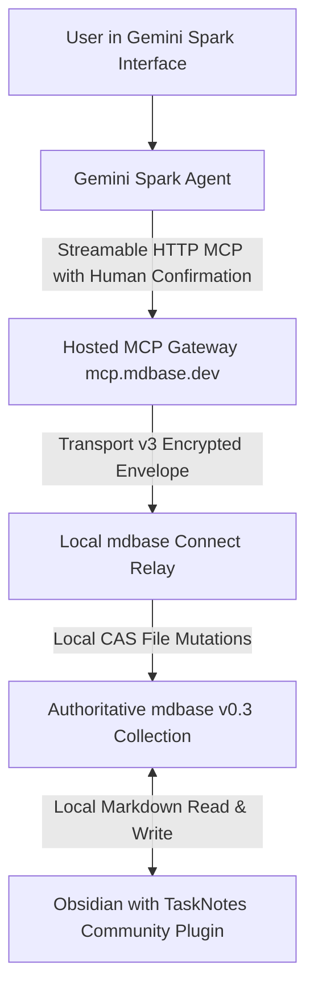

# Gemini Spark Integration Assessment (mdbase v0.3 Architecture)

**Context**: Evaluated on 2026-09-17; updated 2026-09-22 following the Chrysalis architectural overhaul to an open, provider-independent AI Agent Framework operating on an **mdbase v0.3** Markdown database substrate.  
**Disposition**: **DEFERRED** to Phase 2 candidate runtime agent integrations (Backlog Item `R01`).

---

## 1. Scope & Framework Reworking

Chrysalis is an AI Agent Framework operating directly on an mdbase v0.3 Markdown database collection. Gemini Spark is evaluated as a **candidate runtime agent** that supplies cognitive reasoning and invokes standard database operations (`create_record`, `query_records`, `update_record`) defined in [`contracts/agent-runtime.contract.md`](../contracts/agent-runtime.contract.md).

Prior architectures evaluated Spark as an orchestrator writing to a Google Drive vault via a custom cloud adapter, with synchronization to a bespoke Flutter mobile app and custom Obsidian plugin. Those components have been formally retired or deferred:
- **Retired**: Bespoke Chrysalis mobile application (`apps/mobile/`), FastAPI gateway daemon (`apps/gateway/`), vendored Obsidian binary bundle, and custom cloud adapter.
- **Retained**: Authoritative local Markdown database files, JSON Schema Draft 2020-12 validation, exact-document CAS concurrency, human approval gate, and the community TaskNotes Obsidian plugin for UI and Google Calendar synchronization.
- **Candidate Architecture**: Gemini Spark connects as an external MCP client via the standard Streamable HTTP MCP Gateway (`mcp.mdbase.dev`) or a local stdio relay, executing structured operations against the authoritative local collection.

---

## 2. Target Architecture Diagram (mdbase v0.3 Streamable MCP)

### Flow Lifecycle:
1. **User Request**: The user interacts with Gemini Spark (web or mobile) using natural language or uploaded documents.
2. **Context & Ingestion**: Spark parses external inputs under passive untrusted text quarantine (`<untrusted_document_payload>`).
3. **Plan Formulation**: Spark drafts record operations (e.g. deliverable extraction, task creation in `chrysalis/TaskNotes/Tasks/`) adhering to `contracts/agent-runtime.contract.md`.
4. **Approval Gate**: Gemini prompts the user for explicit write confirmation in the Spark interface.
5. **Mutation**: Spark invokes `create_record` or `update_record` with Compare-And-Swap (`if_revision`) validation.
6. **Persistence**: The record is written directly to disk in the local collection. The community TaskNotes plugin detects updates, renders them in agenda/board views, and harmonizes calendar events.

---

## 3. Verified Capabilities & Constraints

### 3.1 What is Verified About Spark
- **MCP Client Connectivity**: Google supports registering Streamable HTTP MCP endpoints through Gemini Connected Apps, callable via `@app` mentions.
- **Mandatory Write Confirmation**: Custom-app tool calls that mutate state require interactive confirmation by the human user. Background cron loops cannot bypass this interactive confirmation.
- **No Direct Filesystem Access**: Spark cannot natively read/write local workstations without an MCP bridge or relay.

### 3.2 Security, Privacy & Boundary Guarantees
- **Connect Control Plane (`relay.mdbase.dev`)**: Operates under Transport v3 with Grant Encryption Profile v1 (P-256 ECDH + HKDF-SHA-256 + AES-256-GCM). It is payload-blind and cannot decode Markdown content, record frontmatter, or query expressions.
- **Hosted MCP Gateway (`mcp.mdbase.dev`)**: Terminates application-side relay encryption in memory so Streamable HTTP MCP clients can interact with collections. Plaintext payloads exist only in ephemeral RAM during execution. The gateway persists OAuth tokens and grant IDs, never note bodies or file contents.
- **Local Authority**: Document bytes on local disk remain the absolute source of truth. Document revisions are strictly `sha256(UTF-8 document bytes)`.

---

## 4. Candidate MCP Tool Surface (Runtime Contract Mapping)

The MCP adapter maps directly to the 9 discrete actions specified in `contracts/agent-runtime.contract.md`:

| MCP Tool | Agent Runtime Action | Scope & Behavior |
| :--- | :--- | :--- |
| `mdbase_query_records` | `query_records` | Filter tasks by status, horizon (`due <= today + 14d`), and tags. |
| `mdbase_read_record` | `read_record` | Retrieve parsed frontmatter, markdown body, and SHA-256 revision hash. |
| `mdbase_create_record` | `create_record` | Create new task, project, or zettel note validating JSON Schema Draft 2020-12. |
| `mdbase_update_record` | `update_record` | Apply atomic CAS mutation requiring `if_revision` match. |
| `mdbase_ingest_source` | `ingest_source` | Record raw document in `Sources/` with SHA-256 provenance deduplication. |

---

## 5. Disposition & Next Steps

Integration with Gemini Spark is deferred to Phase 2 (Backlog Item `R01`). The core mdbase v0.3 foundation, schemas, contracts, local test harness, and validation scenarios are fully operational locally with zero cloud dependencies.
