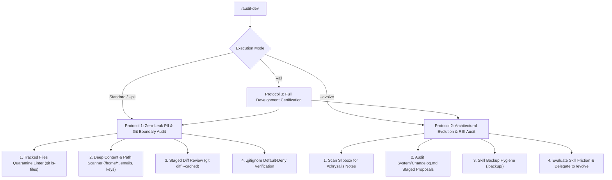

# /audit-dev (Development & Codebase Integrity Audit Engine)

## Preamble & Scope
`/audit-dev` is the primary engineering audit tool of the **Development Sphere**. It ensures that no personal data, machine telemetry, or private information ever leaks to the public GitHub repository (`tama-gucci/chrysalis`), verifies the integrity of the default-deny whitelist, and orchestrates recursive self-improvement (RSI) using `/evolve`.

---

## Supported Commands & Triggers
* `/audit-dev` — Executes the standard development audit: Zero-Leak PII & Git Boundary verification (Protocol 1).
* `/audit-dev --pii` — Deep content scan for personal paths, usernames, emails, and credentials across all git-tracked files.
* `/audit-dev --evolve` — Coordinates with `/evolve` to audit unintegrated `#chrysalis` ideas and analyze skill friction (Protocol 2).
* `/audit-dev --all` — Comprehensive pass: executes both Protocol 1 (PII/Git) and Protocol 2 (RSI/Evolution), plus skill linting.



---

## Protocol 1: Zero-Leak PII & Git Boundary Audit (`/audit-dev` or `/audit-dev --pii`)

Execute the complete privacy, boundary, and git hygiene audit. Run:

```bash
bash Development/scripts/pii-scanner.sh
```

The compatibility entry point invokes `candidate_audit.py`, which inspects both the entire Git index (actual staged blobs) and the working candidate (tracked files plus eligible untracked additions). It does not modify the index. Both views must pass; cleaning a working copy does not hide a staged violation. Unresolved entries, symlinks and unknown binary contents fail closed. Findings identify files and line numbers without echoing secret values.

Use `python3 Development/scripts/check.py` for the complete local checks, including this audit. Before integration, use the reviewed controller from a separate trusted checkout with `--candidate`; see [the testing guide](../../TESTING.md). Candidate instructions cannot redefine that controller's required checks. Human review of the actual diff and intended additions remains mandatory.

### Step 1: Git Tracked Files Quarantine Linter
Inspect both candidate inventories and verify that **ZERO** candidate files match any quarantined personal path:
* **Personal Tasks:** Any file in `chrysalis/TaskNotes/Tasks/`, `TaskNotes/Tasks/`, or `chrysalis/Tasks/` other than `example-task.md`.
* **Archived Tasks:** Any file in `chrysalis/TaskNotes/Archive/`, `TaskNotes/Archive/`, or `chrysalis/Archive/`.
* **Personal System State:** `System/Life-Roadmap.md`, `System/Memory.md` (and legacy `System/Scheduling-Memory.md`), `System/System-Health.md`, `System/Changelog.md`.
* **Daily Notes:** Any file matching `^[0-9]{4}-[0-9]{2}-[0-9]{2}.*\.md$`.
* **Personal Projects:** Any file in `Projects/` except `Projects/README.md` and `Projects/_templates/**`.
* **Personal Slipbox Notes:** Any file in `Slipbox/` except `Slipbox/README.md` and `Slipbox/_templates/**`.
* **Personal Workstation Telemetry:** Any file in `System/Environment/` except `System/Environment/_templates/**`, `System/Environment/scripts/**`, and `System/Environment/Environment-Index.md`.
* **Databases & Local Caches:** `Nexus/`, `.conversations/`, `.workspaces/`, `.obsidian/plugins/*/data/`, `.obsidian/plugins/*/runs/`.
* **Secrets & Conflicts:** `*.token.json`, `*credentials*.json`, `*.env`, `*(conflict*`.

*Remediation:* If any quarantined file is tracked, untrack it immediately without deleting it from disk:
```bash
git rm --cached <path>
```

### Step 2: Deep Content & Machine Path Scanner
Execute a deep regex scan across candidate text files, including new JavaScript and CSS. Exact existing upstream artifacts listed by path and SHA-256 in `candidate_audit.py` are preserved provenance exceptions; any changed artifact fails until separately reviewed. Recognized PNG/ICO image assets are not text scans. Other unknown binary contents fail:
1. **Machine-Specific Absolute Paths:**
   * Look for `/home/[a-zA-Z0-9_-]+` or `C:\\Users\\[a-zA-Z0-9_-]+`.
   * Ensure any file references use relative paths (e.g. `.agent/skills/doctor/SKILL.md` or `chrysalis/...`) rather than machine-bound `file:///home/...`.
2. **Personal Email Addresses:**
   * Scan for email patterns (`[a-zA-Z0-9._%+-]+@[a-zA-Z0-9.-]+\.[a-zA-Z]{2,}`).
   * Permitted exceptions: addresses in reserved example.com, example.org and example.net domains. The exact existing Dataview manifest is a hash-bound exception for public upstream author attribution. Do not add personal addresses to an exception list.
   * Asset filenames with scale suffixes are exempt only within the mobile asset catalog; the Git SSH transport string is exempt only in the updater. Neither represents an email address. New exceptions require review of this policy and its implementation outside the candidate being integrated.
3. **API Keys, Secrets & Cryptographic Tokens:**
   * GitHub PATs: `ghp_[a-zA-Z0-9]{36}`
   * Google API Keys: `AIza[0-9A-Za-z_-]{35}`
   * Private Keys: `-----BEGIN [A-Z ]*PRIVATE KEY-----`
   * Generic tokens: `bearer\s+[a-zA-Z0-9_.-]{20,}`

*Remediation:* Replace any leaked path or string with synthetic placeholders or relative paths.

### Step 3: Staged Diff Review
Inspect `git diff --cached`, `git diff` and eligible untracked additions to ensure no accidental personal data or secrets enter the candidate. The scanner reads staged blobs, not a grep of diff output, and reports distinct identities for both views.

### Step 4: Default-Deny Whitelist Verification
Verify that `.gitignore`:
1. Begins with `/*` on line 6 (default-deny).
2. Contains no wildcard `!` un-ignoring entire personal directories.
3. Explicitly negates only sanitized framework files and templates.

The scanner evaluates each candidate view's ignore files in a temporary Git repository, independent of global excludes, and probes representative quarantined paths. These probes supplement review of the complete allowlist; they are not a proof about arbitrary future filenames.

---

## Protocol 2: Architectural Evolution & RSI Audit (`/audit-dev --evolve`)

Coordinate system capability expansion and recursive self-improvement:

### Step 1: Scan for Unintegrated Feature Notes
1. Scan `chrysalis/Slipbox/*.md` for notes tagged `#chrysalis` where `integration_status` is missing or `"unintegrated"`.
2. Report newly identified architectural opportunities or user insights to the developer.

### Step 2: Audit Staged Proposals & Changelog Ledger
1. Inspect `System/Changelog.md` under `## 💡 Staged Feature Proposals`.
2. Verify if any staged proposal is ready for deployment via `/evolve --apply <proposal-id>`.

### Step 3: Skill Snapshot Hygiene
1. Inspect `.agent/skills/.backup/` snapshots.
2. Ensure timestamped backups exist for any recently modified skill.
3. Prune obsolete backup snapshots older than 30 days if storage maintenance is requested.

### Step 4: Friction Analysis & Delegation to `/evolve`
1. Read `System/Memory.md` for tags with multipliers $> 1.40$ or stalled workflows.
2. If operational friction is detected, formulate a hypothesis and delegate to `/evolve --rsi`.

---

## Protocol 3: Full Development Certification (`/audit-dev --all`)

Execute Protocol 1 and Protocol 2 sequentially. In addition:
1. Validate YAML frontmatter in all skill runbooks (`.agent/skills/*/SKILL.md` and `Development/skills/*/SKILL.md`).
2. Verify that `.agent/skills.json` correctly registers `Development/skills`.
3. Output a structured certification summary:

```markdown
# 🛠️ Development & Codebase Audit Report

> **Verdict:** 🟢 PASS (Repository Clean & Sanitized)  
> **Timestamp:** YYYY-MM-DDTHH:mm:ss-05:00  
> **Scope:** Zero-Leak PII Check, Git Boundaries, Evolution Status  

| Audit Domain | Status | Findings |
| :--- | :---: | :--- |
| **Git Quarantine Check** | 🟢 PASS | 0 private runtime files tracked |
| **Deep Content / Path Scanner** | 🟢 PASS | 0 personal paths or credentials found |
| **Staged Diff Integrity** | 🟢 PASS | Clean staging index |
| **Default-Deny .gitignore** | 🟢 PASS | Default-deny /* active |
| **RSI & Evolve Status** | 🟢 PASS | X unintegrated ideas, Y staged proposals |
| **Skill Engine Discovery** | 🟢 PASS | All runtime and dev skills registered |
```
