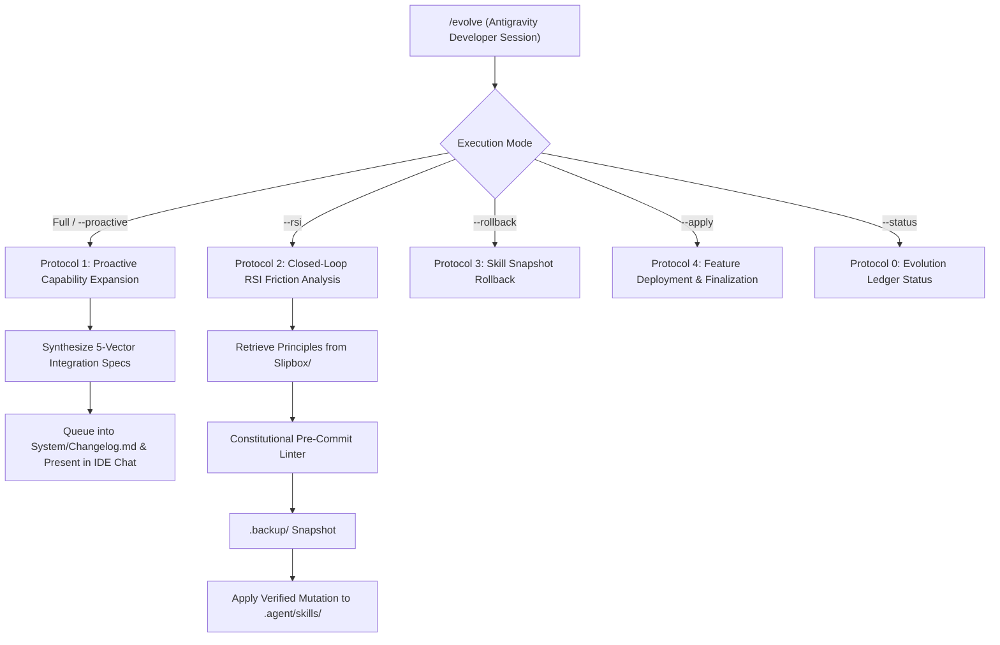

# /evolve (Development Architecture & RSI Engine — Google Antigravity IDE)

> [!NOTE]
> **Development Pipeline Boundary:** `/evolve` is an engineering and architecture skill executed on-demand exclusively by **Google Antigravity** on development workstations. It is never executed during automated daily life routines.

## Supported Commands & Triggers
* `/evolve` — Executes the interactive capability expansion and RSI friction analysis pass in Antigravity.
* `/evolve --proactive` — Queries `#chrysalis` notes and synthesizes 5-vector architectural feature integration specs.
* `/evolve --rsi` — Evaluates operational friction and mutates skill runbooks with pre-commit snapshots.
* `/evolve --rollback [skill]` — Restores the latest backup snapshot from `.agent/skills/.backup/`.
* `/evolve --apply [proposal-id]` — Deploys an approved architectural proposal to disk.
* `/evolve --status` — Displays staged proposals, active skill versions, and recent evolution ledger entries.

---

## Protocol 0: Evolution Ledger Status (`/evolve --status`)
Inspect active system architecture and staged evolutions:
1. Scan `System/Changelog.md` under `## 💡 Staged Feature Proposals`.
2. List available rollback snapshots in `.agent/skills/.backup/`.
3. Output a structured overview table of pending proposals and recent mutations to the developer.

---

## Protocol 1: Proactive Capability Expansion & `#chrysalis` Spec Synthesis (`/evolve --proactive` or `/evolve`)

Execute proactive system growth by scanning unintegrated ideas and formulating architectural upgrade proposals:

### Step 1: Scan for Feature Notes
* Query all vault files in `Slipbox/` and across the vault containing tag `chrysalis` where `integration_status == "unintegrated"` or missing.
* Parse conceptual requirements, architectural intents, and theoretical references.

### Step 2: Multi-Vector Architectural Brainstorming
For each unintegrated note, analyze the 5 Chrysalis integration pathways:
1. **Workflows:** Automated Chrysalis pipelines in `chrysalis/Workflows/`.
2. **Skills:** Modular skill additions, protocol enhancements, or new slash commands in `.agent/skills/`.
3. **Dashboard UI:** Obsidian Dataview blocks, callouts, or summaries in `Dashboard.md`.
4. **Operational Memory:** Schema additions or diurnal telemetry expansions in `System/Memory.md`.
5. **Orchestrator Adapters:** Capability tier updates, floating alias mappings, or model release integrations in `System/Orchestrators/*`.

### Step 3: Environment & Model Telemetry Audit
* Inspect developer workstation package manifests (`System/Environment/*.md`) and local plugin configurations.
* If new CLI tools or model releases are detected, formulate an `Adapter-Spec.md` capability tier update.

### Step 4: Formulate Feature Integration Spec
1. Generate complete code/markdown specifications for the proposed feature or adapter update.
2. Log proposal in `System/Changelog.md` under `## 💡 Staged Feature Proposals`.
3. Present the proposal directly in the Antigravity developer chat for interactive feedback and approval.

---

## Protocol 2: Closed-Loop RSI Friction Analysis & Slipbox Grounding (`/evolve --rsi`)

Execute recursive self-improvement on operational skills based on telemetry friction:

### Step 1: Friction Diagnostic
1. Scan `System/Memory.md` for task tags with active multipliers $> 1.40$ or tasks stalled $> 72\text{h}$.
2. Review `schedule_refinement_memory.feedback_history` for recurring prompt friction, format overrides, or user complaints.

### Step 2: Slipbox Knowledge Retrieval
* Query `chrysalis/Slipbox/*.md` for matching principles (`#concept/*`, `#principle/*`, `#framework/*`) to ground the optimization hypothesis in domain theory.

### Step 3: Constitutional Pre-Commit Linter
Verify that the proposed optimization satisfies all constitutional invariants:
* Invariant explicit local timezone offset (`"-05:00"`).
* File substrate single source of truth (`chrysalis/`).
* Mandatory physical disk mutation (anti-simulation law).
* Dynamic state multiplier bounds clamped to $[0.20, 2.00]$.
* Feedback gate preserved (no autonomous live changes without user review).

### Step 4: Snapshot & Mutation
1. Execute `write_to_file` to snapshot existing skill to `.agent/skills/.backup/<skill>_<timestamp>.md`.
2. Apply verified optimization to `.agent/skills/<skill>/SKILL.md`.
3. Record mutation entry in `System/Changelog.md` under `## [Version] - YYYY-MM-DD`.

---

## Protocol 3: Skill Snapshot Rollback (`/evolve --rollback [skill]`)

If a self-improved skill produces degraded behavior or user rejection:
1. Locate the most recent backup in `.agent/skills/.backup/<skill>_*.md`.
2. Restore the backup to `.agent/skills/<skill>/SKILL.md` using `replace_file_content` / `write_to_file`.
3. Log the rollback event in `System/Changelog.md`.
4. Notify the developer of successful restoration.

---

## Protocol 4: Feature Deployment & Finalization (`/evolve --apply [proposal-id]`)

Upon explicit developer approval of a staged feature proposal:
1. Deploy the designated workflow, skill, UI block, or memory schema file(s) to physical disk.
2. Update the originating note's frontmatter to `integration_status: integrated`.
3. Move proposal from `💡 Staged Feature Proposals` in `System/Changelog.md` to active capabilities.
