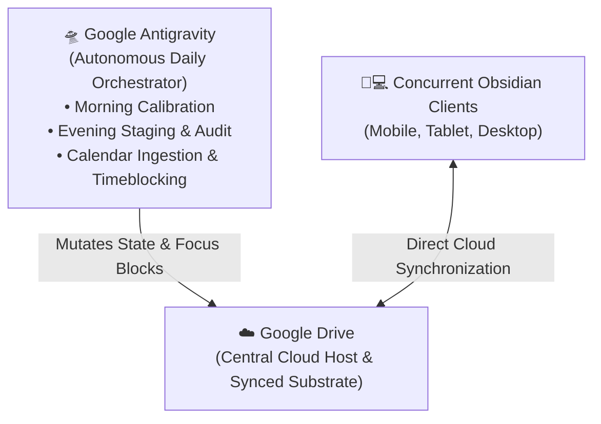

# chrysalis

> [!WARNING]
> **Project Status: Early Alpha**  
> Chrysalis is currently in active personal development and is not yet ready for general use. Formats and features may change frequently.

---

## 🏛️ System Architecture

Chrysalis is built on an open Markdown substrate synchronized via cloud storage (**Google Drive**) and accessed concurrently through **Obsidian** and an autonomous AI orchestrator (**Google Antigravity**):



### Core Components
* **Cloud Substrate (Google Drive):** The single source of truth. All notes, task frontmatter, strategic roadmaps, and modular skills live as plain Markdown files.
* **Client Interface (Obsidian):** Access your schedule, task boards, dashboards, and notes across desktop, tablet, and mobile devices.
* **Autonomous Orchestrator (Google Antigravity):** Executes daily scheduled focus planning, morning wake calibration, evening staging, and calendar collision avoidance with guaranteed tool-gated physical disk mutations.

---

## 📅 Daily Lifecycle

```
+-------------------------------------------------------------------------+
|                                                                         |
|   1. Evening Review (/evening)                                          |
|      • Checks completed tasks from today                                |
|      • Ingests tomorrow's calendar events                               |
|      • Selects 2–3 priority tasks from Life-Roadmap.md                  |
|      • Stages a draft schedule for tomorrow                             |
|                                                                         |
|                                 │                                       |
|                                 ▼                                       |
|                                                                         |
|   2. Morning Calibration (/morning)                                     |
|      • Logs wake time and energy score (1–5)                            |
|      • Shifts daily focus blocks relative to wake time                  |
|      • Writes scheduled start/end timestamps to task files on disk      |
|                                                                         |
|                                 │                                       |
|                                 ▼                                       |
|                                                                         |
|   3. Focus Execution (/plan)                                            |
|      • 75–90m focus sprint blocks with 15m decompression buffers        |
|      • Analytical work mapped to morning focus windows                  |
|      • Administrative tasks mapped to afternoon recovery windows        |
|                                                                         |
+-------------------------------------------------------------------------+
```

---

## 🚀 Setup Guide

---

### Step 1: Vault Setup

1. **Clone the repository into Google Drive:**
   ```bash
   git clone https://github.com/tama-gucci/chrysalis.git ~/GoogleDrive/chrysalis
   cd ~/GoogleDrive/chrysalis
   ```

2. **Run the bootstrap script:**
   ```bash
   bash bootstrap.sh
   ```
   * Automatically detects your local timezone offset, verifies directory substrates, and initializes memory and roadmaps from templates.

3. **Open in Obsidian:**
   * Open [Obsidian](https://obsidian.md) and select **Open folder as vault** pointing to `~/GoogleDrive/chrysalis`.
   * Enable community plugins when prompted (TaskNotes, Dataview, Nexus).

---

### Step 2: Google Antigravity Orchestrator Setup

1. **Open the Vault in Google Antigravity:**
   * Open [Google Antigravity](https://antigravity.google) (IDE or Desktop Application) and select **Open Folder** pointing to `~/GoogleDrive/chrysalis`.
   * Antigravity automatically discovers [`AGENTS.md`](AGENTS.md) and all native modular skills in [`.agent/skills/`](.agent/skills/).

2. **Choose Your Execution Topology:**
   * **Interactive Mode (Default):** Run daily workflows directly on-demand via the chat canvas (`/morning`, `/evening`, `/plan`, `/doctor`).
   * **Automated Scheduled Mode (Optional):** Use Antigravity's native scheduled timers or background cron to fire morning wake calibration (`08:30`) and nightly staging (`21:30`) automatically on a continuous workstation, server, or VM.

3. Detailed runtime contracts and tool bindings are defined in [`System/Orchestrators/Antigravity/Adapter-Spec.md`](System/Orchestrators/Antigravity/Adapter-Spec.md).

---

### Step 3: Initial Conversational Onboarding

Run the onboarding command with your AI orchestrator:

```text
/onboard
```

1. Select a starter archetype or reply with your personal goals.
2. The orchestrator compiles `System/Life-Roadmap.md` with structured pillars and tag registries.
3. The orchestrator initializes baseline multipliers in `System/Scheduling-Memory.md`.
4. The orchestrator executes `/doctor` to validate frontmatter and tag consistency.

---

### Step 4: External Google Calendar Sync (Optional)

1. Enable Google Calendar synchronization within the **TaskNotes** plugin settings in Obsidian.
2. Chrysalis will read cached events from `Scheduling-Memory.md` and wrap focus sprint blocks around external commitments with zero schedule collisions.

---

## 🛠️ Command Reference

### Daily Focus & Task Commands (Runtime Sphere)
| Command | Skill Runbook | Description |
| :--- | :--- | :--- |
| **`/onboard`** | `.agent/skills/onboard/SKILL.md` | Interactive intake interview: compiles strategic roadmap and seeds operational memory. |
| **`/morning`** | `.agent/skills/morning/SKILL.md` | Ingests wake time and energy score, shifting daily focus blocks and locking timestamps. |
| **`/evening`** | `.agent/skills/evening/SKILL.md` | Reconciles daily tasks, ingests calendar events, and stages tomorrow's prototype schedule. |
| **`/plan`** | `.agent/skills/plan/SKILL.md` | Master bio-cognitive focus scheduling engine with ultradian sprints. |
| **`/task`** | `.agent/skills/task/SKILL.md` | Creates a new task note with category tags, time estimates, and modality. |
| **`/doctor`** | `.agent/skills/doctor/SKILL.md` | 6-point integrity diagnostic suite: validates schemas, tags, timezones, and links. |
| **`/audit`** | `.agent/skills/audit/SKILL.md` | Runtime Nightly Audit: updates multipliers, chronotype learning, and 14-day horizons. |
| **`/zettel`** | `.agent/skills/zettel/SKILL.md` | Creates an atomic slipbox knowledge note with bidirectional links. |
| **`/pause`** | `.agent/skills/pause/SKILL.md` | Suspends active timeblocks and freezes multiplier decay across 4 semantic modes. |
| **`/resume`** | `.agent/skills/pause/SKILL.md` | Resumes daily planning cycles smoothly following a pause. |

### Development & Engineering Commands (Development Sphere)
| Command | Skill Runbook | Description |
| :--- | :--- | :--- |
| **`/audit-dev`** | `Development/skills/audit-dev/SKILL.md` | Development & Codebase Audit: Zero-Leak PII scanning, git boundary check, and RSI coordination. |
| **`/evolve`** | `Development/skills/evolve/SKILL.md` | System Evolution Engine: scans `#chrysalis` notes, synthesizes architecture specs, and refactors skills with rollback snapshots. |

---

## 🔧 Customizing & Extending Chrysalis (Developer Guide)

Because Chrysalis is 100% modular Markdown, developers can author custom skills or extend system logic within the [`Development/`](Development/README.md) hub, governed by the [`Development Constitution`](Development/Development-Constitution.md):
* **Modular Skills Engine:** Runtime skills reside in `.agent/skills/`; development skills reside in `Development/skills/` (registered via `.agent/skills.json`).
* **System Evolution Engine (`/evolve`):** When working in a coding IDE, the `/evolve` command inspects `#chrysalis` notes, synthesizes architecture specifications, and refactors skills with automated rollback backups.
* **Development Environment (`Development/Environment/`):** Personal workstation manifests and local developer scripts are quarantined from Git via `.gitignore`.
* **Zero-Leak PII Gate (`/audit-dev`):** Verifies all git-tracked files against PII, personal paths, and token leaks before pushing.

---

## 📦 Acknowledgements & Core Dependencies

Chrysalis is built on top of [Obsidian](https://obsidian.md) and depends on community plugins that are integral to daily operation:

* **[TaskNotes](https://github.com/lucas-rego/obsidian-tasknotes):** Integral to Chrysalis. Provides task note rendering, frontmatter property management, time tracking, and external Google Calendar synchronization.
* **[Nexus](https://github.com/nexus-plugin/nexus):** In-vault AI model connectivity and local tool calling.
* **[Dataview](https://github.com/blacksmithgu/obsidian-dataview):** Dynamic task querying and dashboard aggregation across the vault substrate.

---

## 📄 License
This project is open-source under the [MIT License](LICENSE).

