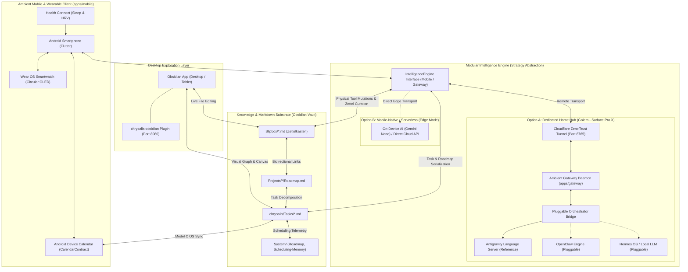
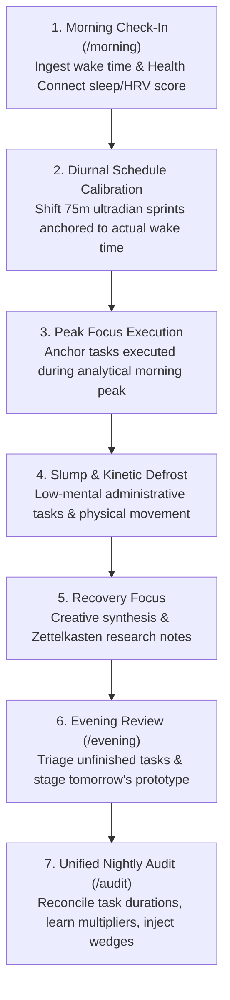

# 🌌 Chrysalis: Autonomous Bio-Cognitive Life Cockpit & Knowledge Hypergraph

> **The Integrated Cockpit for Mind, Knowledge, and Action.**  
> Standard productivity apps create a painful disconnect: your notes live in one app, your to-do lists in another, and your calendar in a third. You spend your day manually juggling between what you *know*, what you *plan to do*, and *when you actually do it*.  
> **Chrysalis unifies this into a single living ecosystem:**
> 1. **Knowledge (Zettelkasten / Slipbox):** Atomic thoughts, research, and mental models.
> 2. **Strategy (Project Roadmaps):** Long-term outcomes, milestones, and deliverables.
> 3. **Execution (Chrysalis Tasks):** Granular, bite-sized tasks tagged with cognitive modality and energy requirements.
> 4. **Timeblocking (Calendar Sprints):** 75-minute ultradian focus sessions scheduled around your natural biological rhythm.

---

## 🧭 The Knowledge-to-Execution Continuum (The Chrysalis Hypergraph)

Chrysalis bridges the gap between deep thinking and daily execution. Operating natively on an open Markdown vault substrate (with deep [Obsidian](https://obsidian.md) and [chrysalis-obsidian](https://github.com/tama-gucci/chrysalis) interoperability), the intelligence engine maintains a living, bidirectional graph:

```
┌─────────────────────────────────────────────────────────────────────────────┐
│ 1. KNOWLEDGE LAYER: Atomic Zettelkasten (Slipbox/*.md)                      │
│    • Atomic permanent notes, mental models, literature insights.            │
│    • Created manually in Obsidian or synthesized autonomously via /zettel.  │
└──────────────────────────────────────┬──────────────────────────────────────┘
                                       │  Linked via Semantic [[WikiLinks]]
                                       ▼
┌─────────────────────────────────────────────────────────────────────────────┐
│ 2. STRATEGIC LAYER: Project Roadmaps (Projects/*/Roadmap.md)                │
│    • Milestone horizons, strategic deliverables, pillar alignment.          │
│    • Grounded in specific Zettel research notes in "## Reference Files".    │
└──────────────────────────────────────┬──────────────────────────────────────┘
                                       │  Decomposed into Atomic Deliverables
                                       ▼
┌─────────────────────────────────────────────────────────────────────────────┐
│ 3. EXECUTION LAYER: Chrysalis Schema (chrysalis/Tasks/*.md)                 │
│    • Standard Chrysalis markdown frontmatter (modality, energy, timeEstimate)│
│    • Native 1:1 compatibility with the chrysalis-obsidian plugin (Port 8080).│
│    • Injects linked_zettels & project_ref for one-tap research access.      │
└──────────────────────────────────────┬──────────────────────────────────────┘
                                       │  Calibrated via Bio-Cognitive Clock
                                       ▼
┌─────────────────────────────────────────────────────────────────────────────┐
│ 4. TEMPORAL LAYER: Timeblocked Calendar Events (Android Calendar / Wear OS) │
│    • 75m focus sprints + 15m decompression buffers (Ultradian alignment).   │
│    • Model C Mobile OS Bridge mirrors blocks directly to Google Calendar.   │
│    • Active sprint cockpit displays direct links back to the Zettel notes!  │
└─────────────────────────────────────────────────────────────────────────────┘
```

---

## 🏛️ System Architecture & Operational Topologies



### 1. Dedicated "Golem" Hardware Topology
* **Hardware:** Microsoft Surface Pro X running Windows 11 on ARM64 24/7 plugged in.
* **Memory Budget:** **16GB RAM total**:
  - **4GB RAM:** Dedicated to Home Assistant operating within Hyper-V.
  - **12GB RAM:** Dedicated operational memory for Chrysalis, the Ambient Gateway daemon (`apps/gateway/`), background agent orchestration, and automated health/audit suites.

### 2. Modular Intelligence Engine Principle
Chrysalis enforces architectural modularity at the interface level, supporting two primary deployment topologies:
* **Option A (Dedicated Home Hub - Golem):** The Ambient Gateway (`apps/gateway/`, FastAPI on port `8765`) runs 24/7 on Golem behind an outbound-only Cloudflare Zero-Trust Tunnel. It connects to autonomous agents via a pluggable adapter bridge (`BaseOrchestratorBridge`), with Google Antigravity as the reference implementation, and pluggable slots for OpenClaw, Hermes OS, or local LLMs.
* **Option B (Mobile-Native / Serverless):** For edge deployments without a dedicated home server, the mobile client connects directly to on-device models (e.g. Gemini Nano via AICore) or direct cloud model endpoints.

### 3. Deep Obsidian & chrysalis-obsidian Interoperability
* Chrysalis operates natively within an Obsidian vault. All task files in `chrysalis/Tasks/*.md` use standard Chrysalis frontmatter schema (`status`, `due`, `scheduled`, `modality`, `energy`, `priority`, `timeEstimate`).
* **Port Separation Invariant:**
  - **Port `8080`:** Reserved exclusively for the `chrysalis-obsidian` plugin API and local server.
  - **Port `8765`:** Dedicated to the Ambient Chrysalis Gateway daemon.
  - Both services run simultaneously on the home node with zero port conflicts.

### 4. Ambient Mobile & Standalone Wear OS Smartwatch Companion
* **Android Smartphone (`apps/mobile/`):** Built with Flutter 3.47 / Dart 3.13 with Material 3 Dark theme. Features an offline-first SQLite cache (Drift) with a SHA-256 mutation journal, diurnal timeline visualization, active focus sprint cockpit, and rapid shorthand capture.
* **Standalone Wear OS Smartwatch Companion:** Designed specifically for circular OLED displays (384×384 px, pure black `#000000` to turn off OLED pixels and preserve battery):
  - Rotary card stack with glanceable active sprint card and countdown timer.
  - Prominent circular voice dictation mic button for instant audio capture.
  - Intelligent intent classification routing voice notes to Chrysalis tasks or Zettelkasten.
* **Biometric Telemetry:** Google Health Connect integration (`androidx.health.connect.client`) ingesting sleep duration, sleep stages (deep, REM, light), resting heart rate (RHR), and HRV RMSSD to dynamically calculate morning readiness ($1$ to $5$).

### 5. Calendar Integration Architecture (Model C: Mobile OS Bridge)
* **Zero Cloud Setup Required:** By using **Model C (Mobile OS Bridge)**, users do not need to register Google Cloud projects, manage OAuth secrets, or configure API quotas.
* The Flutter mobile app writes scheduled focus blocks directly to Android's built-in calendar database via `CalendarContract`. Android automatically mirrors these events to Google Calendar and Wear OS watch complications for free.
* **Collision Avoidance Fallback:** Standalone headless environments can ingest external calendar commitments via `fetch_ical.py`, which pulls Google Calendar's private `.ics` feed with zero setup.

---

## ⚡ Bio-Cognitive Diurnal Planning Cycle

Chrysalis organizes daily work around human biological rhythms rather than static calendars:



### Cognitive Modality Pairing & Ultradian Stacking
Work is partitioned into **75-minute ultradian focus sprints** separated by mandatory **15-minute decompression buffers**:
* **Analytical (`#6366F1` - Electric Indigo):** High mental load, convergent logic (coding, architecture, drafting, analytical problem solving). Scheduled during morning **Peak Focus** ($T_{\text{wake}} + 01:30 \to +04:30$).
* **Kinetic (`#F59E0B` - Warm Amber):** Physical movement, hardware work, errands, cleaning. Scheduled during post-lunch **Slump / Kinetic Defrost** ($T_{\text{wake}} + 06:30 \to +08:15$) to exit sluggishness and elevate dopamine.
* **Synthesis (`#10B981` - Emerald Green):** Creative pattern recognition, literature review, Zettelkasten research notes (`Slipbox/`). Scheduled during evening **Recovery Focus** ($T_{\text{wake}} + 08:30 \to +10:30$).
* **Administrative (`#64748B` - Slate Gray):** Routine paperwork, emails, portals. Scheduled during downtime windows with a strict institutional weekend lockout.

### Adaptive Multipliers & Starter Wedges
* **Experiential Duration Multipliers:** During nightly `/audit`, Chrysalis compares estimated task durations against actual logged durations ($T_{\text{actual}} = \text{completedAt} - \text{startedAt}$) and tunes category multipliers strictly clamped to $[0.20, 2.00]$.
* **Starter Wedges (`micro_chunked: true`):** For high-friction or high-energy tasks, Chrysalis automatically injects a 3-step Starter Wedge (low-friction 5-minute exploratory anchors) to break task paralysis.
* **Semantic Pause Modes:** When taking time off, `/pause [mode]` supports 4 semantic archetypes:
  - 🏖️ **`vacation`:** Pauses daily alerts, freezes target dates and multiplier decay.
  - 🛌 **`rest`:** Clears today's scheduled blocks with zero penalties.
  - 🌊 **`flow`:** Mutes notifications to allow uninterrupted single-project deep dive.
  - 🛠️ **`maintenance`:** Schedules quick chores and housekeeping tasks only.

---

## 🎮 Command Reference

| Command | Domain | Description |
| :--- | :---: | :--- |
| **`/morning`** | Runtime | Captures wake time and energy score (1–5) or Health Connect biometrics, unpauses system, and locks calibrated timeblocks to disk. |
| **`/evening`** | Runtime | Reviews today's completed tasks, ingests tomorrow's calendar, and stages tomorrow's prototype focus schedule. |
| **`/plan`** | Runtime | Master diurnal engine: Protocol 1 (Staging Mode) queries for additions; Protocol 2 (Calibration Mode) locks ISO timestamps. |
| **`/task`** | Runtime | Parses shorthand input (`/task [title] #tag ~45m !urgent`), computes multiplier-adjusted duration, and creates Chrysalis task markdown note. |
| **`/zettel`** | Runtime | Captures atomic thoughts or system evolution ideas (`#chrysalis`), generates unique timestamp IDs (`YYYYMMDDHHmmss`), and bidirectionally links concepts. |
| **`/pause`** | Runtime | Suspends daily focus cycles across 4 semantic modes (`vacation`, `rest`, `flow`, `maintenance`), freezing multiplier decay. |
| **`/resume`** | Runtime | Restores active diurnal scheduling and orchestrates frictionless lifecycle re-entry. |
| **`/doctor`** | Runtime | Executes 6-point system diagnostic suite (schemas, -05:00 timezones, tag registries, wikilinks, skills, state multipliers) and auto-heals errors. |
| **`/audit`** | Runtime | Nightly operational reconciliation: learns duration multipliers, ingests 14-day roadmap milestones, and tunes candidate task pools. |
| **`/onboard`** | Runtime | Interactive intake interview that compiles initial `Life-Roadmap.md`, seeds multipliers, and configures workstation telemetry. |
| **`/evolve`** | Dev | Recursive Self-Improvement (RSI): scans unintegrated `#chrysalis` Zettel notes, synthesizes capability expansions, and tests skills safely. |
| **`/audit-dev`** | Dev | Pre-commit security gate enforcing the Zero-Leak PII Law, git boundaries, and `.gitignore` default-deny integrity. |

---

## 🚀 Quickstart & Setup Guide

### 1. Prerequisites
1. **[Obsidian](https://obsidian.md):** Installed on your workstation or tablet.
2. **Obsidian Community Plugins:**
   * **[chrysalis-obsidian](.obsidian/plugins/chrysalis-obsidian):** Core plugin required for task frontmatter management, boards, MCP server, and hybrid intelligence calendar views (Port `8080`).
   * **[Dataview](https://github.com/blacksmithgu/obsidian-dataview):** Recommended for dynamic dashboard queries.
3. **Python 3.14+:** For running the Ambient Gateway daemon and test suite.
4. **Flutter 3.47+ / Dart 3.13+:** (Optional) For building and running the mobile client and Wear OS companion app.

### 2. Vault Installation & Initial Onboarding
```bash
# Clone the repository
git clone https://github.com/tama-gucci/chrysalis.git ~/vault

# Open the folder as a vault in Obsidian
# Open your AI orchestrator (Google Antigravity) pointed at the vault root
```
Run the interactive onboarding skill in your AI assistant:
```text
/onboard
```
This guides you through a rapid intake interview, configures your explicit local timezone (e.g. `"-05:00"`), compiles your initial `Life-Roadmap.md`, and seeds `Scheduling-Memory.md`.

### 3. Ambient Gateway Setup on "Golem" (Surface Pro X)
To run the 24/7 background gateway service on your home server:
```powershell
cd apps\gateway
python -m venv .venv
.\.venv\Scripts\Activate.ps1
pip install -r requirements.txt

# Launch gateway daemon on dedicated port 8765
$env:CHRYSALIS_GATEWAY_PORT = "8765"
$env:CHRYSALIS_GATEWAY_TOKEN = "your-secure-token"
python main.py
```
Test health endpoint in browser: `http://localhost:8765/health` (leaves port `8080` completely free for chrysalis-obsidian!).

### 4. Running the Complete E2E Test Suite
Chrysalis includes 104 comprehensive end-to-end tests across 4 tiers:
```powershell
python -m pip install pyyaml
python tests\e2e\runner.py
```

---

## 🔒 Absolute Zero-Leak PII Law (GitHub Privacy Invariant)

Chrysalis is distributed publicly on GitHub (`tama-gucci/chrysalis`). To guarantee that private user data never leaks to public version control:
1. **Default-Deny Substrate (`.gitignore`):** The repository enforces root `/*` denial. Personal tasks (`chrysalis/Tasks/*.md`), live state (`System/*.md`), daily notes (`Daily/YYYY-MM-DD*.md`, `chrysalis/Daily/*.md`), personal slipbox notes, and device manifests are strictly ignored.
2. **1-to-1 Public Template Matrix:** Every personal runtime file has an exact, sanitized public template tracked in git (`System/_templates/`).
3. **Synthetic Placeholders Standard:** All public documentation, examples, and tests strictly use synthetic placeholders (`Jane Doe`, `user@example.com`, relative paths).

---

## 📄 License

This project is licensed under the [MIT License](LICENSE).
