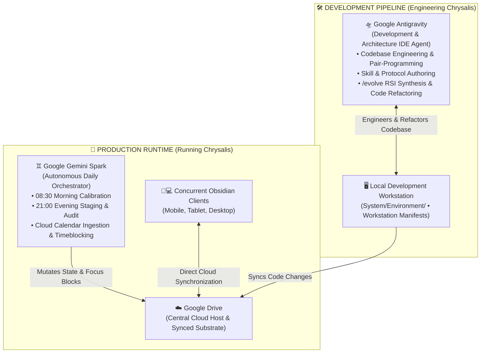

# chrysalis

> [!WARNING]
> **Project Status: Early Alpha**  
> Chrysalis is currently in active personal development and is not yet ready for general use. Formats and features may change frequently.

---

## 🏛️ System Architecture & Division of Labor

Chrysalis operates with a strict, principled division of labor between **Production Runtime** (running daily life operations) and the **Development Pipeline** (engineering and evolving the system):



### 1. 🏃 Production Runtime (Running Chrysalis)
* **Central Host Substrate:** **Google Drive** is the single central host substrate. No single personal machine is required to act as an active server—multiple client devices run Obsidian concurrently, syncing with Google Drive.
* **Autonomous Orchestrator:** **Google Gemini Spark** executes daily operational lifecycles:
  * **08:30 CDT Morning Calibration (`/morning`, `/calibrate`):** Prompts for wake telemetry ($T_{\text{wake}}$, energy $1–5$), calculates diurnal focus blocks, and writes locked ISO timestamps to task frontmatter on disk.
  * **21:00 CDT Evening Staging (`/evening`, `/audit`, `/plan`):** Reconciles completed tasks, updates bounded tag multipliers, ingests 14-day upcoming horizons, injects starter wedges, and stages tomorrow's focus agenda.
  * **Calendar Ingestion:** Automatically wraps focus sprints around external Google Calendar commitments with zero collisions.

### 2. 🛠️ Development Pipeline (Engineering Chrysalis)
* **Development Agent:** **Google Antigravity** is used strictly as the development and architecture IDE agent for pair-programming, codebase engineering, and skill refactoring. Antigravity has zero operational involvement in running daily Chrysalis routines.
* **Quarantined Environment:** The entire `System/Environment/` directory (workstation manifests, package telemetry, and local development scripts) belongs to the development pipeline and is kept out of the public repository.

---

## 📅 Daily Lifecycle

```
+-------------------------------------------------------------------------+
|                                                                         |
|   1. Evening Review (/evening)                                          |
|      • Checks completed tasks from today                                |
|      • Ingests tomorrow's calendar events                               |
|      • Selects 2–3 priority tasks from Life-Roadmap.md                  |
|      • Stages a draft schedule for tomorrow                             |
|                                                                         |
|                                 │                                       |
|                                 ▼                                       |
|                                                                         |
|   2. Morning Calibration (/morning)                                     |
|      • Logs wake time and energy score (1–5)                            |
|      • Shifts daily focus blocks relative to wake time                  |
|      • Writes scheduled start/end timestamps to task files on disk      |
|                                                                         |
|                                 │                                       |
|                                 ▼                                       |
|                                                                         |
|   3. Focus Execution (/plan)                                            |
|      • 75–90m focus sprint blocks with 15m decompression buffers        |
|      • Analytical work mapped to morning focus windows                  |
|      • Administrative tasks mapped to afternoon recovery windows        |
|                                                                         |
+-------------------------------------------------------------------------+
```

---

## 🚀 Setup Guide

---

### Step 1: Vault Setup

1. **Clone the repository into Google Drive:**
   ```bash
   git clone https://github.com/tama-gucci/chrysalis.git ~/GoogleDrive/chrysalis
   cd ~/GoogleDrive/chrysalis
   ```

2. **Run the bootstrap script:**
   ```bash
   bash bootstrap.sh
   ```
   * Automatically detects your local timezone offset, verifies directory substrates, and initializes memory and roadmaps from templates.

3. **Open in Obsidian:**
   * Open [Obsidian](https://obsidian.md) and select **Open folder as vault** pointing to `~/GoogleDrive/chrysalis`.
   * Enable community plugins when prompted (TaskNotes, Dataview, Nexus).

---

### Step 2: Google Gemini Spark Orchestrator Setup

1. Open **Google Gemini / Spark** and configure scheduled prompts for your vault located on Google Drive:
   * **Morning Prompt (Scheduled Daily: 08:30 Local Time):**
     ```text
     [CONTEXT & IDENTITY]
     You are the autonomous orchestrator for Chrysalis, a Markdown-based focus planning, task management, and knowledge system stored in Google Drive in the "chrysalis/" folder.
     All state, roadmaps, task lifecycles, and operational skills exist as plain Markdown files with YAML frontmatter in the "chrysalis/" directory.

     [GROUNDING & BOOTSTRAP]
     Upon execution, read the following core files in Google Drive:
     1. "chrysalis/GEMINI.md" and "chrysalis/System/SYSTEM-PROMPT.md" — Constitutional laws, schemas, and invariants.
     2. "chrysalis/System/Scheduling-Memory.md" — Dynamic operational state, timezone offset ("-05:00"), pause flags, wake rhythms, and pre-approved prototype schedule.
     3. "chrysalis/.agent/skills/morning/SKILL.md" — Executable morning runbook.

     [TASK EXECUTION]
     Execute skill /morning:
     1. Inspect pause state in "chrysalis/System/Scheduling-Memory.md". If paused, respect the pause policy.
     2. If active, prompt the user in natural language for morning wake telemetry (energy score 1-5 and wake notes / actual wake time).
     3. Once telemetry is received:
        - Ingest today's external events from Google Calendar (via Google Workspace tools) or "calendar_sync.cached_events" in "chrysalis/System/Scheduling-Memory.md" to guarantee zero schedule collisions.
        - Shift diurnal focus sprint blocks (75-90m ultradian focus sprints with 15m decompression buffers) anchored to actual wake time (Twake).
        - Execute file tool calls (replace_file_content / write_to_file) to write locked timestamps ("scheduled: YYYY-MM-DDTHH:mm:ss-05:00") into "chrysalis/TaskNotes/Tasks/*.md".
        - Create today's daily note at "chrysalis/YYYY-MM-DD.md".
        - Update "morning_checkin" in "chrysalis/System/Scheduling-Memory.md".

     [CONSTITUTIONAL INVARIANTS]
     - Anti-Simulation Law: You MUST execute file tool calls (replace_file_content / write_to_file) on Google Drive files. Chat text alone never modifies system state.
     - Explicit Timezone: All timestamps must include the explicit local offset from Scheduling-Memory.md (e.g., "-05:00"). Never write raw UTC "Z" strings.
     ```
   * **Evening Prompt (Scheduled Daily: 21:00 Local Time):**
     ```text
     [CONTEXT & IDENTITY]
     You are the autonomous orchestrator for Chrysalis, a Markdown-based focus planning, task management, and knowledge system stored in Google Drive in the "chrysalis/" folder.
     All state, roadmaps, task lifecycles, and operational skills exist as plain Markdown files with YAML frontmatter in the "chrysalis/" directory.

     [GROUNDING & BOOTSTRAP]
     Upon execution, read the following core files in Google Drive:
     1. "chrysalis/GEMINI.md" and "chrysalis/System/SYSTEM-PROMPT.md" — Constitutional laws, schemas, and invariants.
     2. "chrysalis/System/Scheduling-Memory.md" — Dynamic operational state, timezone offset ("-05:00"), bounded multipliers, pause state, and candidate task pools.
     3. "chrysalis/System/Life-Roadmap.md" & "chrysalis/Projects/*/Roadmap.md" — Primary strategic priority arbiter and active deliverables.
     4. "chrysalis/.agent/skills/evening/SKILL.md" — Executable evening runbook.

     [TASK EXECUTION]
     Execute skill /evening:
     1. Run Unified Nightly Audit (/audit):
        - Reconcile completed tasks in "chrysalis/TaskNotes/Tasks/*.md" against completed session deltas and update bounded multipliers within [0.20, 2.00] in "chrysalis/System/Scheduling-Memory.md".
        - Ingest upcoming 14-day roadmap milestones from "chrysalis/System/Life-Roadmap.md" and create new task notes if needed.
        - Inject Starter Wedges (micro_chunked: true) into stalled tasks (>72h).
        - Maintain the candidate task pool in "chrysalis/System/Scheduling-Memory.md".
     2. Ingest external Google Calendar events for tomorrow via Google Workspace tools or cached_events in "chrysalis/System/Scheduling-Memory.md".
     3. Prompt the user in natural language for any schedule additions, errands, or context for tomorrow.
     4. Arbitrate daily priority against "chrysalis/System/Life-Roadmap.md" (active roadmap milestones take Peak Focus slots; user additions fill downtime/slump windows).
     5. Assemble tomorrow's prototype focus schedule (75-90m ultradian sprints, 15m decompression buffers) and execute file tool calls to serialize "prototype_schedule" into "chrysalis/System/Scheduling-Memory.md".

     [CONSTITUTIONAL INVARIANTS]
     - Anti-Simulation Law: You MUST execute file tool calls (replace_file_content / write_to_file) on Google Drive files. Chat text alone never modifies system state.
     - Explicit Timezone: All timestamps must include the explicit local offset from Scheduling-Memory.md (e.g., "-05:00"). Never write raw UTC "Z" strings.
     ```
2. Runtime instructions and adapter specifications are defined in [GEMINI.md](file:///home/sin/GoogleDrive/chrysalis/GEMINI.md) and `System/Orchestrators/Gemini/Adapter-Spec.md`.

---

### Step 3: Initial Conversational Onboarding

Run the onboarding command with your AI orchestrator:

```text
/onboard
```

1. Select a starter archetype or reply with your personal goals.
2. The orchestrator compiles `System/Life-Roadmap.md` with structured pillars and tag registries.
3. The orchestrator initializes baseline multipliers in `System/Scheduling-Memory.md`.
4. The orchestrator executes `/doctor` to validate frontmatter and tag consistency.

---

### Step 4: External Google Calendar Sync (Optional)

1. Enable Google Calendar synchronization within the **TaskNotes** plugin settings in Obsidian.
2. Chrysalis will read cached events from `Scheduling-Memory.md` and wrap focus sprint blocks around external commitments with zero schedule collisions.

---

## 🛠️ Command Reference

### Daily Production Commands (Google Gemini Spark)
| Command | Skill Runbook | Description |
| :--- | :--- | :--- |
| **`/onboard`** | `.agent/skills/onboard/SKILL.md` | Interactive intake interview: compiles strategic roadmap and seeds operational memory. |
| **`/morning`** | `.agent/skills/morning/SKILL.md` | Ingests wake time and energy score, shifting daily focus blocks and locking timestamps. |
| **`/evening`** | `.agent/skills/evening/SKILL.md` | Reconciles daily tasks, ingests calendar events, and stages tomorrow's prototype schedule. |
| **`/plan`** | `.agent/skills/plan/SKILL.md` | Master bio-cognitive focus scheduling engine with ultradian sprints. |
| **`/task`** | `.agent/skills/task/SKILL.md` | Creates a new task note with category tags, time estimates, and modality. |
| **`/doctor`** | `.agent/skills/doctor/SKILL.md` | 6-point integrity diagnostic suite: validates schemas, tags, timezones, and links. |
| **`/audit`** | `.agent/skills/audit/SKILL.md` | Unified nightly reconciliation: updates multipliers, chronotype learning, and horizons. |
| **`/zettel`** | `.agent/skills/zettel/SKILL.md` | Creates an atomic slipbox knowledge note with bidirectional links. |
| **`/pause`** | `.agent/skills/pause/SKILL.md` | Suspends active timeblocks and freezes multiplier decay across 4 semantic modes. |
| **`/resume`** | `.agent/skills/pause/SKILL.md` | Resumes daily planning cycles smoothly following a pause. |

### Development & Architecture Commands (Google Antigravity IDE)
| Command | Skill Runbook | Description |
| :--- | :--- | :--- |
| **`/evolve`** | `.agent/skills/evolve/SKILL.md` | On-demand capability expansion, 5-vector feature synthesis, and RSI friction analysis. |
| **`/doctor`** | `.agent/skills/doctor/SKILL.md` | Pre-commit and diagnostic integrity validation during codebase refactoring. |

---

## 📦 Acknowledgements & Core Dependencies

Chrysalis is built on top of [Obsidian](https://obsidian.md) and depends on community plugins that are integral to daily operation:

* **[TaskNotes](https://github.com/lucas-rego/obsidian-tasknotes):** Integral to Chrysalis. Provides task note rendering, frontmatter property management, time tracking, and external Google Calendar synchronization.
* **[Nexus](https://github.com/nexus-plugin/nexus):** In-vault AI model connectivity and local tool calling.
* **[Dataview](https://github.com/blacksmithgu/obsidian-dataview):** Dynamic task querying and dashboard aggregation across the vault substrate.

---

## 📄 License
This project is open-source under the [MIT License](LICENSE).

