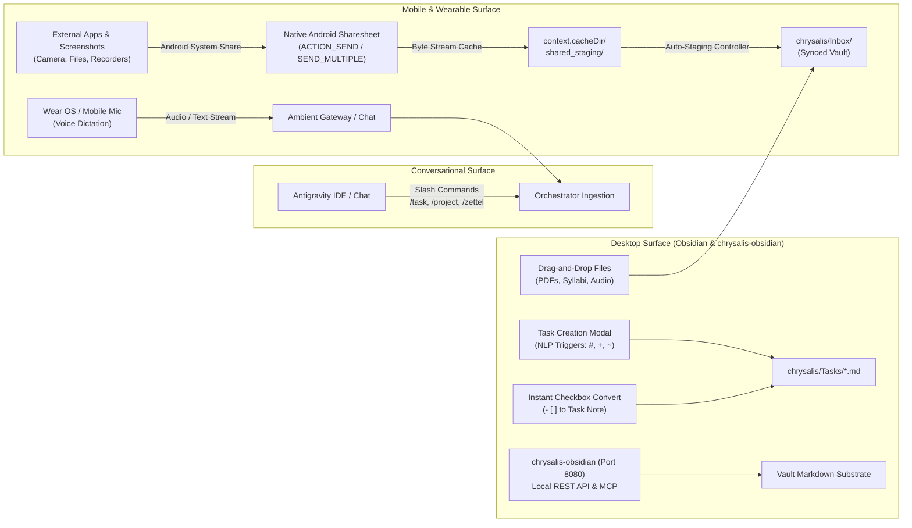
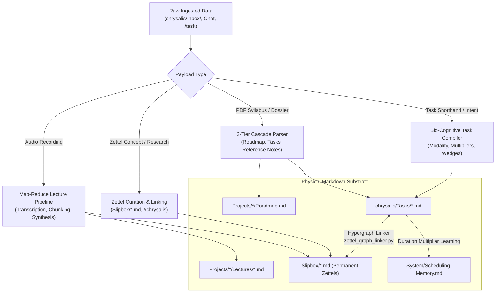
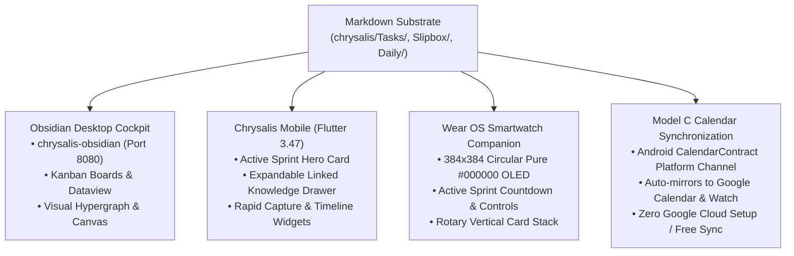

# 🌌 Chrysalis: Autonomous Bio-Cognitive Life Cockpit & Knowledge Hypergraph

> **The Integrated Cockpit for Mind, Knowledge, and Action.**  
> Conventional productivity apps isolate your life across fragmented silos: notes in one app, tasks in another, calendar blocks in a third. You spend your day manually transcribing what you *know*, what you *plan to do*, and *when you actually do it*.  
> 
> **Chrysalis unifies this into a single, closed-loop bio-cognitive ecosystem.**  
> Grounded in an open, local-first Markdown filesystem, Chrysalis eliminates cognitive friction between real-world inputs, autonomous AI processing, and daily human execution.

---

## 🌊 The Three Core Pillars: Metamorphic Flow of Data Architecture

Chrysalis models the flow of knowledge and action through the biological narrative of metamorphosis:

* **Stage 1: 🐛🍃 The Hungry Caterpillar (Pillar I: Data Ingestion):** Ravenously consuming raw real-world "leaves"—system screenshots, PDF syllabi, audio recordings, web articles, voice dictations, and conversational chat—with zero cognitive friction.
* **Stage 2: 🧬 The Metamorphic Chrysalis (Pillar II: Orchestrator Processing):** The quiet, focused cocoon where chaos dissolves and transforms. The autonomous AI orchestrator synthesizes raw input into atomic Markdown Zettels, project roadmaps, and ultradian task sprints.
* **Stage 3: 🦋✨ The Emergent Butterfly (Pillar III: Interface Translation):** Emerging in full flight, translating the crystalline Markdown substrate into lightweight, glanceable human interfaces across smartwatch, mobile, calendar, and desktop.

```
┌───────────────────────────────────────────────────────────────────────────────────────────┐
│                   PILLAR I: DATA INGESTION 🐛🍃 (The Hungry Caterpillar)                   │
│                                                                                           │
│   Universal Android Sharesheet & Screenshots      Direct Conversational Chat & Voice      │
│   • Native ACTION_SEND / SEND_MULTIPLE            • Google Antigravity & Ambient Gateway  │
│   • Screenshots, PDFs, Audio, Syllabi, URLs       • Slash Commands (/task, /plan, /zettel)│
│   • Auto-Staged to chrysalis/Inbox/               • Standalone Wear OS Circular Dictation │
│                                                                                           │
│                            Obsidian & chrysalis-obsidian                                  │
│                            • Local REST API & MCP Server (Port 8080)                      │
│                            • Zero-config single-folder encapsulation                      │
│                            • NLP Quick Capture (#, +, ~) & Inline Checkbox Conversion     │
└─────────────────────────────────────────────┬─────────────────────────────────────────────┘
                                              │
                                              ▼
┌───────────────────────────────────────────────────────────────────────────────────────────┐
│              PILLAR II: ORCHESTRATOR PROCESSING 🧬 (The Metamorphic Chrysalis)            │
│                                                                                           │
│   Autonomous AI Engine (Antigravity Language Server / Gemini 3.8 Flash)                   │
│   • Anti-Simulation Invariant: Physical tool mutations persist state to disk              │
│   • Audio & Lecture Pipeline: Map-Reduce transcription into Zettels (Slipbox/)            │
│   • Document Ingestion: Syllabi & dossiers into 3-Tier Roadmaps (Projects/)               │
│   • Task Shorthand Parsing: Synthesis into Chrysalis Schema (chrysalis/Tasks/)            │
│   • Bio-Cognitive Scheduling: 75m ultradian focus sprints + 15m decompression             │
│   • Hypergraph Linking: Automated [[WikiLinks]] connecting knowledge to action            │
│   • Dynamic Chronotype Multipliers: Learned execution tracking bounded in [0.20, 2.00]    │
└─────────────────────────────────────────────┬─────────────────────────────────────────────┘
                                              │
                                              ▼
┌───────────────────────────────────────────────────────────────────────────────────────────┐
│               PILLAR III: INTERFACE TRANSLATION 🦋✨ (The Emergent Butterfly)              │
│                                                                                           │
│   Obsidian Desktop Cockpit                 Chrysalis Mobile (Flutter 3.47 / Dart 3.13)    │
│   • Kanban, Sprint Boards, Views           • Active Sprint Cockpit Hero Card              │
│   • Visual Knowledge Graph View            • Expandable Linked Knowledge Drawer           │
│   • Canvas Project Workflows               • Rapid Capture Bar & Timeline Widget          │
│                                                                                           │
│   Wear OS Smartwatch (Circular OLED)       Model C Calendar Synchronization               │
│   • 384x384 Pure #000000 Black Stack       • Direct Android CalendarContract Sync         │
│   • Active Countdown Timer & Controls      • Zero Google Cloud setup / OAuth quotas       │
│   • Glanceable Complications               • Auto-mirrors to Google Calendar & Watch      │
└───────────────────────────────────────────────────────────────────────────────────────────┘
```

---

## 📊 Software Development Status & Tripartite Progress

Chrysalis comprises three symbiotic software engines operating over a shared, local-first Markdown substrate.

```
Overall Ecosystem Status: [█████████████░░░░░░░] 67% (Phase 1 MVP Achieved)
```

| Component | Status | Progress | Key Deliverables & Next Steps |
| :--- | :--- | :--- | :--- |
| **1. Android Mobile & Wearable Client**<br/>`apps/mobile/` | 🟢 **MVP Complete** | `[██████████] 100%` | **Delivered:** Native sharesheet & screenshot intake (`image/*`, `audio/*`, `application/pdf`, `text/plain`), auto-staging to `<vault>/chrysalis/Inbox/`, local Drift SQLite persistence (`DatabaseFactory.createPersistent`), and verified debug APK (162MB, minSdk 26).<br/>**Next:** UI polish, Wear OS standalone build, and biometric background sync. |
| **2. Desktop Ambient Gateway**<br/>`apps/gateway/` | 🟡 **Functional Prototype** | `[██████░░░░]  60%` | **Delivered:** Asynchronous Python FastAPI daemon on Port 8765, Pluggable Orchestrator Bridge to Antigravity language server / `agentapi`, auth tokens, and health telemetry.<br/>**Next:** PyInstaller Windows `.exe` packaging with `freeze_support()`, Inno Setup user-login installer, and `%LOCALAPPDATA%\Chrysalis\gateway.json` config. |
| **3. Chrysalis Obsidian Plugin**<br/>`chrysalis-obsidian` | 🟡 **Pre-Fork Prototype** | `[████░░░░░░]  40%` | **Delivered:** Deployed locally in `.obsidian/plugins/chrysalis-obsidian/`, full decommissioning of legacy TaskNotes codebase (28.9k lines removed), canonical `chrysalis/` layout.<br/>**Next:** Standalone repository `tama-gucci/chrysalis-obsidian`, Chrysalis schema default settings & modal wizard, embedded Port 8080 REST/MCP server, and BRAT / Community Registry distribution. |

### ⏱️ Timeline of Major Milestones

```
[T-12h Architecture] ──► [T-4h Mobile MVP] ──► [T-1h Legacy Prune] ──► [Audit & Verification] ──► [Next Packaging Horizon]
         │                       │                     │                      │                             │
         ├─ Three Core Pillars   ├─ Universal Sharesheet├─ 28.9k Lines Pruned  ├─ Tripartite Status Audit    ├─ Windows .exe Installer
         ├─ Metamorphic Flow     ├─ Screenshot Intake   ├─ Single-Folder chrysalis├─ doctor.py: 0 errors    ├─ Inno Setup (Session 1)
         └─ RFC 5545 iCal Fixes  ├─ Drift SQLite Cache  └─ Canonical Harness   ├─ 124/124 Tests Passing      └─ Obsidian BRAT Release
                                 └─ 162MB APK Compiled                         └─ Zero-Leak PII Certified
```

1. **Three Core Pillars Architecture Restructure (T-12h):**  
   Reorganized root and component documentation around the biological metamorphosis model (🐛🍃 Ingestion, 🧬 Processing, 🦋✨ Translation). Resolved RFC 5545 iCal recurrence bounds (`EXDATE`, `COUNT`, `UNTIL`) with complete regression coverage.
2. **Mobile Android Client MVP Delivery (T-4h):**  
   Implemented native Android Sharesheet receiver (`ACTION_SEND` / `ACTION_SEND_MULTIPLE`) in Kotlin and Dart. Enabled instant intake of system screenshots (`image/*`), audio memos (`audio/*`), syllabi (`application/pdf`), and text with auto-staging to `<vault>/chrysalis/Inbox/`. Wired local Drift SQLite persistence (`DatabaseFactory.createPersistent`). Configured OpenJDK 17 ARM64 toolchain and compiled verified 162MB debug APK (`apps/mobile/build/app/outputs/flutter-apk/app-debug.apk`).
3. **Legacy TaskNotes Decommissioning (T-1h):**  
   Cleanly purged 28,973 lines of legacy TaskNotes cruft, deprecated plugins, and obsolete templates. Re-anchored the test harness, fixtures, and scripts to canonical single-folder `<vault>/chrysalis/` encapsulation.
4. **Tripartite Architecture Audit & Verification Certification (Current):**  
   Conducted deep ground-truth audit of the three software pieces (@[conversation:"Chrysalis Software Development Status"]). Hardened `doctor.py` 6-point diagnostic suite (`/doctor`), achieving 0 errors across runtime and repository vaults. All 124 unit and end-to-end Python tests passed. Zero Dart analysis issues. Zero-Leak PII certified.
5. **Desktop Daemon Packaging & Plugin Distribution (Next Horizon):**  
   Roadmap established to package `apps/gateway` as a single-file Windows `.exe` installer (handling PyInstaller freeze protection and user-session execution) and launch `chrysalis-obsidian` as a standalone repo for 1-click installation via BRAT and the Obsidian Community Registry.

---

## 📥 Pillar I: Data Ingestion 🐛🍃 (The Hungry Caterpillar — Devouring Raw Data)

Pillar I provides zero-friction capture across mobile, wearable, desktop, and conversational surfaces, ensuring raw ideas, documents, and audio leaves enter the system without cognitive tax.



### 1. Universal Android Native Sharesheet & Screenshot Ingestion
* **Native System Integration:** Direct integration with Android's system sharesheet (`Intent.ACTION_SEND` and `Intent.ACTION_SEND_MULTIPLE`).
* **Universal MIME Handling:** Ingests system screenshot overlays (`image/*`), PDFs (course syllabi, specification dossiers), audio recordings (`audio/*`), and text notes (`text/plain`).
* **Binary-Safe Stream Caching:** Android content URIs (`content://`) expire quickly. The Kotlin native layer (`MainActivity.kt`) instantly streams incoming bytes into `context.cacheDir/shared_staging/<filename>`, performing path-traversal sanitization and collision deduplication before permissions lapse.
* **Frictionless Auto-Staging to `chrysalis/Inbox/`:** The Dart `ShareAutoStagingController` automatically routes cached payloads to `<vault>/chrysalis/Inbox/`, presents a lightweight native Toast confirmation (*"Saved to Chrysalis Inbox: [filename]"*), and immediately dismisses (`finishAndRemoveTask()`) with zero UI interruption.

### 2. Direct Conversational Chat & Voice Dictation
* **Natural Language Shorthand:** Users capture intent conversationally in the IDE or mobile cockpit. The parser decodes tags, durations, priorities, and modalities in a single pass:
  ```text
  /task Draft AIA Layering Standards #cad/drafting ~75m !high
  ```
* **Structured Multi-Vector Slash Commands:**
  - `/project`: Interactive intake interview for new multi-phase projects and roadmap compilation.
  - `/zettel`: Instant capture of technical insights and mental models with automated timestamp IDs.
  - `/morning` & `/evening`: Rapid diurnal check-in and staging telemetry.
* **Standalone Wear OS Circular Voice Dictation:** Smartwatch client provides a one-tap circular microphone button (`#6366F1`) that captures voice transcripts and autonomously classifies them into tasks or Zettels.

### 3. Obsidian & Chrysalis-Obsidian Interface Ingestion
* **Interactive Quick Capture & NLP Triggers:** Create structured tasks on the fly using natural language triggers (`#` tags, `+` project roadmaps, `~` durations, modality selectors).
* **Instant Inline Checkbox-to-Task Conversion:** Highlight any standard markdown checklist item (`- [ ]`) to convert it into a schema-compliant Chrysalis task file (`chrysalis/Tasks/YYYYMMDD-<title>.md`) while leaving a clean `[[WikiLink]]` in place.
* **Drag-and-Drop Ingestion to `chrysalis/Inbox/`:** Drag course syllabi, briefs, or lecture audio files directly into `chrysalis/Inbox/`. The orchestrator automatically routes them through the 3-Tier Cascade or Map-Reduce audio pipelines.
* **Dedicated REST API & MCP Server Architecture (Port 8080):** Port 8080 is reserved exclusively for the upcoming embedded `chrysalis-obsidian` Local REST API and MCP server (with current calendar synchronization gracefully falling back to headless `fetch_ical.py`), strictly isolated from the Gateway daemon on Port 8765.
* **Single-Folder Encapsulation Invariant:** All runtime data lives cleanly encapsulated inside `<vault>/chrysalis/` (`Tasks/`, `Archive/`, `Daily/`, `Views/`, `Workflows/`, `Inbox/`), enabling users to open any existing Obsidian vault without namespace collisions.

---

## ⚙️ Pillar II: Orchestrator Processing 🧬 (The Metamorphic Chrysalis — Synthesizing into Markdown)

Pillar II is the cognitive core of Chrysalis—the protective cocoon where raw ingested leaves undergo radical metamorphosis. The autonomous AI orchestrator (Google Antigravity language server / Gemini 3.8 Flash baseline) breaks down unstructured data and reconstitutes it into an interconnected, bidirectional Markdown hypergraph stored physically on disk.



### 1. Mandatory Physical Disk Mutation (Anti-Simulation Law)
* **The Core Constitutional Invariant:** Chat text output alone **NEVER** mutates Chrysalis state. The AI agent must never claim tasks are scheduled, staged, or calibrated without calling physical disk manipulation tools (`replace_file_content`, `write_to_file`).
* All system roadmaps, task lifecycles, and agent skills exist as plain Markdown files with YAML frontmatter.

### 2. Audio & Lecture Processing Pipeline (Map-Reduce Paradigm)
Chrysalis processes long-form technical lectures (45–90 minutes) through a robust **Sliding-Window Map-Reduce Protocol**:
1. **Map Phase (Transcription & Chunking):** Audio from `chrysalis/Inbox/` is parsed into timestamped, speaker-diarized text windows.
2. **Extraction:** The orchestrator extracts core arguments, definitions, and citations across 15-minute segments.
3. **Reduce Phase (Dual-Target Synthesis):**
   - **Lecture Master Note:** Written to `Projects/<Course>/Lectures/YYYY-MM-DD-<Topic>.md` containing executive summaries and chronological outlines.
   - **Atomic Permanent Zettels:** 2–4 standalone atomic notes generated in `Slipbox/<Timestamp>-<concept>.md` with formal definitions and bidirectional `[[WikiLinks]]`.

### 3. Document & Syllabus Ingestion (The 3-Tier Cascade)
When complex documents (e.g. course syllabi, contract specifications) are shared to Chrysalis:
* **Tier 1 (Strategic Roadmap):** Compiles `Projects/<Project_Name>/Roadmap.md` with horizon windows and milestone criteria.
* **Tier 2 (Actionable Tasks):** Decomposes milestones into atomic Chrysalis task notes in `chrysalis/Tasks/*.md` tagged with cognitive modalities and durations.
* **Tier 3 (Reference Knowledge):** Scaffolds initial reference Zettels in `Slipbox/*.md` and links them directly into Section 3 of the project roadmap.

### 4. Bio-Cognitive Diurnal Modality Scheduling
Chrysalis structures human work into **75–90 minute ultradian focus sprints** separated by **15-minute decompression buffers**, categorized across 4 biological modalities:

| Modality | Accent Color | Cognitive Profile | Optimal Diurnal Window |
| :--- | :--- | :--- | :--- |
| **Analytical** | `#6366F1` (Electric Indigo) | High mental load, convergent logic, coding, CAD | **Morning Peak Focus** ($T_{\text{wake}} + 01:30 \to +04:30$) |
| **Kinetic** | `#F59E0B` (Warm Amber) | Physical movement, lab setup, hardware, cleaning | **Slump / Kinetic Defrost** ($T_{\text{wake}} + 06:30 \to +08:15$) |
| **Synthesis** | `#10B981` (Emerald Green) | Creative reflection, literature notes, architecture | **Evening Recovery Focus** ($T_{\text{wake}} + 08:30 \to +10:30$) |
| **Administrative** | `#64748B` (Slate Gray) | Routine emails, forms, portals (lockout on weekends) | **Downtime Buffers** ($T_{\text{wake}} + 04:30 \to +06:30$) |

### 5. Universal Chrysalis Task Frontmatter Schema
Every task note in `chrysalis/Tasks/*.md` strictly adheres to the universal specification:

```yaml
---
title: "Imperative Task Title"
status: todo # Allowed: todo, in-progress, done, archived
dateCreated: "2026-09-10T08:00:00-05:00"
created: "2026-09-10T08:00:00-05:00" # Backward-compatible alias
due: "2026-09-14"
scheduled: "2026-09-10T09:30:00-05:00" # Explicit local ISO timestamp or null
priority: high # Allowed: urgent, high, normal, low, none
urgency_tier: 3 # Scale: 1 (Lowest) to 4 (Highest)
modality: analytical # Allowed: analytical, kinetic, synthesis, administrative
timeEstimate: 75 # In minutes (baseline duration * active tag multiplier)
energy: high # Allowed: high, medium, low
friction: medium # Allowed: high, medium, low
micro_chunked: true # Boolean: true if Starter Wedge is injected
tags:
  - task
  - pillar-1/cad
linked_zettels:
  - "[[20260912100000-aia-cad-layer-guidelines]]"
project_ref: "[[Projects/CAD_Certification_2026/Roadmap]]"
googleCalendarEventId: "android_calendar_event_12345"
---

## Starter Wedge
- [ ] 1. Launch AutoCAD and load the ACC template.
- [ ] 2. Verify AIA layer colors and lineweights.
- [ ] 3. Begin drawing sheet border.
```

### 6. Dynamic Multipliers & Hypergraph Linking
* **Experiential Multiplier Learning:** During the unified nightly `/audit`, Chrysalis calculates $T_{\text{actual}} = \text{completedAt} - \text{startedAt}$, updating tag multipliers bounded strictly within $[0.20, 2.00]$ in `System/Scheduling-Memory.md`.
* **Automated Hypergraph Linking (`zettel_graph_linker.py`):** Traverses `Slipbox/*.md` and links relevant reference notes directly into task frontmatter (`linked_zettels`).

---

## 🖥️ Pillar III: Interface Translation 🦋✨ (The Emergent Butterfly — Effortless Understanding & Access)

Pillar III translates the internal crystalline Markdown substrate into lightweight, accessible interfaces tailored to the user's immediate physical context across mobile, smartwatch, calendar, and desktop.



### 1. Obsidian Desktop Cockpit (`chrysalis-obsidian`)
* **Live Knowledge Canvas:** Explore the living knowledge-to-execution continuum through Obsidian's interactive Graph View, linking atomic Zettels directly to active project milestones.
* **Dynamic Kanban & Dashboards:** Built-in Dataview queries render active tasks by modality, sprint timeline, and urgency tier.
* **Canvas Workflows:** Visual planning workflows (`chrysalis/Workflows/`) facilitate project retrospectives and weekly reviews.

### 2. Chrysalis Mobile Client (Flutter 3.47 / Dart 3.13)
* **Active Sprint Cockpit Card:** Displays current 75-minute focus sprint, live countdown timer, and modality color indicator.
* **Expandable Linked Knowledge Drawer:** Inspect connected atomic research notes (`linked_zettels`) from `Slipbox/` directly inside the active sprint card without switching apps.
* **Local Persistence (Drift SQLite):** Operates offline-first via Drift SQLite storage (`DatabaseFactory.createPersistent`) and `LocalVaultStorageProvider`.
* **Diurnal Timeline Widget:** Visualizes wake time, analytical focus windows, post-lunch slump defrost, and recovery periods.
* **Verified Debug APK Build:** Ready for physical device testing (`apps/mobile/build/app/outputs/flutter-apk/app-debug.apk`, 162MB, minSdk 26).

### 3. Standalone Wear OS Smartwatch Companion
* **OLED-Optimized Layout:** Formatted specifically for circular displays (384×384 px) with pure black backgrounds (`#000000`) to maximize battery endurance.
* **Rotary Card Stack:** Active sprint card with real-time countdown, one-tap voice capture microphone, and quick action controls (`Calibrate Today`, `Pause System`).

### 4. Frictionless Calendar Synchronization (Model C: Mobile OS Bridge)
* **Zero Cloud Console Configuration:** Eliminates the friction of registering Google Cloud developer projects, managing client IDs, handling OAuth consent screens, or dealing with rate limits.
* **Native Platform Channel (`CalendarContract`):** The Flutter app writes scheduled focus blocks directly to Android's built-in device calendar database. Android mirrors these events to Google Calendar and Wear OS complications automatically for free.
* **RFC 5545 Headless Fallback (`fetch_ical.py`):** Standalone server environments ingest calendar commitments via a pure Python iCal parser supporting `UNTIL`, `COUNT`, and `EXDATE` recurrence rules.

### 5. Dedicated "Golem" Hardware Topology & Ambient Gateway
* **Home Server Hardware:** Microsoft Surface Pro X (16GB RAM, Windows 11 on ARM64) running 24/7.
* **Strict Port Separation Invariant:**
  - **Port 8080:** Reserved exclusively for `chrysalis-obsidian` Local REST API and MCP server.
  - **Port 8765:** Reserved exclusively for the Ambient Chrysalis Gateway daemon.
  - Both services run simultaneously on Golem with zero port collisions.

---

## 🎮 Command Reference

| Command | Domain | Function |
| :--- | :---: | :--- |
| **`/morning`** | Runtime | Captures wake time and energy score (1–5) or biometrics, unpauses system, and locks calibrated timeblocks to disk. |
| **`/evening`** | Runtime | Reviews completed tasks, ingests calendar commitments, and stages tomorrow's prototype schedule. |
| **`/plan`** | Runtime | Master diurnal engine: Protocol 1 (Staging Mode) queries additions; Protocol 2 (Calibration Mode) locks ISO timestamps. |
| **`/task`** | Runtime | Parses shorthand input (`/task [title] #tag ~45m !urgent`), computes multiplier duration, and creates task markdown note. |
| **`/project`** | Runtime | Guides conversational intake for new projects and synthesizes 3-tier roadmaps. |
| **`/zettel`** | Runtime | Captures atomic literature or evolution ideas (`#chrysalis`), generates timestamp IDs, and links concepts bidirectionally. |
| **`/pause`** | Runtime | Suspends daily focus cycles across 4 semantic modes (`vacation`, `rest`, `flow`, `maintenance`), freezing multiplier decay. |
| **`/resume`** | Runtime | Restores active diurnal scheduling and orchestrates frictionless lifecycle re-entry. |
| **`/doctor`** | Runtime | Executes 6-point diagnostic suite (schemas, timezones, tag registries, wikilinks, skills, multipliers) and auto-heals errors. |
| **`/audit`** | Runtime | Nightly reconciliation: learns duration multipliers, ingests 14-day roadmap milestones, and tunes task pools. |
| **`/onboard`** | Runtime | Interactive intake interview that compiles initial `Life-Roadmap.md`, seeds multipliers, and configures workstation telemetry. |
| **`/evolve`** | Dev | Recursive Self-Improvement (RSI): scans unintegrated `#chrysalis` notes, synthesizes capability expansions, and tests skills. |
| **`/audit-dev`** | Dev | Pre-commit security gate enforcing the Zero-Leak PII Law, git boundaries, and `.gitignore` default-deny integrity. |

---

## 📁 Repository Directory Structure

```
vault-git/
├── .agent/
│   └── skills/                # Universal executable runtime skills (/plan, /doctor, /audit, etc.)
├── AGENTS.md                  # Master Constitution & Universal Task Frontmatter Schema
├── apps/
│   ├── gateway/               # Ambient Chrysalis Gateway (FastAPI daemon on port 8765)
│   └── mobile/                # Chrysalis Mobile & Wear OS Client (Flutter 3.47 / Dart 3.13)
│       └── build/.../app-debug.apk # Compiled 162MB MVP Debug APK (minSdk 26)
├── chrysalis/                 # Single-folder runtime encapsulation structure
│   ├── Archive/               # Completed and archived task notes
│   ├── Daily/                 # Diurnal calibration logs and focus notes (YYYY-MM-DD.md)
│   ├── Inbox/                 # Sharesheet & screenshot auto-staging landing zone
│   ├── Tasks/                 # Active Chrysalis task notes (Universal schema)
│   ├── Views/                 # Dataview dashboards and board configurations
│   └── Workflows/             # Visual Canvas workflows
├── Development/               # Engineering sphere, developer specs, and RSI protocols
│   ├── Development-Constitution.md
│   ├── scripts/pii-scanner.sh
│   └── skills/                # Development-only skills (/audit-dev, /evolve)
├── Projects/                  # Strategic project dossiers and roadmaps (Roadmap.md)
├── Slipbox/                   # Atomic Zettelkasten permanent knowledge notes
├── System/
│   ├── Environment/           # Hardware telemetry profiles and active node manifests
│   ├── Orchestrators/         # Orchestrator adapter specs and integration contracts
│   ├── scripts/               # Core Python tooling (doctor.py, fetch_ical.py, sync_calendar.py)
│   └── _templates/            # Public 1-to-1 sanitized template matrix
└── tests/                     # 124 Unit, E2E, and regression test suites across 4 tiers
```

---

## 🚀 Quickstart & Setup Guide

### 1. Prerequisites
1. **[Obsidian](https://obsidian.md):** Installed on your workstation or tablet.
2. **Obsidian Community Plugins:**
   * **`chrysalis-obsidian`:** Core plugin for task frontmatter management, boards, MCP server, and REST API (Port 8080).
   * **`Dataview`:** Recommended for dynamic dashboard queries.
3. **Python 3.11+:** For running the Ambient Gateway daemon, diagnostic linters, and test suite.
4. **Android SDK & Flutter 3.47+:** (Optional) For compiling mobile and Wear OS applications.

### 2. Vault Installation & Initial Onboarding
```bash
# Clone the repository
git clone https://github.com/tama-gucci/chrysalis.git ~/vault

# Open the directory as a vault in Obsidian
# Launch your AI orchestrator (Google Antigravity) pointing at the vault root
```
Run the interactive onboarding skill in chat:
```text
/onboard
```
This configures your explicit local timezone offset (e.g. `"-05:00"`), compiles your initial `Life-Roadmap.md`, and seeds `Scheduling-Memory.md`.

### 3. Deploying the Mobile Android MVP App
To install the verified debug APK on a physical Android device or emulator via ADB:
```bash
adb install -r "apps/mobile/build/app/outputs/flutter-apk/app-debug.apk"
```
Once installed, share any screenshot, PDF, or audio file to **Chrysalis** to verify instant staging into `<vault>/chrysalis/Inbox/`.

### 4. Ambient Gateway Setup on "Golem" (Surface Pro X)
To launch the 24/7 background gateway service on your home server:
```powershell
cd apps\gateway
python -m venv .venv
.\.venv\Scripts\Activate.ps1
pip install -r requirements.txt

# Launch gateway daemon on dedicated port 8765
$env:CHRYSALIS_GATEWAY_PORT = "8765"
$env:CHRYSALIS_GATEWAY_TOKEN = "your-secure-token"
python main.py
```
Test health endpoint: `http://localhost:8765/health` (leaves port 8080 completely free for `chrysalis-obsidian`).

### 5. Running System Diagnostics & Verification Suite
Run the 6-point system diagnostic health suite:
```powershell
python System\scripts\doctor.py
```
Execute the complete 124-test verification suite:
```powershell
python -m unittest discover -t . -s tests
```

---

## 🔒 Absolute Zero-Leak PII Law (GitHub Privacy Invariant)

Chrysalis is distributed publicly on GitHub (`tama-gucci/chrysalis`). To guarantee that private user data never leaks to public version control:
1. **Default-Deny Substrate (`.gitignore`):** The repository enforces root `/*` denial. Personal tasks (`chrysalis/Tasks/*.md`), live state (`System/*.md`), daily notes (`chrysalis/Daily/*.md`), personal slipbox notes, and device manifests are strictly ignored.
2. **1-to-1 Public Template Matrix:** Every personal runtime file has an exact, sanitized public template tracked in git (`System/_templates/`).
3. **Synthetic Placeholders Standard:** All public documentation, examples, and tests strictly use synthetic placeholders (`Jane Doe`, `user@example.com`, relative paths `vault/...`, `vault-git/...`).

---

## 📄 License

This project is licensed under the [MIT License](LICENSE).
