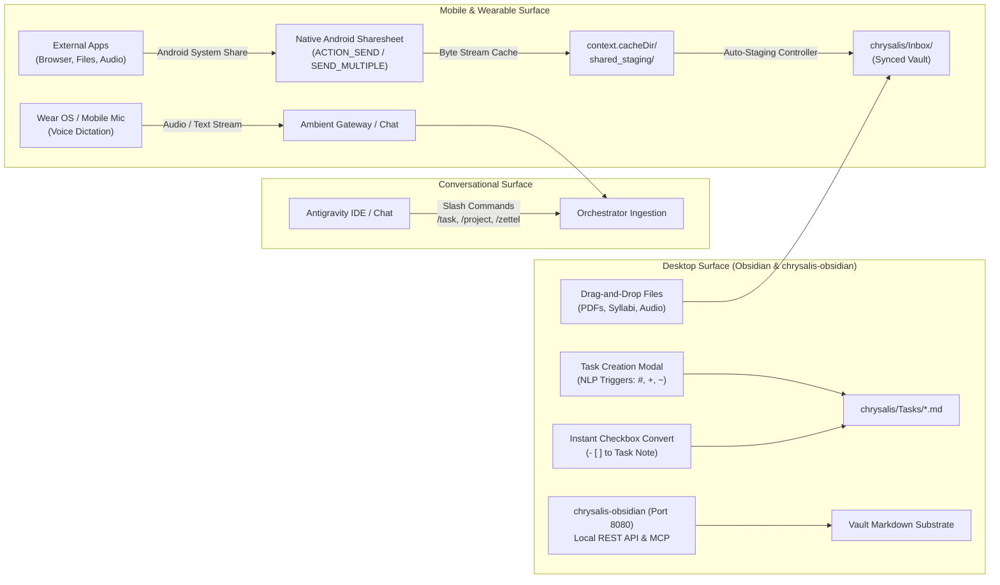
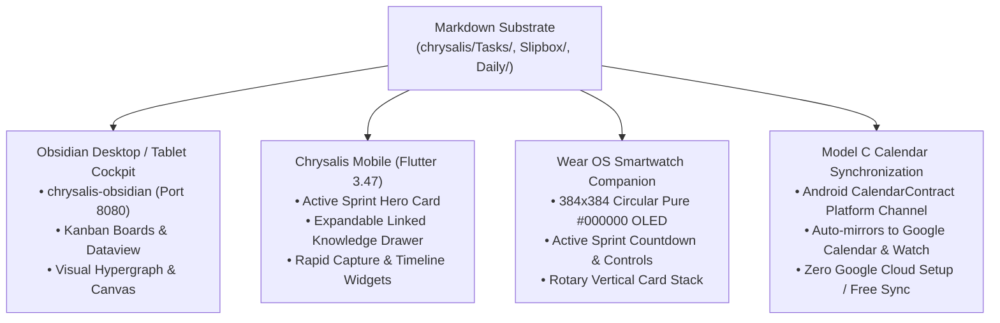

# 🌌 Chrysalis: Autonomous Bio-Cognitive Life Cockpit & Knowledge Hypergraph

> **The Integrated Cockpit for Mind, Knowledge, and Action.**  
> Conventional productivity apps isolate your life across fragmented silos: notes in one app, tasks in another, calendar blocks in a third. You spend your day manually transcribing what you *know*, what you *plan to do*, and *when you actually do it*.  
> 
> **Chrysalis unifies this into a single, closed-loop bio-cognitive ecosystem.**  
> Grounded in an open, local-first Markdown filesystem (`Google Drive`), Chrysalis eliminates cognitive friction between real-world inputs, autonomous AI processing, and daily human execution.

---

## 🌊 The Three Core Pillars: Metamorphic Flow of Data Architecture

Chrysalis models the flow of knowledge and action through the biological narrative of metamorphosis—a transformation that guides both our data architecture and the intentional UI/UX design (and future 3-stage mascot evolution) of the system:

* **Stage 1: 🐛🍃 The Hungry Caterpillar (Pillar I: Data Ingestion):** Ravenously consuming raw real-world "leaves"—PDF syllabi, audio recordings, web articles, voice dictations, and conversational chat—with zero cognitive friction.
* **Stage 2: 🧬 The Metamorphic Chrysalis (Pillar II: Orchestrator Processing):** The quiet, focused cocoon where chaos dissolves and transforms. The autonomous AI orchestrator synthesizes raw input into atomic Markdown Zettels, project roadmaps, and ultradian task sprints.
* **Stage 3: 🦋✨ The Emergent Butterfly (Pillar III: Interface Translation):** Emerging in full flight, translating the crystalline Markdown substrate into lightweight, beautiful, and glanceable human interfaces across smartwatch, mobile, calendar, and desktop.

```
┌───────────────────────────────────────────────────────────────────────────────────┐
│               PILLAR I: DATA INGESTION 🐛🍃 (The Hungry Caterpillar)               │
│                                                                                   │
│   Universal Android Share Sheet        Direct Conversational Chat & Voice         │
│   • Native ACTION_SEND / SEND_MULTIPLE • Google Antigravity & Ambient Gateway     │
│   • PDFs, Audio, Syllabi, URLs         • Slash Commands (/task, /plan, /zettel)   │
│   • Auto-Staged to chrysalis/Inbox/    • Standalone Wear OS Circular Dictation    │
│                                                                                   │
│                        Obsidian & chrysalis-obsidian                              │
│                        • Local REST API & MCP Server (Port 8080)                  │
│                        • Zero-config single-folder encapsulation                  │
│                        • NLP Quick Capture (#, +, ~) & Inline Checkbox Conversion │
└─────────────────────────────────────────┬─────────────────────────────────────────┘
                                          │
                                          ▼
┌───────────────────────────────────────────────────────────────────────────────────┐
│          PILLAR II: ORCHESTRATOR PROCESSING 🧬 (The Metamorphic Chrysalis)         │
│                                                                                   │
│   Autonomous AI Engine (Antigravity Language Server / Gemini 3.8 Flash)           │
│   • Anti-Simulation Invariant: Physical tool mutations persist state to disk      │
│   • Audio & Lecture Pipeline: Map-Reduce transcription into Zettels (Slipbox/)    │
│   • Document Ingestion: Syllabi & dossiers into 3-Tier Roadmaps (Projects/)       │
│   • Task Shorthand Parsing: Synthesis into Chrysalis Schema (chrysalis/Tasks/)    │
│   • Bio-Cognitive Scheduling: 75m ultradian focus sprints + 15m decompression    │
│   • Hypergraph Linking: Automated [[WikiLinks]] connecting knowledge to action    │
│   • Dynamic Chronotype Multipliers: Learned execution tracking in [0.20, 2.00]    │
└─────────────────────────────────────────┬─────────────────────────────────────────┘
                                          │
                                          ▼
┌───────────────────────────────────────────────────────────────────────────────────┐
│           PILLAR III: INTERFACE TRANSLATION 🦋✨ (The Emergent Butterfly)          │
│                                                                                   │
│   Obsidian Desktop Cockpit             Chrysalis Mobile (Flutter 3.47)            │
│   • Kanban, Sprint Boards, Views       • Active Sprint Cockpit Hero Card          │
│   • Visual Knowledge Graph View        • Expandable Linked Knowledge Drawer       │
│   • Canvas Project Workflows           • Rapid Capture Bar & Timeline Widget      │
│                                                                                   │
│   Wear OS Smartwatch (Circular OLED)   Model C Calendar Synchronization           │
│   • 384x384 Pure #000000 Black Stack   • Direct Android CalendarContract Sync     │
│   • Active Countdown Timer & Controls  • Zero Google Cloud setup / OAuth quotas   │
│   • Glanceable Complications           • Auto-mirrors to Google Calendar & Watch  │
└───────────────────────────────────────────────────────────────────────────────────┘
```

---

## 📥 Pillar I: Data Ingestion 🐛🍃 (The Hungry Caterpillar — Devouring Raw Data)

Pillar I provides zero-friction capture across mobile, wearable, desktop, and conversational surfaces, ensuring raw ideas, documents, and audio leaves enter the system without cognitive tax.



### 1. Universal Android Native Sharesheet Ingestion
* **Pure Native Integration:** Rather than burdening the user with a custom, sluggish web-based share dialog, Chrysalis hooks directly into Android's native system sharesheet (`Intent.ACTION_SEND` and `Intent.ACTION_SEND_MULTIPLE`).
* **Universal MIME Handling:** Accepts `text/plain` (URLs, article clippings, thoughts), `application/pdf` (course syllabi, assignment sheets, specification dossiers), `audio/*` (`.m4a`, `.wav`, `.mp3` lecture recordings from Google Recorder or Plaud.ai), and all arbitrary files (`*/*`).
* **Binary-Safe Stream Caching:** Android content URIs (`content://`) frequently expire when background tasks finish. The Kotlin native layer (`MainActivity.kt`) instantly streams incoming bytes into `context.cacheDir/shared_staging/<filename>`, performing path-traversal sanitization and collision deduplication before permission expires.
* **Frictionless Auto-Staging to `chrysalis/Inbox/`:** The Dart `ShareAutoStagingController` automatically routes cached payloads to `<vault>/chrysalis/Inbox/`, presents a lightweight native Toast/SnackBar confirmation (*"Saved to Chrysalis Inbox: [filename]"*), and immediately finishes the activity (`finishAndRemoveTask()`) with zero unnecessary UI overhead.

### 2. Direct Conversational Chat & Voice Dictation
* **Natural Language Shorthand:** Users capture intent conversationally in the IDE or mobile cockpit. The parser decodes tags, durations, priorities, and modalities in a single pass:
  ```text
  /task Draft AIA Layering Standards #cad/drafting ~75m !high
  ```
* **Structured Multi-Vector Slash Commands:**
  - `/project`: Interactive intake interview for new multi-phase projects and roadmap compilation.
  - `/zettel`: Instant capture of technical insights and mental models with automated timestamp IDs.
  - `/morning` & `/evening`: Rapid diurnal check-in and staging telemetry.
* **Standalone Wear OS Circular Voice Dictation:** Smartwatch client provides a one-tap circular microphone button (`#6366F1`) that captures voice transcripts and autonomously classifies them into tasks or Zettels.

### 3. Obsidian & Chrysalis-Obsidian Interface Ingestion
Beyond background syncing, Chrysalis provides native, tactile ingestion vectors directly inside Obsidian powered by the core `chrysalis-obsidian` plugin:
* **Interactive Quick Capture & NLP Triggers:** Create structured tasks on the fly using natural language triggers:
  - `#` triggers instant tag selection mapped to `Life-Roadmap.md` pillars.
  - `+` links tasks directly to active project roadmaps (`Projects/*/Roadmap.md`).
  - `~` parses baseline duration estimates with real-time multiplier adjustment.
  - Custom field selectors rapidly assign cognitive **Modality** (`analytical`, `kinetic`, `synthesis`, `administrative`), **Energy**, **Friction**, and **Urgency Tier**.
* **Instant Inline Checkbox-to-Task Conversion:** Highlight any standard markdown checklist item (`- [ ]`) in arbitrary meeting notes, daily logs, or lecture outlines. A single keystroke or context click converts the inline text into a fully fledged, schema-compliant Chrysalis task file (`chrysalis/Tasks/YYYYMMDD-<title>.md`) while leaving a clean `[[WikiLink]]` in place.
* **Drag-and-Drop Ingestion to `chrysalis/Inbox/`:** Drag course syllabi (PDF), project briefs, or lecture audio files directly into Obsidian's file explorer. When dropped into `chrysalis/Inbox/`, the orchestrator automatically detects and routes them through the 3-Tier Cascade or Map-Reduce audio pipelines.
* **Local REST API & MCP Server (Port 8080):** `chrysalis-obsidian` operates an embedded HTTP REST API and Model Context Protocol (MCP) server on dedicated **Port `8080`**. This allows local automation tools, browser extensions, and autonomous agents to inspect vault context, query task backlogs, and inject notes programmatically with zero cloud dependence.
* **Single-Folder Encapsulation Invariant:** All Chrysalis runtime data lives cleanly encapsulated inside `<vault>/chrysalis/` (`Tasks/`, `Archive/`, `Daily/`, `Views/`, `Workflows/`, `Inbox/`), enabling users to open any existing personal Obsidian vault without namespace collisions.

---

## ⚙️ Pillar II: Orchestrator Processing 🧬 (The Metamorphic Chrysalis — Synthesizing into Markdown)

Pillar II is the cognitive core of Chrysalis—the protective cocoon where raw ingested leaves undergo radical metamorphosis. The autonomous AI orchestrator (Google Antigravity language server / Gemini 3.8 Flash baseline) breaks down unstructured data and reconstitutes it into an interconnected, bidirectional Markdown hypergraph stored physically on disk.


### 1. Mandatory Physical Disk Mutation (Anti-Simulation Law)
* **The Core Constitutional Invariant:** Chat text output alone **NEVER** mutates Chrysalis state. The AI agent must never claim tasks are scheduled, staged, or calibrated without calling physical disk manipulation tools (`replace_file_content`, `write_to_file`).
* All system roadmaps, task lifecycles, and agent skills exist as plain Markdown files with YAML frontmatter.

### 2. Audio & Lecture Processing Pipeline (The Plaud / Recorder Paradigm)
Grounded in deep comparative analysis of Plaud.ai and Google Recorder, Chrysalis processes long-form technical lectures (45–90 minutes) through a robust **Sliding-Window Map-Reduce Protocol**:
1. **Transcription & Chunking (Map Phase):** Long audio files from `chrysalis/Inbox/` are parsed into timestamped, speaker-diarized text windows.
2. **Conceptual Extraction:** The orchestrator extracts core arguments, definitions, architectural principles, and referenced citations across 15-minute segments.
3. **Structured Dual-Target Synthesis (Reduce Phase):**
   - **Lecture Master Note:** Written to `Projects/<Course>/Lectures/YYYY-MM-DD-<Topic>.md` containing an executive summary, chronological topic outline, and action items.
   - **Atomic Permanent Zettels:** 2–4 standalone atomic notes generated in `Slipbox/<Timestamp>-<concept>.md` formatted with mental models, formal definitions, and bidirectional `[[WikiLinks]]`.

### 3. Document & Syllabus Ingestion (The 3-Tier Cascade)
When complex documents (e.g. course syllabi, contract specifications) are shared to Chrysalis:
* **Tier 1 (Strategic Roadmap):** Compiles `Projects/<Project_Name>/Roadmap.md` with horizon windows, delivery milestones, and grading/deliverable criteria.
* **Tier 2 (Actionable Tasks):** Decomposes milestones into atomic Chrysalis task notes in `chrysalis/Tasks/*.md`, tagged with appropriate cognitive modalities and time estimates.
* **Tier 3 (Reference Knowledge):** Scaffolds initial reference Zettels in `Slipbox/*.md` and links them directly into Section 3 of the project roadmap.

### 4. Bio-Cognitive Diurnal Modality Scheduling
Chrysalis structures human work into **75–90 minute ultradian focus sprints** separated by **15-minute decompression buffers**, categorized across 4 biological modalities:

| Modality | Accent Color | Cognitive Profile | Optimal Diurnal Window |
| :--- | :--- | :--- | :--- |
| **Analytical** | `#6366F1` (Electric Indigo) | High mental load, convergent logic, coding, CAD drafting | **Morning Peak Focus** ($T_{\text{wake}} + 01:30 \to +04:30$) |
| **Kinetic** | `#F59E0B` (Warm Amber) | Physical movement, lab setup, hardware, cleaning | **Slump / Kinetic Defrost** ($T_{\text{wake}} + 06:30 \to +08:15$) |
| **Synthesis** | `#10B981` (Emerald Green) | Creative reflection, literature notes, system architecture | **Evening Recovery Focus** ($T_{\text{wake}} + 08:30 \to +10:30$) |
| **Administrative** | `#64748B` (Slate Gray) | Routine emails, forms, portals (institutional lockout on weekends) | **Downtime Buffers** ($T_{\text{wake}} + 04:30 \to +06:30$) |

### 5. Universal Chrysalis Task Frontmatter Schema
Every task note in `chrysalis/Tasks/*.md` strictly adheres to the universal specification:

```yaml
---
title: "Imperative Task Title"
status: todo # Allowed: todo, in-progress, done, archived
dateCreated: "2026-09-10T08:00:00-05:00"
created: "2026-09-10T08:00:00-05:00" # Backward-compatible alias
due: "2026-09-14"
scheduled: "2026-09-10T09:30:00-05:00" # Explicit local ISO timestamp or null
priority: high # Allowed: urgent, high, normal, low, none
urgency_tier: 3 # Scale: 1 (Lowest) to 4 (Highest)
modality: analytical # Allowed: analytical, kinetic, synthesis, administrative
timeEstimate: 75 # In minutes (baseline duration * active tag multiplier)
energy: high # Allowed: high, medium, low
friction: medium # Allowed: high, medium, low
micro_chunked: true # Boolean: true if Starter Wedge is injected
tags:
  - task
  - pillar-1/cad
linked_zettels:
  - "[[20260912100000-aia-cad-layer-guidelines]]"
project_ref: "[[Projects/CAD_Certification_2026/Roadmap]]"
googleCalendarEventId: "android_calendar_event_12345"
---

## Starter Wedge
- [ ] 1. Launch AutoCAD and load the ACC template.
- [ ] 2. Verify AIA layer colors and lineweights.
- [ ] 3. Begin drawing sheet border.
```

### 6. Dynamic Multipliers & Hypergraph Linking
* **Experiential Multiplier Learning:** During the unified nightly `/audit`, Chrysalis calculates $T_{\text{actual}} = \text{completedAt} - \text{startedAt}$, updating tag multipliers bounded strictly within $[0.20, 2.00]$ in `System/Scheduling-Memory.md`.
* **Automated Hypergraph Linking (`zettel_graph_linker.py`):** Scans `Slipbox/*.md` for concepts referenced in `Projects/*/Roadmap.md` and populates `linked_zettels` in `chrysalis/Tasks/*.md`, establishing direct bidirectional connections between knowledge and execution.

---

## 🖥️ Pillar III: Interface Translation 🦋✨ (The Emergent Butterfly — Effortless Understanding & Access)

Pillar III is the culmination of the transformation—the emergent butterfly. It translates the internal crystalline Markdown substrate into lightweight, accessible, distraction-free interfaces tailored to the user's immediate physical context across mobile, smartwatch, calendar, and desktop.



### 1. Obsidian Desktop Cockpit (`chrysalis-obsidian`)
* **Live Knowledge Canvas:** Explore the living knowledge-to-execution continuum through Obsidian's interactive Graph View, linking atomic Zettels directly to active project milestones.
* **Dynamic Kanban & Dashboards:** Built-in Dataview queries and `chrysalis-obsidian` views render active tasks by modality, sprint timeline, and urgency tier.
* **Canvas Workflows:** Visual planning workflows (`chrysalis/Workflows/`) facilitate project retrospectives and weekly review sessions.

### 2. Chrysalis Mobile Client (Flutter 3.47 / Dart 3.13)
* **Active Sprint Cockpit Card:** Displays the current 75-minute ultradian focus sprint, live countdown timer, and modality color indicator.
* **Expandable Linked Knowledge Drawer:** Inside the active sprint card, users tap to expand connected research notes (`linked_zettels`) from `Slipbox/`. Review technical mental models and reference materials directly in your sprint cockpit without switching contexts.
* **Diurnal Timeline Widget:** Visualizes the full day's rhythm, showing wake time, analytical focus windows, post-lunch slump defrost, and recovery periods.
* **Morning Calibration Sheet:** Ingests wake time and energy score ($1$ to $5$) or Google Health Connect biometrics (Sleep stages, RHR, HRV RMSSD) to slide sprint windows dynamically.

### 3. Standalone Wear OS Smartwatch Companion
* **OLED-Optimized Layout:** Formatted specifically for circular displays (384×384 px) with pure black backgrounds (`#000000`) to power off pixels and maximize battery endurance.
* **Rotary Card Stack:**
  - Active sprint card with real-time countdown.
  - One-tap circular voice capture microphone.
  - Tactile action controls: `Calibrate Today` and `Pause System`.

### 4. Frictionless Calendar Synchronization (Model C: Mobile OS Bridge)
* **Zero Cloud Console Configuration:** Eliminates the friction of registering Google Cloud developer projects, managing client IDs, handling OAuth consent screens, or dealing with rate limits.
* **Native Platform Channel (`CalendarContract`):** The Flutter app writes scheduled focus blocks directly to Android's built-in device calendar database. Android mirrors these events to Google Calendar and Wear OS watch complications automatically for free.
* **RFC 5545 Headless Fallback (`fetch_ical.py`):** Standalone server environments ingest calendar commitments via a robust, pure Python iCal parser. Full support for intraday `UNTIL` clauses, sequential `COUNT` limits, and `EXDATE` exclusions guarantees zero ghost conflicts or phantom events.

### 5. Dedicated "Golem" Hardware Topology & Ambient Gateway
* **Home Server Hardware:** Microsoft Surface Pro X (16GB RAM, Windows 11 on ARM64) running 24/7.
  - **4GB RAM:** Dedicated to Home Assistant operating within Hyper-V.
  - **12GB RAM:** Dedicated to Chrysalis, the Ambient Gateway daemon (`apps/gateway/` on port `8765`), background agents, and automated health diagnostics.
* **Strict Port Separation Invariant:**
  - **Port `8080`:** Reserved exclusively for `chrysalis-obsidian` Local REST API and MCP server.
  - **Port `8765`:** Reserved exclusively for the Ambient Chrysalis Gateway daemon.
  - Both services run simultaneously on Golem with zero port collisions.

---

## 🎮 Command Reference

| Command | Domain | Function |
| :--- | :---: | :--- |
| **`/morning`** | Runtime | Captures wake time and energy score (1–5) or Health Connect biometrics, unpauses system, and locks calibrated timeblocks to disk. |
| **`/evening`** | Runtime | Reviews completed tasks, ingests calendar commitments, and stages tomorrow's prototype schedule. |
| **`/plan`** | Runtime | Master diurnal engine: Protocol 1 (Staging Mode) queries for additions; Protocol 2 (Calibration Mode) locks ISO timestamps. |
| **`/task`** | Runtime | Parses shorthand input (`/task [title] #tag ~45m !urgent`), computes multiplier-adjusted duration, and creates Chrysalis task markdown note. |
| **`/project`** | Runtime | Staging and lifecycle integration engine: guides conversational intake for new projects and synthesizes roadmaps. |
| **`/zettel`** | Runtime | Captures atomic literature or system evolution ideas (`#chrysalis`), generates unique timestamp IDs, and links concepts bidirectionally. |
| **`/pause`** | Runtime | Suspends daily focus cycles across 4 semantic modes (`vacation`, `rest`, `flow`, `maintenance`), freezing multiplier decay. |
| **`/resume`** | Runtime | Restores active diurnal scheduling and orchestrates frictionless lifecycle re-entry. |
| **`/doctor`** | Runtime | Executes 6-point system diagnostic suite (schemas, -05:00 timezones, tag registries, wikilinks, skills, state multipliers) and auto-heals errors. |
| **`/audit`** | Runtime | Nightly operational reconciliation: learns duration multipliers, ingests 14-day roadmap milestones, and tunes candidate task pools. |
| **`/onboard`** | Runtime | Interactive intake interview that compiles initial `Life-Roadmap.md`, seeds multipliers, and configures workstation telemetry. |
| **`/evolve`** | Dev | Recursive Self-Improvement (RSI): scans unintegrated `#chrysalis` Zettel notes, synthesizes capability expansions, and tests skills safely. |
| **`/audit-dev`** | Dev | Pre-commit security gate enforcing the Zero-Leak PII Law, git boundaries, and `.gitignore` default-deny integrity. |

---

## 📁 Repository Directory Structure

```
vault-git/
├── .agent/
│   └── skills/                # Universal executable runtime skills (/plan, /doctor, /audit, etc.)
├── AGENTS.md                  # Master Constitution & Universal Task Frontmatter Schema
├── apps/
│   ├── gateway/               # Ambient Chrysalis Gateway (FastAPI daemon on port 8765)
│   └── mobile/                # Chrysalis Mobile & Wear OS Client (Flutter 3.47 / Dart 3.13)
├── chrysalis/                 # Single-folder runtime encapsulation structure
│   ├── Archive/               # Completed and archived task notes
│   ├── Daily/                 # Diurnal calibration logs and focus notes (YYYY-MM-DD.md)
│   ├── Inbox/                 # Native Android Sharesheet auto-staging landing zone
│   ├── Tasks/                 # Active Chrysalis task notes (Universal schema)
│   ├── Views/                 # Dataview dashboards and board configurations
│   └── Workflows/             # Visual Canvas workflows
├── Development/               # Engineering sphere, developer specs, and RSI protocols
│   ├── Development-Constitution.md
│   ├── scripts/pii-scanner.sh
│   └── skills/                # Development-only skills (/audit-dev, /evolve)
├── Projects/                  # Strategic project dossiers and roadmaps (Roadmap.md)
├── Slipbox/                   # Atomic Zettelkasten permanent knowledge notes
├── System/
│   ├── Environment/           # Hardware telemetry profiles and active node manifests
│   ├── Orchestrators/         # Orchestrator adapter specs and integration contracts
│   ├── scripts/               # Core Python tooling (fetch_ical.py, doctor.py, sync_calendar.py)
│   └── _templates/            # Public 1-to-1 sanitized template matrix
└── tests/                     # 124 Unit, E2E, and regression test suites across 4 tiers
```

---

## 🚀 Quickstart & Setup Guide

### 1. Prerequisites
1. **[Obsidian](https://obsidian.md):** Installed on your workstation or tablet.
2. **Obsidian Community Plugins:**
   * **`chrysalis-obsidian`:** Core plugin for task frontmatter management, boards, MCP server, and REST API (Port `8080`).
   * **`Dataview`:** Recommended for dynamic dashboard queries.
3. **Python 3.14+:** For running the Ambient Gateway daemon and test suite.
4. **Flutter 3.47+ / Dart 3.13+:** (Optional) For compiling the mobile client and Wear OS companion app.

### 2. Vault Installation & Initial Onboarding
```bash
# Clone the repository
git clone https://github.com/tama-gucci/chrysalis.git ~/vault

# Open the directory as a vault in Obsidian
# Launch your AI orchestrator (Google Antigravity) pointing at the vault root
```
Run the interactive onboarding skill in chat:
```text
/onboard
```
This guides you through intake, configures your explicit local timezone (e.g. `"-05:00"`), compiles your initial `Life-Roadmap.md`, and seeds `Scheduling-Memory.md`.

### 3. Ambient Gateway Setup on "Golem" (Surface Pro X)
To launch the 24/7 background gateway service on your home server:
```powershell
cd apps\gateway
python -m venv .venv
.\.venv\Scripts\Activate.ps1
pip install -r requirements.txt

# Launch gateway daemon on dedicated port 8765
$env:CHRYSALIS_GATEWAY_PORT = "8765"
$env:CHRYSALIS_GATEWAY_TOKEN = "your-secure-token"
python main.py
```
Test health endpoint: `http://localhost:8765/health` (leaves port `8080` completely free for `chrysalis-obsidian`).

### 4. Running the Verification Test Suite
Chrysalis includes 124 comprehensive unit and end-to-end tests across 4 tiers:
```powershell
python -m unittest discover -t . -s tests
```

---

## 🔒 Absolute Zero-Leak PII Law (GitHub Privacy Invariant)

Chrysalis is distributed publicly on GitHub (`tama-gucci/chrysalis`). To guarantee that private user data never leaks to public version control:
1. **Default-Deny Substrate (`.gitignore`):** The repository enforces root `/*` denial. Personal tasks (`chrysalis/Tasks/*.md`), live state (`System/*.md`), daily notes (`chrysalis/Daily/*.md`), personal slipbox notes, and device manifests are strictly ignored.
2. **1-to-1 Public Template Matrix:** Every personal runtime file has an exact, sanitized public template tracked in git (`System/_templates/`).
3. **Synthetic Placeholders Standard:** All public documentation, examples, and tests strictly use synthetic placeholders (`Jane Doe`, `user@example.com`, relative paths `vault/...`, `vault-git/...`).

---

## 📄 License

This project is licensed under the [MIT License](LICENSE).
