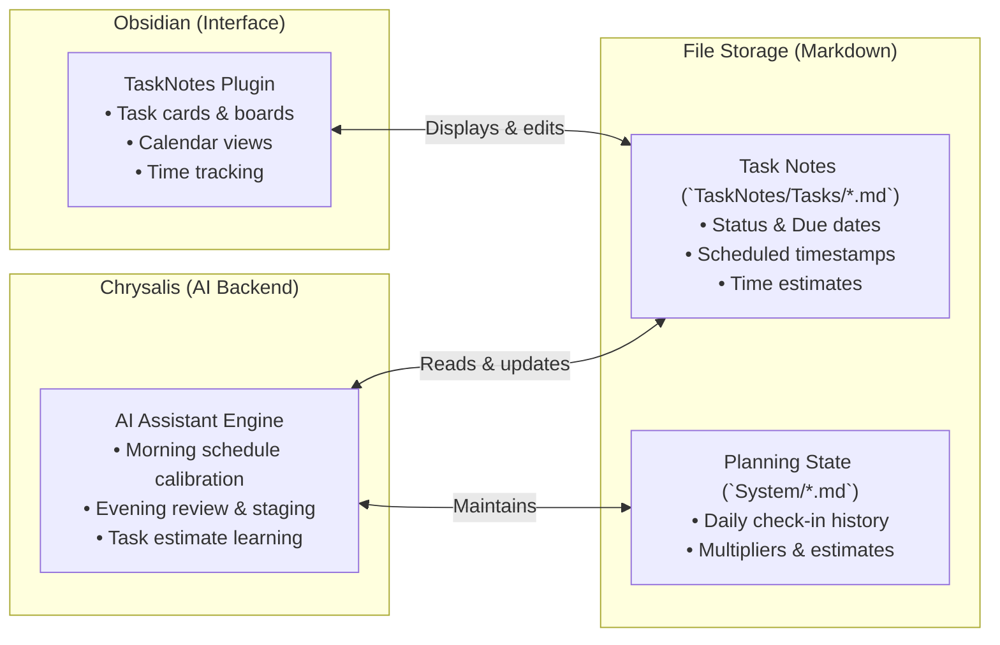
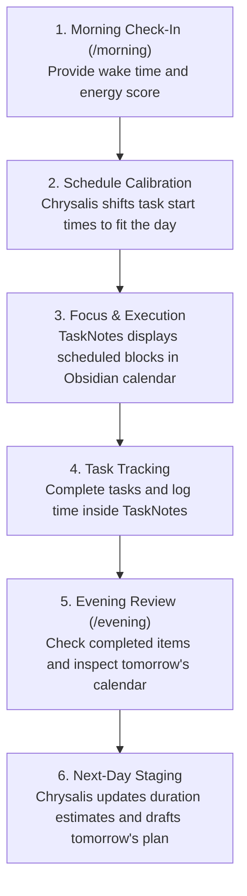
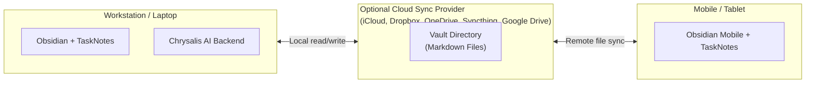

# Chrysalis

Chrysalis is an AI planning backend for the [TaskNotes](https://github.com/lucas-rego/obsidian-tasknotes) plugin in [Obsidian](https://obsidian.md).

> **Project status:** Early-stage personal project in active development. Formats and functionality may change as it is tested and updated.

---

## Overview

[TaskNotes](https://github.com/lucas-rego/obsidian-tasknotes) is an Obsidian plugin that manages tasks as individual Markdown notes, providing task cards, Kanban boards, calendar views, and time tracking.

Chrysalis acts as an AI companion backend for TaskNotes. It reads your task files and planning history, organizes them into daily schedules, adjusts timeblocks when your day changes, and updates task estimates based on how long past tasks took to complete.



---

## What It Does (Real-World Examples)

Chrysalis automates scheduling and time recalculations inside TaskNotes:

### 1. Rescheduling When You Start Late
* **The situation:** You had scheduled tasks to start at 8:00 AM, but you wake up or get to your desk at 9:30 AM.
* **What Chrysalis does:** When you run `/morning`, you provide your wake time and current energy. Chrysalis recalculates your day, shifts the `scheduled` timestamps forward on your TaskNotes files to start when you actually begin, and keeps your primary priorities intact. You do not need to manually drag tasks around in the calendar view.

### 2. Prioritizing Key Projects Over Routine Chores
* **The situation:** You have long-term projects (like coursework, writing, or home repairs) alongside everyday chores and administrative work (like email or filing receipts).
* **What Chrysalis does:** When assembling a daily schedule with `/plan`, Chrysalis places focused work on primary project deliverables into earlier high-energy focus blocks, scheduling routine and administrative tasks into afternoon or recovery windows.

### 3. Adjusting Time Estimates Based on Actual Duration
* **The situation:** A task is estimated at 30 minutes, but repeatedly takes 60 minutes in practice.
* **What Chrysalis does:** TaskNotes records when you start and complete a task. During the nightly `/audit`, Chrysalis compares your estimated durations against actual logged completion times and updates category multipliers so future schedules allocate realistic time.

### 4. Preparing Tomorrow's Schedule in Advance
* **The situation:** You want tomorrow morning's schedule set up before you finish work for the day.
* **What Chrysalis does:** During the `/evening` review, Chrysalis inspects your completed tasks from today, checks upcoming calendar events for tomorrow, selects candidate tasks, and drafts a proposed schedule for the next day.

### 5. Pausing Active Schedules for Time Off
* **The situation:** You are taking a weekend off, going on vacation, or out sick.
* **What Chrysalis does:** Running `/pause` de-schedules active timeblocks and stops schedule recalculations until you resume, preventing tasks from accumulating overdue notices while you are away.

---

## The Daily Planning Cycle



---

## Data Storage & Cross-Device Sync

### Local File Storage
All tasks, notes, and planning memory are plain Markdown files with YAML frontmatter stored on your local disk. Chrysalis does not use external databases or proprietary servers to store your tasks.

### Optional Cloud Sync
**Cloud storage is not required for Chrysalis to function.** Chrysalis can run entirely on a single desktop or laptop computer.

However, using a cloud storage provider (such as iCloud, Dropbox, OneDrive, Syncthing, or Google Drive) to sync the vault directory substantially increases utility:
* **Mobile & Tablet Access:** You can view your schedule, read notes, and check off tasks on your phone or tablet via the mobile Obsidian app while away from your desk.
* **Continuous Updates:** Changes made in TaskNotes on mobile sync back to your computer for Chrysalis to read during your next check-in.



---

## Command Reference

| Command | Function |
| :--- | :--- |
| **`/morning`** | Records wake time and energy rating, shifting the day's scheduled blocks in TaskNotes. |
| **`/evening`** | Reviews today's completed tasks, checks tomorrow's calendar, and stages a draft schedule. |
| **`/plan`** | Generates focus blocks for active tasks around external calendar commitments. |
| **`/task`** | Creates a new TaskNotes note with estimated duration, modality, and category tags. |
| **`/pause`** | Suspends active planning and clears scheduled timestamps during vacations or sick leave. |
| **`/resume`** | Resumes daily planning cycles following a pause. |
| **`/doctor`** | Checks vault files for missing tags, broken links, or frontmatter formatting issues. |
| **`/audit`** | Reconciles task completion logs, updates duration multipliers, and reviews upcoming milestones. |

---

## Setup

### Prerequisites
1. **[Obsidian](https://obsidian.md):** Installed on your computer.
2. **Community Plugins:**
   * **[TaskNotes](https://github.com/lucas-rego/obsidian-tasknotes):** Required. Provides the user interface for tasks, frontmatter management, and calendar views.
   * **[Dataview](https://github.com/blacksmithgu/obsidian-dataview):** Recommended for custom task dashboards and queries.
3. **AI Environment:** An environment that can interact with the vault folder (such as Google Antigravity).

### Installation
1. Clone or download this repository:
   ```bash
   git clone https://github.com/tama-gucci/chrysalis.git ~/chrysalis
   ```
2. Open the folder as a vault in Obsidian.
3. Enable the TaskNotes plugin in Obsidian settings.
4. Open the folder in your AI environment and run:
   ```text
   /onboard
   ```
   This initializes `System/Scheduling-Memory.md` and `System/Life-Roadmap.md` with your initial settings.

---

## License

This project is licensed under the [MIT License](LICENSE).
