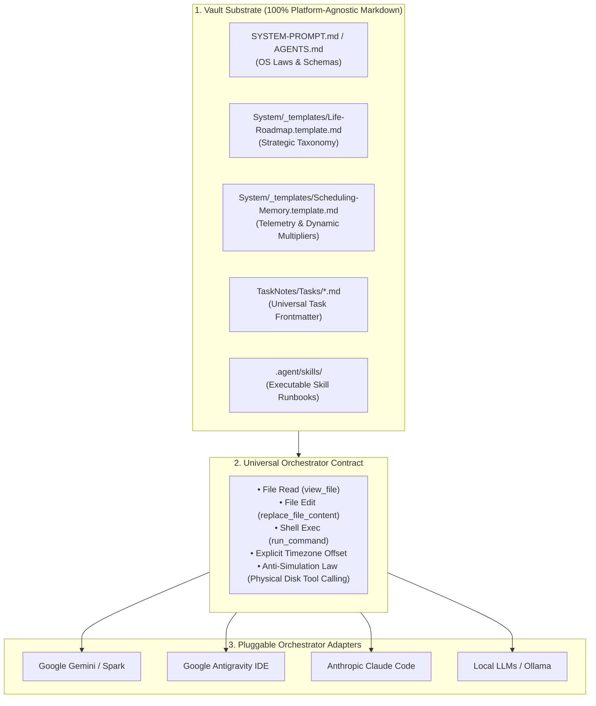

# Chrysalis OS

> **The Autonomous Bio-Cognitive Operating System for Obsidian & AI Agent Orchestrators.**

> [!WARNING]
> **Project Status: Early Alpha (Active Development)**  
> Chrysalis OS is currently in an experimental alpha state and is **not yet ready for general public use**. Schemas, autonomous skill protocols, and orchestrator contracts are undergoing rapid architectural evolution. Early adopters should expect frequent updates and breaking changes.

Chrysalis is an open-source, platform-agnostic personal operating system built on a **100% plain Markdown file substrate**. It bridges biological chronobiology, strategic life roadmaps, and autonomous AI agents (Google Gemini, Google Antigravity, Anthropic Claude, and Local LLMs) into a unified, self-calibrating daily focus loop.

---

## Key Features

* **Bio-Cognitive Ultradian Scheduling:** Aligns your daily focus blocks to your natural circadian and ultradian rhythms. Stack high-focus work into 75–90m sprints with 15m decompression buffers, paired by cognitive modality (Analytical $\to$ Peak Sprints, Kinetic $\to$ Slump/Defrost, Synthesis $\to$ Recovery).
* **Two-Stage Focus Planning Lifecycle:**
  * **Evening Staging (`/plan --stage` / `/evening`):** Ingests tomorrow's external calendar events, queries for additions, arbitrates priorities against your strategic roadmap, and stages a prototype schedule.
  * **Morning Calibration (`/plan --calibrate` / `/morning`):** Ingests actual wake time ($T_{\text{wake}}$) and subjective energy score ($1–5$), dynamically shifts diurnal sprint blocks, and locks ISO timestamps to task frontmatter on disk.
* **Modular Orchestrator Architecture:** Compatible with multiple AI platforms through standardized capability tiers (`operational_tier` vs `deep_reasoning_tier`):
  * **Google Gemini:** Cloud Spark scheduled cron prompts, Google Workspace tools, Nexus integration.
  * **Google Antigravity:** Native IDE agent skills, subagent task delegation.
  * **Anthropic Claude:** Claude Code CLI and Desktop MCP tools.
  * **Local LLMs:** Ollama, LM Studio, and Obsidian Nexus provider.
* **Adaptive Multiplier Learning:** Automatically learns dynamic time multipliers for your task categories based on actual completion deltas ($T_{\text{actual}} / T_{\text{estimated}}$), bounded in $[0.20, 2.00]$.
* **Automated Diagnostic Gate (`/doctor`):** Built-in 6-point integrity suite validating frontmatter schemas, explicit local timezone serialization (`-05:00`), strategic tag registries, wikilinks, and skill dependencies.
* **Semantic Pause Lifecycle (`/pause` & `/resume`):** Freeze schedule decay curves across 4 semantic modes (`maintenance`, `rest`, `flow`, `vacation`) with frictionless re-entry.

---

## System Architecture



---

## Quick Start (3-Minute Setup)

### 1. Clone & Bootstrap
```bash
# Clone the repository
git clone https://github.com/tama-gucci/chrysalis.git ~/Chrysalis
cd ~/Chrysalis

# Run the bootstrap installer (auto-detects local timezone & seeds templates)
./bootstrap.sh
```

### 2. Launch Obsidian
1. Download and install [Obsidian](https://obsidian.md).
2. Click **Open folder as vault** $\to$ Select the `~/Chrysalis` directory.
3. Click **Turn on community plugins** when prompted.

### 3. Run Autonomous Onboarding
Open your AI chat interface (Antigravity, Gemini CLI, or Claude Code) in the vault directory and type:
```text
/onboard
```
The agent will guide you through a 4-step intake interview or let you pick from pre-built archetype presets (*Student/Academic*, *Solo Founder/Dev*, *Career Switcher/Licensure*, *Creator/Freelancer*), automatically compiling your `Life-Roadmap.md` and seeding your daily focus rhythms!

---

## Interactive Skills & Slash Commands

All Chrysalis protocols are implemented as self-contained executable runbooks in `.agent/skills/`:

| Command | Skill | Description |
| :--- | :--- | :--- |
| **`/onboard`** | `onboard` | Interactive intake wizard: compiles strategic roadmap and seeds operational memory. |
| **`/morning`** | `morning` | 08:30 morning telemetry check-in: ingests wake time ($1–5$), shifts diurnal sprint blocks. |
| **`/evening`** | `evening` | 21:00 evening review: runs nightly audit and stages tomorrow's prototype schedule. |
| **`/plan`** | `plan` | Master two-stage focus scheduling engine (`--stage` / `--calibrate`). |
| **`/doctor`** | `doctor` | 6-point system integrity diagnostic suite and auto-heal validator. |
| **`/audit`** | `audit` | Nightly reconciliation: multiplier learning, 14-day horizon crawling, and RSI friction analysis. |
| **`/task`** | `task` | Shorthand natural language task parser with automatic multiplier adjustments. |
| **`/zettel`** | `zettel` | Atomic Zettelkasten note capture with bidirectional wikilinking. |
| **`/pause` / `/resume`** | `pause` | Manual system suspension across 4 semantic archetypes (`maintenance`, `rest`, `flow`, `vacation`). |

---

## The Anti-Simulation Law

Chrysalis enforces a strict constitutional invariant across all AI orchestrators:
> **Chat text output alone NEVER mutates system state.**  
> The agent must actively execute tool calls (`replace_file_content` / `write_to_file`) to persist schedule timestamps, check-in telemetry, and task mutations directly to Markdown files on disk.

---

## License
This project is open-source under the [MIT License](LICENSE).
