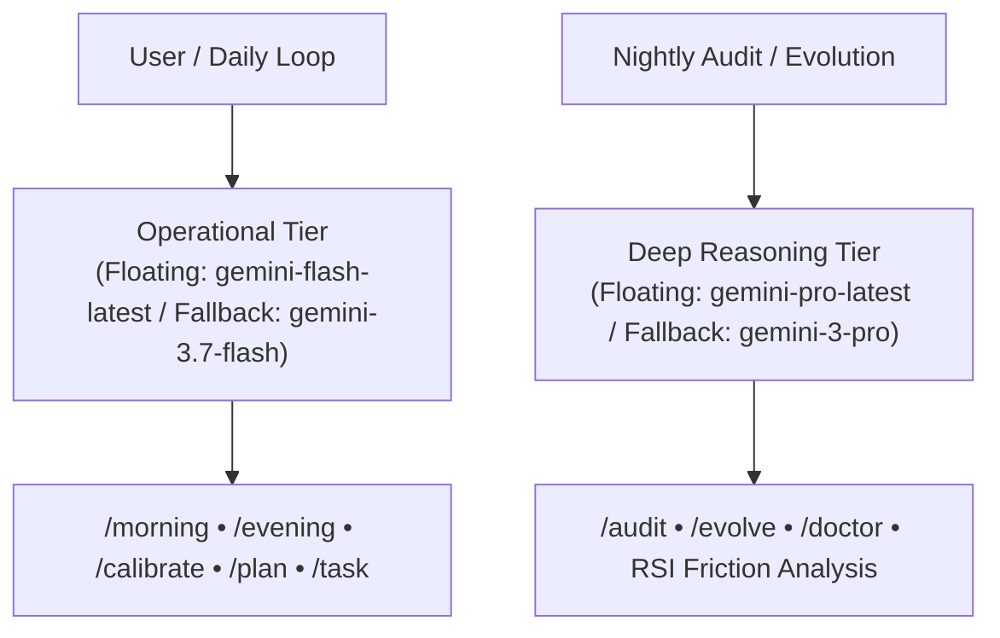
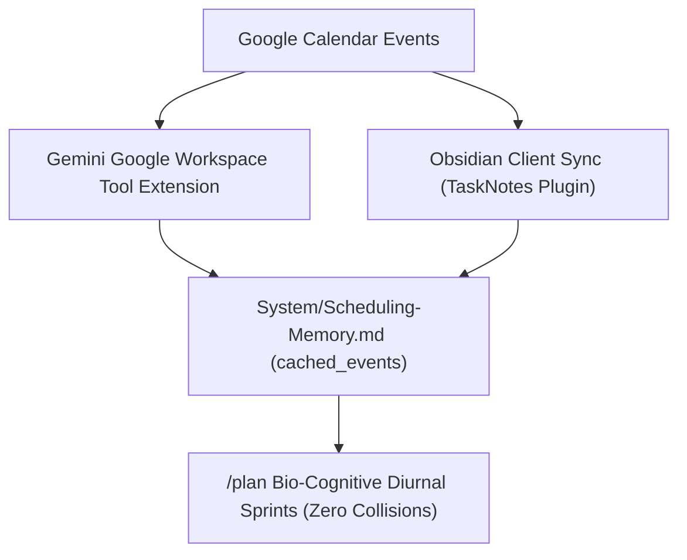

# ♊ Google Gemini Orchestrator Adapter

This document specifies the integration configuration, capability tier routing, scheduled automation hooks, and tool bindings when using **Google Gemini Spark** as the **Autonomous Production Orchestrator** running Chrysalis daily life operations over the Google Drive central substrate.

---

## 🎯 Capability Tier Architecture & Model Routing

Chrysalis decouples from hardcoded model names by using **Semantic Capability Tiers** paired with **floating provider aliases**.



* **Operational Tier (`gemini-flash-latest`):** 
  * Primary engine for rapid daily check-ins, bio-cognitive scheduling, and shorthand task capture.
  * Ensures zero-friction responsiveness during real-time human interaction.
* **Deep Reasoning Tier (`gemini-pro-latest`):**
  * Invoked during nightly reconciliation (`/audit`), capability evolution (`/evolve`), recursive self-improvement (RSI), and multi-project horizon crawls.
  * Utilizes extended thinking effort to formulate optimization hypotheses and verify code/frontmatter invariants.

---

## 🔄 Autonomous Terminology & Model Evolution via `/evolve`

This adapter evolves dynamically alongside Google Gemini model releases without manual code rewrites:

1. **Floating Aliases:** By targeting `gemini-flash-latest` and `gemini-pro-latest`, new architecture improvements are automatically inherited on backend rollout.
2. **Model Identifier Detection:** During development evolution passes, `/evolve` checks active tool configs and model releases to formulate `pinned_tested` updates.
3. **Slipbox Capability Ingestion:** When notes tagged `#chrysalis` mentioning new Gemini capabilities are captured in the Slipbox, `/evolve` generates an adapter upgrade proposal for evening staging.

---

## ⏰ Google Spark Autonomous Cron Prompts

Chrysalis uses two daily scheduled prompts to maintain biological rhythm synchronization:

### 1. Morning Calibration Prompt (Scheduled: Daily at `08:30 CDT`)
* **Cron Target:** `30 8 * * *`
* **Execution Mode:** Headless / Interactive Notification
* **Target Tier:** `operational_tier` (`gemini-flash-latest`)
* **Prompt Payload:**
  ```text
  You are the Chrysalis Operating System orchestrator.
  Execute skill /morning:
  1. Read System/Scheduling-Memory.md to inspect current pause state and pre-approved prototype schedule.
  2. If active, prompt the user for morning wake telemetry (energy score 1-5 and wake notes).
  3. When telemetry is received, calculate rolling rhythms, shift diurnal focus blocks relative to Twake, execute tool calls to serialize scheduled timestamps to TaskNotes/Tasks/*.md, and write today's YYYY-MM-DD.md note.
  Follow all constitutional invariants in System/SYSTEM-PROMPT.md.
  ```

### 2. Evening Staging & Nightly Audit Prompt (Scheduled: Daily at `21:00 CDT`)
* **Cron Target:** `0 21 * * *`
* **Execution Mode:** Headless / Interactive Notification
* **Target Tier:** `deep_reasoning_tier` (`gemini-pro-latest`) for audit/evolution, switching to `operational_tier` for staging
* **Prompt Payload:**
  ```text
  You are the Chrysalis Operating System orchestrator.
  Execute skill /evening:
  1. Run the unified nightly audit (/audit): reconcile completed tasks, update bounded tag multipliers in [0.20, 2.00], ingest upcoming 14-day roadmap horizons, inject starter wedges into stalled tasks, and maintain inferred task pool.
  2. If /evolve is present, execute capability expansion pass for pending feature proposals.
  3. Ingest external Google Calendar events for tomorrow via Google Workspace tool extension or cached events in Scheduling-Memory.md.
  4. Query the user for any schedule additions, arbitrate priority with Life-Roadmap.md, assemble the prototype focus schedule with ultradian sprints, and serialize to prototype_schedule in Scheduling-Memory.md.
  Follow all constitutional invariants in System/SYSTEM-PROMPT.md.
  ```

---

## 📅 Calendar Ingestion & Collision Avoidance

Gemini orchestrates calendar synchronization through a cloud-native dual-layer strategy:



1. **Cloud / Google Workspace Ingestion (Primary Production Mode):**
   * If Gemini Workspace extensions are active in the environment, queries `Google Calendar` directly and persists any newly detected events to `Scheduling-Memory.md`.
2. **Client-Synchronized Event Cache (Obsidian Sync):**
   * Reads `calendar_sync.cached_events` from `Scheduling-Memory.md` as primary ground truth (populated and kept current by client-side TaskNotes calendar sync across synced devices).
   * Focus blocks automatically wrap around scheduled meetings, classes, or external events with zero collisions.

---

## 🔌 Obsidian Nexus Provider Configuration (Optional Client Integration)

To connect Gemini directly within Obsidian via the Nexus plugin:

```json
{
  "llmProviders": {
    "google-gemini-cli": {
      "apiKey": "gemini-cli-local-auth",
      "enabled": true,
      "providerId": "google-gemini-cli"
    }
  },
  "defaultModel": {
    "provider": "google-gemini-cli",
    "model": "gemini-3.7-flash"
  }
}
```

---

## 🛡️ Invariant Compliance Mandate

When Gemini executes as the Chrysalis orchestrator:
* **Tool-Gated Disk Mutation:** Gemini MUST execute `replace_file_content` or `write_to_file` on disk files. Merely emitting text tables in chat is a fatal anti-simulation breach.
* **Explicit Timezone Offset:** All generated timestamps must strictly include the explicit local timezone offset (`"-05:00"`).

