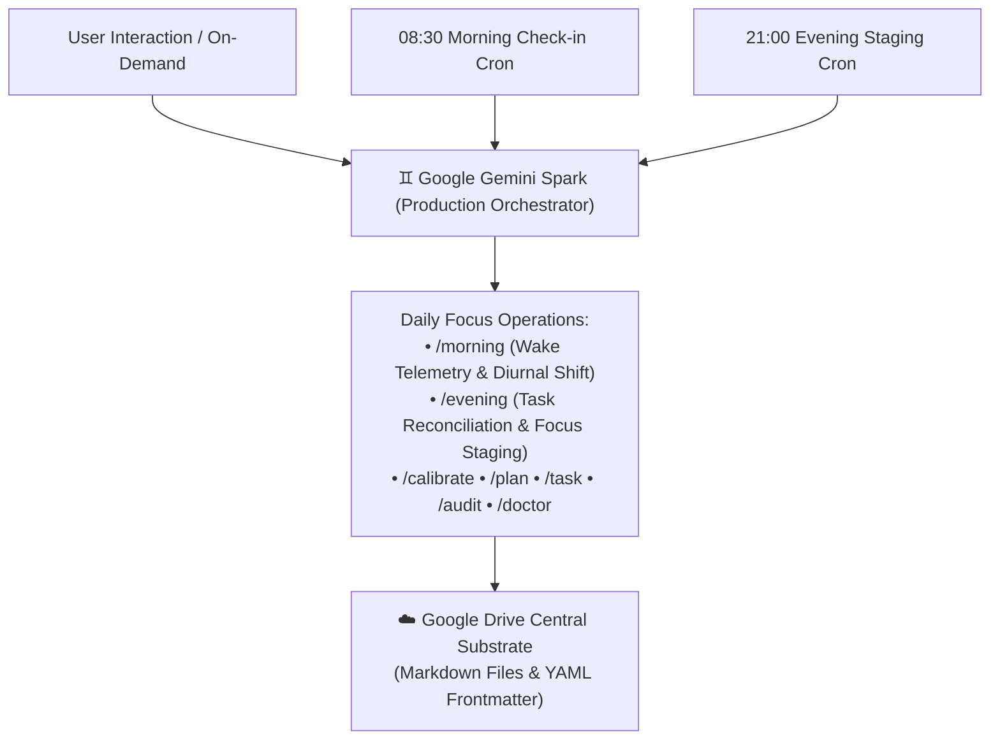
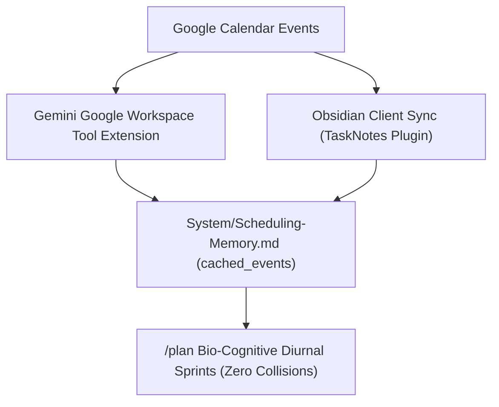

# ♊ Google Gemini Orchestrator Adapter

This document specifies the scheduled automation hooks, cloud-native calendar ingestion, and tool bindings when using **Google Gemini Spark** as the **Autonomous Production Orchestrator** running Chrysalis daily life operations over the Google Drive central substrate.

---

## 🌐 Autonomous Production Lifecycle

Google Gemini Spark operates as the autonomous production runtime for Chrysalis, executing scheduled daily life loops and real-time operational commands directly over Google Drive:



* **Interactive / On-Demand Loops:** Real-time check-ins, bio-cognitive scheduling, shorthand task creation, and emergency pause/resumption (`/morning`, `/plan`, `/task`, `/pause`, `/resume`).
* **Scheduled Lifecycles:** Nightly task audit and roadmap horizon reconciliation (`/evening`, `/audit`) and morning wake calibration (`/morning`, `/calibrate`).

---

## ⏰ Google Spark Autonomous Cron Prompts

Chrysalis uses two daily scheduled prompts to maintain biological rhythm synchronization:

### 1. Morning Calibration Prompt (Scheduled: Daily at `08:30 CDT`)
* **Schedule Name:** `Chrysalis Morning Orchestrator`
* **Cron Target:** `30 8 * * *`
* **Execution Mode:** Interactive Notification / Daily Trigger
* **Prompt Payload:**
  ```text
  [CONTEXT & IDENTITY]
  You are the autonomous orchestrator for Chrysalis, a Markdown-based focus planning, task management, and knowledge system stored in Google Drive in the "chrysalis/" folder.
  All state, roadmaps, task lifecycles, and operational skills exist as plain Markdown files with YAML frontmatter in the "chrysalis/" directory.

  [GROUNDING & BOOTSTRAP]
  Upon execution, read the following core files in Google Drive:
  1. "chrysalis/GEMINI.md" and "chrysalis/System/SYSTEM-PROMPT.md" — Constitutional laws, schemas, and invariants.
  2. "chrysalis/System/Scheduling-Memory.md" — Dynamic operational state, timezone offset ("-05:00"), pause flags, wake rhythms, and pre-approved prototype schedule.
  3. "chrysalis/.agent/skills/morning/SKILL.md" — Executable morning runbook.

  [TASK EXECUTION]
  Execute skill /morning:
  1. Inspect pause state in "chrysalis/System/Scheduling-Memory.md". If paused, respect the pause policy.
  2. If active, prompt the user in natural language for morning wake telemetry (energy score 1-5 and wake notes / actual wake time).
  3. Once telemetry is received:
     - Ingest today's external events from Google Calendar (via Google Workspace tools) or "calendar_sync.cached_events" in "chrysalis/System/Scheduling-Memory.md" to guarantee zero schedule collisions.
     - Shift diurnal focus sprint blocks (75-90m ultradian focus sprints with 15m decompression buffers) anchored to actual wake time (Twake).
     - Execute file tool calls (replace_file_content / write_to_file) to write locked timestamps ("scheduled: YYYY-MM-DDTHH:mm:ss-05:00") into "chrysalis/TaskNotes/Tasks/*.md".
     - Create today's daily note at "chrysalis/YYYY-MM-DD.md".
     - Update "morning_checkin" in "chrysalis/System/Scheduling-Memory.md".

  [CONSTITUTIONAL INVARIANTS]
  - Anti-Simulation Law: You MUST execute file tool calls (replace_file_content / write_to_file) on Google Drive files. Chat text alone never modifies system state.
  - Explicit Timezone: All timestamps must include the explicit local offset from Scheduling-Memory.md (e.g., "-05:00"). Never write raw UTC "Z" strings.
  ```

### 2. Evening Staging & Nightly Audit Prompt (Scheduled: Daily at `21:00 CDT`)
* **Schedule Name:** `Chrysalis Evening Orchestrator`
* **Cron Target:** `0 21 * * *`
* **Execution Mode:** Interactive Notification / Nightly Trigger
* **Prompt Payload:**
  ```text
  [CONTEXT & IDENTITY]
  You are the autonomous orchestrator for Chrysalis, a Markdown-based focus planning, task management, and knowledge system stored in Google Drive in the "chrysalis/" folder.
  All state, roadmaps, task lifecycles, and operational skills exist as plain Markdown files with YAML frontmatter in the "chrysalis/" directory.

  [GROUNDING & BOOTSTRAP]
  Upon execution, read the following core files in Google Drive:
  1. "chrysalis/GEMINI.md" and "chrysalis/System/SYSTEM-PROMPT.md" — Constitutional laws, schemas, and invariants.
  2. "chrysalis/System/Scheduling-Memory.md" — Dynamic operational state, timezone offset ("-05:00"), bounded multipliers, pause state, and candidate task pools.
  3. "chrysalis/System/Life-Roadmap.md" & "chrysalis/Projects/*/Roadmap.md" — Primary strategic priority arbiter and active deliverables.
  4. "chrysalis/.agent/skills/evening/SKILL.md" — Executable evening runbook.

  [TASK EXECUTION]
  Execute skill /evening:
  1. Run Unified Nightly Audit (/audit):
     - Reconcile completed tasks in "chrysalis/TaskNotes/Tasks/*.md" against completed session deltas and update bounded multipliers within [0.20, 2.00] in "chrysalis/System/Scheduling-Memory.md".
     - Ingest upcoming 14-day roadmap milestones from "chrysalis/System/Life-Roadmap.md" and create new task notes if needed.
     - Inject Starter Wedges (micro_chunked: true) into stalled tasks (>72h).
     - Maintain the candidate task pool in "chrysalis/System/Scheduling-Memory.md".
  2. Ingest external Google Calendar events for tomorrow via Google Workspace tools or cached_events in "chrysalis/System/Scheduling-Memory.md".
  3. Prompt the user in natural language for any schedule additions, errands, or context for tomorrow.
  4. Arbitrate daily priority against "chrysalis/System/Life-Roadmap.md" (active roadmap milestones take Peak Focus slots; user additions fill downtime/slump windows).
  5. Assemble tomorrow's prototype focus schedule (75-90m ultradian sprints, 15m decompression buffers) and execute file tool calls to serialize "prototype_schedule" into "chrysalis/System/Scheduling-Memory.md".

  [CONSTITUTIONAL INVARIANTS]
  - Anti-Simulation Law: You MUST execute file tool calls (replace_file_content / write_to_file) on Google Drive files. Chat text alone never modifies system state.
  - Explicit Timezone: All timestamps must include the explicit local offset from Scheduling-Memory.md (e.g., "-05:00"). Never write raw UTC "Z" strings.
  ```

---

## 📅 Calendar Ingestion & Collision Avoidance

Gemini orchestrates calendar synchronization through a cloud-native dual-layer strategy:



1. **Cloud / Google Workspace Ingestion (Primary Production Mode):**
   * If Gemini Workspace extensions are active in the environment, queries `Google Calendar` directly and persists any newly detected events to `Scheduling-Memory.md`.
2. **Client-Synchronized Event Cache (Obsidian Sync):**
   * Reads `calendar_sync.cached_events` from `Scheduling-Memory.md` as primary ground truth (populated and kept current by client-side TaskNotes calendar sync across synced devices).
   * Focus blocks automatically wrap around scheduled meetings, classes, or external events with zero collisions.

---

## 🔌 Obsidian Nexus Provider Configuration (Optional Client Integration)

To connect Gemini directly within Obsidian via the Nexus plugin:

```json
{
  "llmProviders": {
    "google-gemini-cli": {
      "apiKey": "gemini-cli-local-auth",
      "enabled": true,
      "providerId": "google-gemini-cli"
    }
  },
  "defaultModel": {
    "provider": "google-gemini-cli",
    "model": "gemini-3.7-flash"
  }
}
```

---

## 🛡️ Invariant Compliance Mandate

When Gemini executes as the Chrysalis orchestrator:
* **Tool-Gated Disk Mutation:** Gemini MUST execute `replace_file_content` or `write_to_file` on disk files. Merely emitting text tables in chat is a fatal anti-simulation breach.
* **Explicit Timezone Offset:** All generated timestamps must strictly include the explicit local timezone offset (`"-05:00"`).

