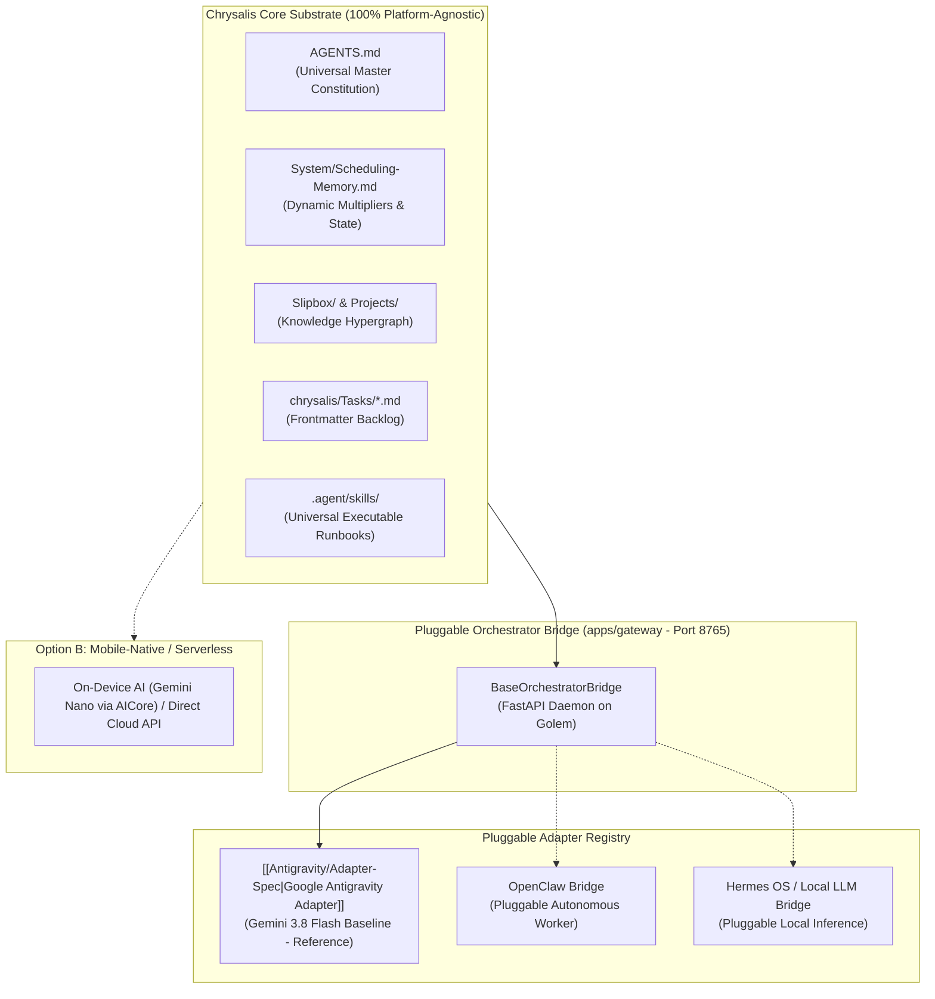

# 🔌 Chrysalis Modular Orchestrator Architecture

Chrysalis is designed with a **strictly decoupled, platform-agnostic core substrate**. All schemas, state machines, bio-cognitive diurnal algorithms, mathematical learning models, and skills exist as universal Markdown specifications on disk.

The **Orchestrator Layer** fulfills **Pillar II (Orchestrator Processing)** of the Chrysalis data flow: connecting autonomous AI agent runtimes to the Markdown substrate through standardized runtime contracts, semantic capability tiers, and modular adapters.

---

## 🏛️ Architecture & Active Orchestrator

---

## 📋 The Universal Orchestrator Contract

To orchestrate Chrysalis, an AI agent platform must satisfy six core capabilities:

1. **Physical Disk Mutation (Anti-Simulation Law):** Chat text generation alone NEVER modifies Chrysalis state. The orchestrator must actively execute physical tool calls (`replace_file_content`, `write_to_file`) to persist schedule timestamps, check-in telemetry, and task creations directly to disk.
2. **Standard Tool Interface:**
   * **Read:** Inspect files (`view_file`).
   * **Write/Edit:** Modify existing files with precise contiguous replacements (`replace_file_content`) or write new files (`write_to_file`).
3. **Explicit Local Timezone Enforcement:** All generated or mutated timestamps must serialize with the explicit local offset defined in `Scheduling-Memory.md` (`-05:00`). Raw UTC (`Z`) timestamps are strictly prohibited.
4. **Skill Discovery & State Execution:** The orchestrator discovers and executes operational protocols defined in `.agent/skills/<skill>/SKILL.md` (`doctor`, `audit`, `plan`, `morning`, `evening`, `pause`, `task`, `project`, `zettel`, `onboard`).
5. **Knowledge Hypergraph Linking:** The orchestrator bidirectionally links atomic Zettelkasten research notes (`Slipbox/`) to strategic deliverables (`Projects/*/Roadmap.md`) and execution frontmatter (`chrysalis/Tasks/*.md` `linked_zettels`).
6. **Calendar Synchronization & Port Coexistence:** The orchestrator synchronizes with external calendar commitments (via Model C Mobile OS Bridge, private iCal feed `fetch_ical.py`, or chrysalis-obsidian MCP) and respects the strict port boundary: port `8080` for chrysalis-obsidian, port `8765` for the Ambient Gateway.

---

## 🗂️ Active Orchestrator Registry

| Adapter | Primary Runtime / Environment | Integration Type | Documentation | Status |
| :--- | :--- | :--- | :--- | :---: |
| **Google Antigravity** | Antigravity IDE, Antigravity 2.0, `language_server.exe` / `agentapi` | Interactive / Scheduled Native Tool Adapter (Gemini 3.8 Flash Baseline) | `[[Antigravity/Adapter-Spec\|Antigravity Adapter]]` | 🟢 Active Module |
| **OpenClaw** | OpenClaw runtime / background orchestrator | Pluggable Gateway Adapter | `System/Orchestrators/OpenClaw/` | 🟡 Specification |
| **Hermes OS / Local LLM** | Local inference engine (GGUF/vLLM) | Pluggable Gateway Adapter | `System/Orchestrators/Hermes/` | 🟡 Specification |

---

## 🔄 Operating with Google Antigravity

Ensure your workspace root contains `AGENTS.md` and review the operational runbooks and tool contracts in `[[Antigravity/Adapter-Spec|System/Orchestrators/Antigravity/Adapter-Spec.md]]`.
