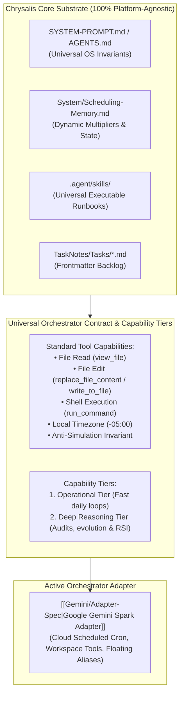

# 🔌 Chrysalis Modular Orchestrator Architecture

Chrysalis is designed with a **strictly decoupled, platform-agnostic core substrate**. All schemas, state machines, bio-cognitive diurnal algorithms, mathematical learning models, and skills exist as universal Markdown specifications on disk.

The **Orchestrator Layer** connects autonomous AI agent runtimes to the Chrysalis substrate through standardized runtime contracts, semantic capability tiers, and modular adapters.

---

## 🏛️ Architecture & Active Orchestrator

---

## 🎯 Semantic Capability Tiers & Model Routing

Chrysalis standardizes on two functional **Capability Tiers**:

1. **`operational_tier` (Daily Focus Loops):**
   * **Role:** Real-time conversational check-ins, bio-cognitive diurnal scheduling, task creation, and calendar synchronization (`/morning`, `/evening`, `/calibrate`, `/plan`, `/task`).
   * **Target:** `gemini-flash-latest` (Pinned Tested: `gemini-3.7-flash`).
2. **`deep_reasoning_tier` (Audits, Capability Evolution & RSI):**
   * **Role:** Nightly reconciliation (`/audit`), capability expansion and architectural self-improvement (`/evolve`), multi-project milestone crawling, and diagnostic auto-heals (`/doctor`).
   * **Target:** `gemini-pro-latest` (Pinned Tested: `gemini-3-pro`).

---

## 📋 The Universal Orchestrator Contract

To orchestrate Chrysalis, an AI agent platform must satisfy five basic capabilities:

1. **Physical Disk Mutation (Anti-Simulation Law):** Chat text generation alone NEVER modifies Chrysalis state. The orchestrator must actively execute tool calls (`replace_file_content`, `write_to_file`) to persist schedule timestamps, check-in telemetry, and task creations directly to disk.
2. **Standard Tool Interface:**
   * **Read:** Inspect files (`view_file`).
   * **Write/Edit:** Modify existing files with precise contiguous replacements (`replace_file_content`) or write new files (`write_to_file`).
   * **Execute:** Shell execution (`run_command` / bash) for environment scripts (e.g. `sync_calendar.py`, `generate_manifest.py`).
3. **Explicit Local Timezone Enforcement:** All generated or mutated timestamps must serialize with the explicit local offset defined in `Scheduling-Memory.md` (`-05:00`). Raw UTC (`Z`) timestamps are strictly prohibited.
4. **Skill Discovery & State Execution:** The orchestrator discovers and executes operational protocols defined in `chrysalis/.agent/skills/<skill>/SKILL.md` (`doctor`, `audit`, `evolve`, `plan`, `morning`, `evening`, `pause`, `task`, `zettel`, `onboard`).
5. **Calendar Ingestion & Collision Avoidance:** The orchestrator retrieves external schedule commitments (via the local TaskNotes HTTP API bridge at `localhost:8080`, cached memory events, or host-native calendar integrations) and wraps focus sprints around them without collisions.

---

## 🗂️ Active Orchestrator Registry

| Adapter | Primary Runtime / Environment | Integration Type | Documentation | Status |
| :--- | :--- | :--- | :--- | :---: |
| **Google Gemini Spark** | Google Spark Scheduled Prompts, Google Workspace, Gemini CLI | Cloud Scheduled Cron / Workspace | `[[Gemini/Adapter-Spec\|Gemini Adapter]]` | 🟢 Active Module |

---

## 🔄 Operating with Google Gemini Spark

Ensure your root `GEMINI.md` points to `System/SYSTEM-PROMPT.md` and review the cron schedules and tool mappings in `[[Gemini/Adapter-Spec|System/Orchestrators/Gemini/Adapter-Spec.md]]`.
