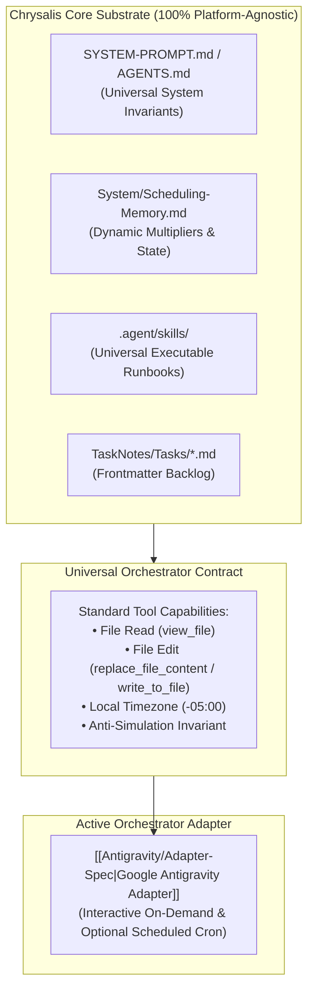

# 🔌 Chrysalis Modular Orchestrator Architecture

Chrysalis is designed with a **strictly decoupled, platform-agnostic core substrate**. All schemas, state machines, bio-cognitive diurnal algorithms, mathematical learning models, and skills exist as universal Markdown specifications on disk.

The **Orchestrator Layer** connects autonomous AI agent runtimes to the Chrysalis substrate through standardized runtime contracts, semantic capability tiers, and modular adapters.

---

## 🏛️ Architecture & Active Orchestrator

---

## 📋 The Universal Orchestrator Contract

To orchestrate Chrysalis, an AI agent platform must satisfy five basic capabilities:

1. **Physical Disk Mutation (Anti-Simulation Law):** Chat text generation alone NEVER modifies Chrysalis state. The orchestrator must actively execute tool calls (`replace_file_content`, `write_to_file`) to persist schedule timestamps, check-in telemetry, and task creations directly to disk.
2. **Standard Tool Interface:**
   * **Read:** Inspect files (`view_file`).
   * **Write/Edit:** Modify existing files with precise contiguous replacements (`replace_file_content`) or write new files (`write_to_file`).
3. **Explicit Local Timezone Enforcement:** All generated or mutated timestamps must serialize with the explicit local offset defined in `Scheduling-Memory.md` (`-05:00`). Raw UTC (`Z`) timestamps are strictly prohibited.
4. **Skill Discovery & State Execution:** The orchestrator discovers and executes operational protocols defined in `chrysalis/.agent/skills/<skill>/SKILL.md` (`doctor`, `audit`, `plan`, `morning`, `evening`, `pause`, `task`, `zettel`, `onboard`).
5. **Calendar Ingestion & Collision Avoidance:** The orchestrator retrieves external schedule commitments (via TaskNotes MCP, cached memory events in `Scheduling-Memory.md`, or client synchronization) and wraps focus sprints around them without collisions.

---

## 🗂️ Active Orchestrator Registry

| Adapter | Primary Runtime / Environment | Integration Type | Documentation | Status |
| :--- | :--- | :--- | :--- | :---: |
| **Google Antigravity** | Antigravity IDE, Antigravity 2.0, `agy` CLI | Interactive / Scheduled Native Tool Adapter | `[[Antigravity/Adapter-Spec\|Antigravity Adapter]]` | 🟢 Active Module |

---

## 🔄 Operating with Google Antigravity

Ensure your workspace root contains `AGENTS.md` and review the operational runbooks and tool contracts in `[[Antigravity/Adapter-Spec|System/Orchestrators/Antigravity/Adapter-Spec.md]]`.
