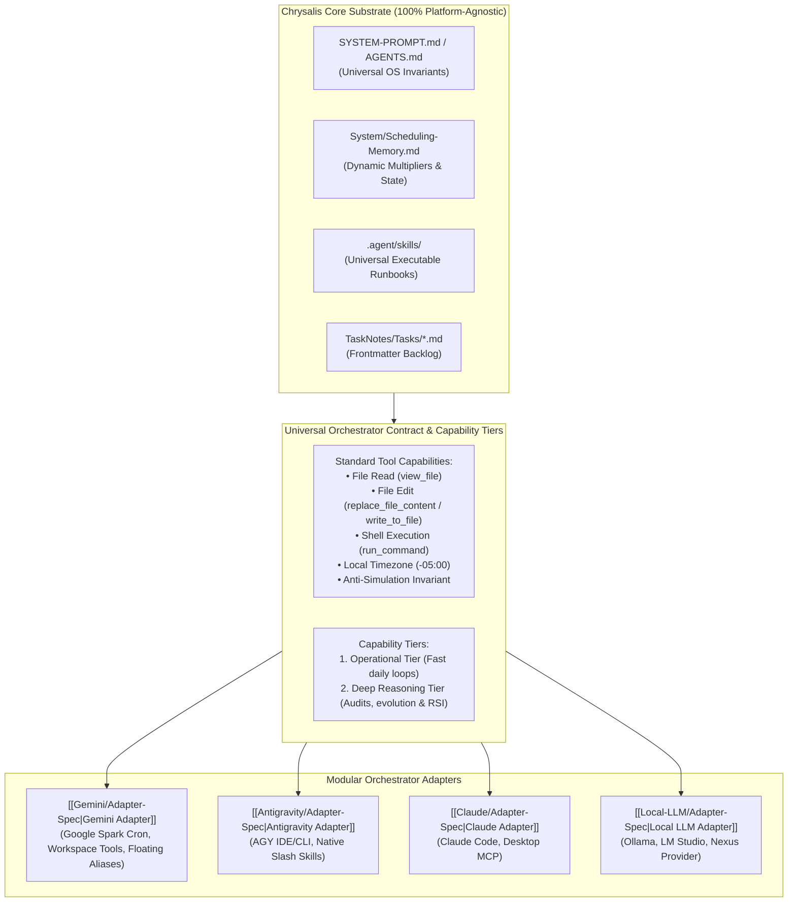

# 🔌 Chrysalis Modular Orchestrator Architecture

Chrysalis is designed with a **strictly decoupled, platform-agnostic core substrate**. All schemas, state machines, bio-cognitive diurnal algorithms, mathematical learning models, and skills exist as universal Markdown specifications on disk.

The **Orchestrator Layer** connects autonomous AI agent runtimes to the Chrysalis substrate through standardized runtime contracts, semantic capability tiers, and modular adapters.

---

## 🏛️ Architecture Overview

---

## 🎯 Semantic Capability Tiers & Model Evolution

Rather than hardcoding static point releases across the OS, Chrysalis standardizes on two functional **Capability Tiers**:

1. **`operational_tier` (Daily Focus Loops):**
   * **Role:** Real-time conversational check-ins, bio-cognitive diurnal scheduling, task creation, and calendar synchronization (`/morning`, `/evening`, `/calibrate`, `/plan`, `/task`).
   * **Requirements:** Low-latency response times, high throughput, robust structured tool calling, large context window ($1\text{M}+$ tokens).
   * **Resolution Strategy:** Targets provider floating aliases (e.g. `gemini-flash-latest`, `claude-sonnet-latest`, `qwen2.5-coder:latest`) with tested pinned fallbacks.
2. **`deep_reasoning_tier` (Audits, Capability Evolution & RSI):**
   * **Role:** Nightly reconciliation (`/audit`), capability expansion and architectural self-improvement (`/evolve`), multi-project milestone crawling, and diagnostic auto-heals (`/doctor`).
   * **Requirements:** Extended thinking / reasoning effort, complex multi-step planning, deep invariant verification.
   * **Resolution Strategy:** Targets provider frontier reasoning aliases (e.g. `gemini-pro-latest`, `claude-thought-latest`, `deepseek-r1:latest`).

---

## 🔄 Autonomous Terminology & Model Upgrades via `/evolve`

Chrysalis adapts to ongoing advancements in the AI landscape through the dedicated capability expansion engine:
* **Package & CLI Telemetry Detection:** During system evolution passes (`/evolve`), the system checks environment package manifests (`System/Environment/obelisk.md`) and plugin configs (`.obsidian/plugins/nexus/data.json`). When new model identifiers or CLI updates are detected, `/evolve` updates the pinned model fallbacks in `Adapter-Spec.md`.
* **Proactive `#chrysalis` Ingestion:** When the user captures a note in `Slipbox/` with `#chrysalis` announcing a new model architecture or tooling release, `/evolve` automatically synthesizes an adapter upgrade specification, stages it for evening review, and records deployment in `System/Changelog.md`.

---

## 📋 The Universal Orchestrator Contract

To orchestrate Chrysalis, an AI agent or platform must satisfy five basic capabilities:

1. **Physical Disk Mutation (Anti-Simulation Law):** Chat text generation alone NEVER modifies Chrysalis state. The orchestrator must actively execute tool calls (`replace_file_content`, `write_to_file`) to persist schedule timestamps, check-in telemetry, and task creations directly to disk.
2. **Standard Tool Interface:**
   * **Read:** Ability to inspect files (`view_file` / `cat`).
   * **Write/Edit:** Ability to modify existing files with precise contiguous replacements (`replace_file_content`) or write new files (`write_to_file`).
   * **Execute:** Shell execution (`run_command` / bash) for environment scripts (e.g. `sync_calendar.py`, `generate_manifest.py`).
3. **Explicit Local Timezone Enforcement:** All generated or mutated timestamps must serialize with the explicit local offset defined in `Scheduling-Memory.md` (`-05:00`). Raw UTC (`Z`) timestamps are strictly prohibited.
4. **Skill Discovery & State Execution:** The orchestrator discovers and executes operational protocols defined in `chrysalis/.agent/skills/<skill>/SKILL.md` (`doctor`, `audit`, `evolve`, `plan`, `morning`, `evening`, `pause`, `task`, `zettel`, `onboard`).
5. **Calendar Ingestion & Collision Avoidance:** The orchestrator retrieves external schedule commitments (via the local TaskNotes HTTP API bridge at `localhost:8080`, cached memory events, or host-native calendar integrations) and wraps focus sprints around them without collisions.

---

## 🗂️ Registered Orchestrator Adapters

| Adapter | Primary Runtime / Environment | Integration Type | Documentation | Status |
| :--- | :--- | :--- | :--- | :---: |
| **Google Gemini** | Google Spark Scheduled Prompts, Gemini CLI, Nexus | Cloud Cron / Workspace / CLI | `[[Gemini/Adapter-Spec\|Gemini Adapter]]` | 🟢 Active Module |
| **Google Antigravity** | Antigravity IDE, `agy` CLI | Native IDE Agent / Subagents | `[[Antigravity/Adapter-Spec\|Antigravity Adapter]]` | 🟢 Active Module |
| **Anthropic Claude** | Claude Code CLI, Claude Desktop MCP | Local CLI / MCP Server | `[[Claude/Adapter-Spec\|Claude Adapter]]` | 🟡 Reference Spec |
| **Local LLMs / Ollama** | Ollama, LM Studio, Obsidian Nexus Plugin | Local Inference / REST / Tool Calling | `[[Local-LLM/Adapter-Spec\|Local LLM Adapter]]` | 🟡 Reference Spec |

---

## 🔄 Selecting or Switching Your Orchestrator

1. **To use Google Gemini:** Ensure your root `GEMINI.md` points to `System/SYSTEM-PROMPT.md` and review the cron schedules and tool mappings in `System/Orchestrators/Gemini/Adapter-Spec.md`.
2. **To use Antigravity:** Open the vault in Antigravity IDE; skills and slash commands in `.agent/skills/` are loaded natively.
3. **To use an Alternative Orchestrator:** Consult the corresponding adapter specification in this directory to configure prompt wrappers, tool schemas, or scheduled automation scripts.
