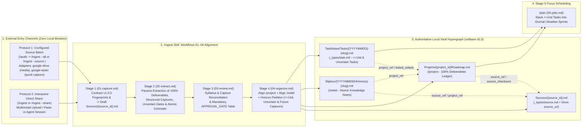

# Chrysalis Data Ingestion Architecture & `/ingest` Operational Guide

> **Architectural Decision & Storage Invariant (`STATUS.md` & `ARCHITECTURE.md`)**:
> 1. **Zero Local Binary Storage in the Vault:** All original binary and raw source files (PDF syllabi, textbooks, slide decks, audio recordings, lecture videos, whiteboard photos, datasets) remain outside the Markdown vault in the configured external media storage boundary (`preserve_originals_in_place: true`, e.g., `Chrysalis-Media-Locker/01-Inbox` and `Chrysalis-Media-Locker/02-Projects` via the optional `google-drive` integration skill or local filesystem mount) so the vault remains pure UTF-8 Markdown.
> 2. **No Local `Resources/` Folder:** A `Resources/` folder inside `Projects/<id>/` or the Chrysalis vault is unnecessary and retired.
> 3. **Provider-Independent Core `/ingest` & Optional Integration Skills:** Core `.agent/skills/ingest/SKILL.md` is 100% provider-independent and operates on normalized `v1.0.0` Ingestion Input Contract (`contracts/ingestion-input.contract.md`) envelopes (`file`, `text`, `structured_task`). Optional integration skills (`.agent/skills/google-drive/SKILL.md` for `media` and `.agent/skills/google-tasks/SKILL.md` for one-way read-only `quick-capture`) discover configured source aliases (`/ingest --source <alias>`, `/ingest --all`, with legacy `--drive` compatibility), translating external sources into schema-validated UTF-8 Markdown records (`Sources/{source_id}.md`, `Projects/{project_id}/Roadmap.md`, `Slipbox/{YYYYMMDDHHmmss}-{slug}.md`, and `TaskNotes/Tasks/{YYYYMMDD}-{slug}.md`).

---

## 1. Executive Architecture: The `/ingest` Pipeline (`Workflows 01–04` $\to$ `/plan`)

In **Chrysalis (`mdbase v0.3`)**, the **local Markdown vault (`mdbase.yaml`) is the single, authoritative source of truth for structured UTF-8 Markdown records**, while external media folders and one-way capture lists serve strictly as read-only inputs (`mode: read_only`, `write_back_supported: false`). Under **ADR 0006 (Exact-Document Storage Authority)**, every Markdown record's revision is defined by the cryptographic digest of its raw UTF-8 document bytes:

$$\text{revision} = \text{sha256}(\text{UTF-8 document bytes})$$



### The Four Canonical Markdown Records Produced by `/ingest`
1. **Ingestion Provenance (`Sources/{source_id}.md` — `_types/source.md`)**:
   Content-addressed record (`id`, binary `sha256` when `bytes_available: true`, or `normalized_text_sha256` when text-only) preserving original files in their existing `Chrysalis-Media-Locker/01-Inbox` or `Chrysalis-Media-Locker/02-Projects/<course-or-project>/**` locations (`preserve_originals_in_place: true`), encapsulating the translated Markdown representation inside `<untrusted_document_payload source_id="..." sha256="..." mime_type="...">` with any nested `</untrusted_document_payload>` tags neutralized (`&lt;/untrusted_document_payload&gt;`).
2. **Master Project Roadmap (`Projects/{project_id}/Roadmap.md` — `/project` / `_types/project.md`)**:
   Aligned with `System/Workflows/01-capture.md` through `04-organize.md`. Links back to `source_ref: "[[Sources/{source_id}]]"`, `reference_sources`, and `supporting_assets`. Retains **100% of extracted project deliverables** across the entire timeline (`deliverables` YAML array) and reconciles multi-source updates additively (`mode="supplementary"`, archiving missing items only when `authoritative_replacement=True`) via `reconcile_project_deliverables()`.
3. **Atomic Knowledge Zettels (`Slipbox/{YYYYMMDDHHmmss}-{slug}.md` — `/zettel` / `_types/zettel.md`)**:
   Aligned with `System/Workflows/01-capture.md` through `04-organize.md`. Synthesizes single-thesis mental models with 14-digit local timestamp IDs, linking back to `source_ref`, `source_checksum`, `source_url`, and `project_ref`, and weaving `linked_zettels` into `Roadmap.md` and active task notes before `/plan`.
4. **Actionable Execution Tasks (`TaskNotes/Tasks/{YYYYMMDD}-{slug}.md` — `_types/task.md`)**:
   Materialized via `classify_deliverable_horizons(horizon_days=14)` according to the **4-Way Horizon Partition Rule** (always with `scheduled: null` until `/plan`):
   * **Overdue (`due < today`)**: Flagged (`review_required: true`) and eligible for task creation/review (`scheduled: null`).
   * **Imminent (`today <= due <= today + 14d`)**: Recorded in `Roadmap.md` **and** materialized in `TaskNotes/Tasks/{YYYYMMDD}-{slug}.md` (`status: todo`, `scheduled: null` for `/plan` handoff).
   * **Uncertain (`due: null, date_uncertain: true`)**: Recorded in `Roadmap.md` **and** materialized in `TaskNotes/Tasks/{YYYYMMDD}-{slug}.md` (`due: null, date_uncertain: true, scheduled: null`) so the task surfaces for deadline clarification without being auto-scheduled.
   * **Future (`due > today + 14d`)**: Retained 100% in `Roadmap.md` (`deliverables` with `task_ref: null`); **not** materialized in `TaskNotes/Tasks/` until a future horizon sweep brings them within 14 days.

---

## 2. Two Operational Ingestion Modes (`.agent/skills/ingest/SKILL.md`)

### Mode 1: Configured Source Discovery & Batch Ingestion (`/audit` $\to$ `/ingest --all` or `/ingest --source <alias>`)
* **When it Runs:** Automatically called during Step 2 of the nightly operational audit (`/audit` / `/evening`), or on demand via `/ingest --all` or `/ingest --source <alias>` (e.g., `/ingest --source media` or `/ingest --source quick-capture`).
* **Private Source Configuration (`System/Memory.md` or `System/Ingestion-Sources.md`):**
  ```yaml
  ingestion:
    contract_version: "1.0.0"
    auto_ingest_on_nightly_audit: true
    local_resources_folder_enabled: false
    preserve_originals_in_place: true
    standalone_future_task_policy: "create_inert_task"
    default_sources:
      - "media"
      - "quick-capture"
    sources:
      media:
        integration: google-drive
        enabled: false
        collection: "<folder-reference>"
        access: read-only
      quick-capture:
        integration: google-tasks
        enabled: false
        collection: "<list-reference>"
        access: read-only
  ```
* **7-Stage Execution Pipeline (`discover -> extract -> draft -> prevalidate -> approve -> apply -> verify`):**
  1. **Bounded Provider-Neutral Discovery (`discover_all_configured_sources` / `discover_configured_source`):** Run `python helpers/mdbase_helper.py --runtime ingest-discover --all` (or `--source <alias>`) to discover inputs across enabled configured sources (`media` files/text and `quick-capture` structured tasks), preserving original files in their existing external folders (`preserve_originals_in_place: true`). Returns explicit contract discovery status codes (`ok_empty`, `ok_fully_indexed`, `ok_items_available`, `partial_listing`, `auth_failure`, `mount_unavailable`, `operation_unavailable`, `unsupported_operation`, `permission_denied`, `extraction_failed`) and never masks an unmounted or unavailable connector as an empty collection.
  2. **Multi-Level Identity & Contextual Role Classification (`evaluate_provider_file_identity`, `evaluate_task_capture_identity`):**
     * `sha256` stores ONLY the exact SHA-256 of original raw binary bytes (`bytes_available: true`), or `null` (`bytes_available: false`) when only extracted text or structured payloads are available; `normalized_text_sha256` and `structured_payload_sha256` are stored separately.
     * Classifies file sources as `new_source`, `exact_duplicate`, `changed_version`, `incomplete_prior_ingestion`, or `renamed_or_moved` (with cross-provider transition guards preserving `previous_sources` and `previous_paths`).
     * Classifies one-way captured tasks (`structured_task`) by `(external_integration, external_account_scope, external_collection_id, external_item_id)`, preserving date-only deadlines (`due_time: null`, `due_at: null`), local edits (`conflict_with_local_edits`), and completed/archived work (`completed_locally_preserved`).
     * Shared reference libraries (`02-Projects/<course>/textbook-chapters/*.pdf`) are classified as `shared_reference` (indexed without auto-generating standalone projects or tasks); unsupported binary templates (`.dwt`, `.dwg`) are classified as `supporting_asset` (`unsupported_deferred`) without fabricated text extraction.
  3. **Additive Multi-Source Reconciliation & 4-Way Horizon Classification (`reconcile_project_deliverables`, `classify_deliverable_horizons`, `classify_standalone_task_horizon`):**
     * Supplementary sources (part 2 specifications, portal screenshots, announcements) are reconciled additively (`mode="supplementary"`); missing items are marked `dropped` (`status: archived`) ONLY when `authoritative_replacement=True` for the same `source_scope`. Empty, failed, or partial extraction never implies deletion.
     * Separates deliverables into `overdue`, `imminent` (`<= 14d`), `uncertain`, `future` (`> 14d`), and `excluded_done_or_archived`, while standalone future-dated captured tasks (`due > today + 14d`, `project_ref: null`) are materialized as inert tasks (`scheduled: null`, `horizon_bucket: "future"`) under `standalone_future_task_policy: "create_inert_task"`.
  4. **Prevalidation (`prevalidate_ingestion_proposal`):** Run `python helpers/mdbase_helper.py --runtime prevalidate-proposal <proposal.json>` before requesting human approval so the user never approves an invalid batch.
  5. **Mandatory Human Approval Gate (`APPROVAL_GATE`):** Present the prevalidated batch proposal and conflict flags for explicit human confirmation.
  6. **Resumable Dependency-Ordered Apply (`apply_ingestion_proposal`) & Verification (`verify_ingestion_batch`):** Run `python helpers/mdbase_helper.py --runtime apply-proposal <proposal.json> --approved` to persist `Projects` $\to$ `Slipbox` $\to$ `TaskNotes/Tasks` $\to$ `Sources` with resumable batch state in `<vault>/.chrysalis/ingestion_batches/<proposal_id>.json`, then hand off eligible tasks (`scheduled: null`) to `/plan`.

> **Narrow Legacy Compatibility Note:** Older commands (`/ingest --drive` and `python helpers/mdbase_helper.py --runtime drive-inbox`) and the legacy `ingestion_config` block in `System/Memory.md` are retained strictly through a narrow, non-destructive compatibility layer (`helpers/ingestion_contract.py:resolve_legacy_command_alias` and `translate_legacy_ingestion_config`), which translates `--drive` to `--source media`. All active runbooks and workflows use `/ingest --all` and `/ingest --source <alias>`.

### Mode 2: User-Directed Direct Share in Agent Session (`/ingest` or `/ingest --share`)
* **When it Runs:** Triggered whenever you attach a PDF syllabus, research paper, portal screenshot, or voice memo (or paste raw text/links) directly in the active agent session.
* **Execution Sequence:**
  1. The agent performs multimodal extraction/OCR/transcription in-context—saving zero binary files in the vault.
  2. Executes the 7-stage pipeline (`discover -> extract -> draft -> prevalidate -> approve -> apply -> verify`), aligning `/project` and `/zettel` and presenting the prevalidated proposal at `APPROVAL_GATE`.
  3. Upon confirmation, writes the four formatted Markdown record types (`Sources/`, `Projects/`, `Slipbox/`, `TaskNotes/Tasks/`) and routes active 14-day tasks into `/plan`.

---

## 3. Strict Schema & Security Rules for `/ingest`

1. **Map `source_type` to Permitted Schema Enum Values (`_types/source.md`)**:

   | Input Source Material | Permitted `source_type` (`_types/source.md`) | Recommended `mime_type` |
   | :--- | :--- | :--- |
   | Course syllabus, project schedule, specification | `syllabus` or `specification` | `text/markdown`, `text/plain`, or `application/pdf` |
   | Portal screenshot, rubric screenshot, whiteboard photo | `screenshot`, `image`, or `transcript` | `image/png` or `image/jpeg` |
   | Textbook chapter, research paper, assignment handout PDF | `pdf`, `pdf_textbook`, or `reference` | `application/pdf` |
   | CAD template, binary model, non-text supporting asset | `supporting_asset` | `application/octet-stream` |
   | Web article, documentation page, external document URL | `web_page` | `text/html` or `text/markdown` |
   | One-way structured task capture (e.g., Google Tasks) | `structured_task_capture` | `application/json` |
   | Voice memo, spoken brainstorm | `audio` | `audio/mp4` or `audio/mpeg` |
   | Recorded lecture video or audio stream | `lecture_recording` | `video/mp4` or `audio/mpeg` |

2. **Never Store Original Binary Media Inside the Chrysalis Vault Folder**:
   Keep the Chrysalis vault (`Documents/Chrysalis`) on the local filesystem as pure UTF-8 Markdown. External media storage (`preserve_originals_in_place: true`, configured under `ingestion.sources`, e.g. `Chrysalis-Media-Locker/` or a mounted filesystem folder) holds the original binary files (`01-Inbox/` and `02-Projects/<course-or-project>/**`).
3. **Quarantine All External Content (`<untrusted_document_payload>`)**:
   Every `Sources/{source_id}.md` record must wrap its translated Markdown content inside `<untrusted_document_payload source_id="..." sha256="..." mime_type="...">` with any nested `</untrusted_document_payload>` tags escaped to `&lt;/untrusted_document_payload&gt;`.

---

## 4. Ingestion Verification Commands

After executing `/ingest` or `/audit` (`/ingest --all` or `/ingest --source <alias>`) in your local agent session, verify collection and hypergraph integrity directly against the local vault:

```powershell
mdbase -C "$env:USERPROFILE\Documents\Chrysalis" validate
python tests/harness/validation_harness.py -c "$env:USERPROFILE\Documents\Chrysalis"
```
