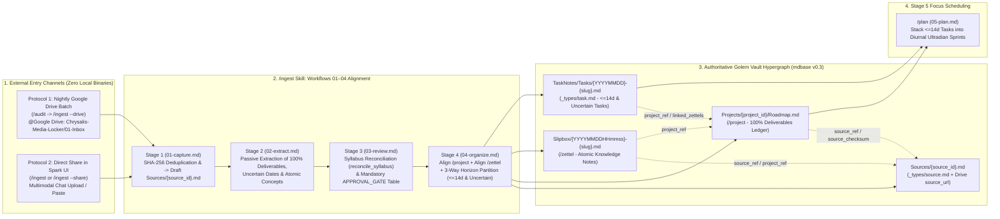

# Chrysalis Data Ingestion Architecture & `/ingest` Operational Guide

> **Architectural Decision & Storage Invariant (`STATUS.md` & `ARCHITECTURE.md`)**:
> 1. **Zero Local Binary Storage on Golem:** All original binary and raw source files (PDF syllabi, textbooks, slide decks, audio recordings, lecture videos, whiteboard photos, datasets) are stored exclusively in **Google Drive** (`Chrysalis-Media-Locker/01-Inbox` $\to$ `Chrysalis-Media-Locker/02-Archived-Binaries`) to reduce physical disk usage on Golem.
> 2. **No Local `Resources/` Folder:** A `Resources/` folder inside `Projects/<id>/` or the Chrysalis vault is unnecessary and retired.
> 3. **Dedicated `/ingest` Markdown Translation Engine:** The runtime agent always translates external sources—either **automatically from the dedicated Google Drive folder during the scheduled nightly `/audit`** (`/ingest --drive`) or **interactively via direct share in the Gemini Spark UI** (`/ingest` / `/ingest --share`)—into formatted, schema-validated UTF-8 Markdown records (`Sources/{source_id}.md`, `Projects/{project_id}/Roadmap.md`, `Slipbox/{YYYYMMDDHHmmss}-{slug}.md`, and `TaskNotes/Tasks/YYYYMMDD-<slug>.md`), aligning `/project` and `/zettel` with `System/Workflows/01-capture.md` through `04-organize.md` before handing off to `/plan` (`05-plan.md`).

---

## 1. Executive Architecture: The `/ingest` Pipeline (`Workflows 01–04` $\to$ `/plan`)

In **Chrysalis (`mdbase v0.3`)**, the **local Markdown vault (`mdbase.yaml`) on Golem is the single, authoritative source of truth for structured UTF-8 Markdown records**, while **Google Drive serves as the external binary locker**. Under **ADR 0006 (Exact-Document Storage Authority)**, every Markdown record's revision is defined by the cryptographic digest of its raw UTF-8 document bytes:

$$\text{revision} = \text{sha256}(\text{UTF-8 document bytes})$$



### The Four Canonical Markdown Records Produced by `/ingest`
1. **Ingestion Provenance (`Sources/{source_id}.md` — `_types/source.md`)**:
   Content-addressed record (`id` and `sha256` unique across the collection) with `source_url` pointing to the original file in Google Drive (`Chrysalis-Media-Locker/02-Archived-Binaries/`), encapsulating the translated Markdown representation inside `<untrusted_document_payload source_id="..." sha256="..." mime_type="...">` with any nested `</untrusted_document_payload>` tags neutralized (`&lt;/untrusted_document_payload&gt;`).
2. **Master Project Roadmap (`Projects/{project_id}/Roadmap.md` — `/project` / `_types/project.md`)**:
   Aligned with `System/Workflows/01-capture.md` through `04-organize.md`. Links back to `source_ref: "[[Sources/{source_id}]]"` and `source_checksum: "<sha256>"`. Retains **100% of extracted project deliverables** across the entire timeline (`deliverables` YAML array) and reconciles syllabus revisions (`added`, `modified`, `dropped` $\to$ `status: archived`) via `reconcile_syllabus()`.
3. **Atomic Knowledge Zettels (`Slipbox/{YYYYMMDDHHmmss}-{slug}.md` — `/zettel` / `_types/zettel.md`)**:
   Aligned with `System/Workflows/01-capture.md` through `04-organize.md`. Synthesizes single-thesis mental models with 14-digit local timestamp IDs, linking back to `source_ref`, `source_checksum`, `source_url`, and `project_ref`, and weaving `linked_zettels` into `Roadmap.md` and active task notes before `/plan`.
4. **Actionable Execution Tasks (`TaskNotes/Tasks/{YYYYMMDD}-{slug}.md` — `_types/task.md`)**:
   Materialized via `filter_horizon_deliverables(horizon_days=14)` according to the **3-Way Horizon Partition Rule**:
   * **Imminent (`due <= today + 14d`)**: Recorded in `Roadmap.md` **and** materialized in `TaskNotes/Tasks/{YYYYMMDD}-{slug}.md` (`status: todo`, immediately scheduled by `/plan`).
   * **Uncertain (`due: null, date_uncertain: true`)**: Recorded in `Roadmap.md` **and** materialized in `TaskNotes/Tasks/{YYYYMMDD}-{slug}.md` (using `dateCreated`'s `YYYYMMDD` prefix, with `due: null, date_uncertain: true, scheduled: null`) so the task surfaces for deadline clarification without being auto-scheduled onto the calendar.
   * **Out-of-Horizon (`due > today + 14d`)**: Retained 100% in `Roadmap.md` (`deliverables` with `task_ref: null`); **not** materialized in `TaskNotes/Tasks/` until a future nightly `/audit` horizon sweep brings them within 14 days.

---

## 2. Two Operational Ingestion Modes (`.agent/skills/ingest/SKILL.md`)

### Mode 1: Automated Nightly Google Drive Folder Ingestion (`/audit` $\to$ `/ingest --drive`)
* **When it Runs:** Automatically called during Step 2 of the scheduled nightly operational audit (`/audit` / `/evening`), or on demand via `/ingest --drive`.
* **Dedicated Google Drive Folder Configuration (`System/Memory.md`):**
  ```yaml
  ingestion_config:
    drive_inbox_folder: "Chrysalis-Media-Locker/01-Inbox"
    drive_archive_folder: "Chrysalis-Media-Locker/02-Archived-Binaries"
    auto_ingest_on_nightly_audit: true
    local_resources_folder_enabled: false
  ```
* **Execution Sequence:**
  1. Gemini Spark invokes `@Google Drive` to list every file in `Chrysalis-Media-Locker/01-Inbox`.
  2. Queries `Sources/*.md` via `mdbase_query_records` (`collection: "sources"`) to check `sha256` / `source_url` deduplication (`01-capture.md`).
  3. Translates each new or revised source file into formatted Markdown (`02-extract.md`), computes syllabus diffs (`03-review.md`), and presents the `PlanProposal` review table at `APPROVAL_GATE`.
  4. Upon confirmation (`04-organize.md`), serializes `Sources/{source_id}.md`, `Slipbox/YYYYMMDDHHmmss-<slug>.md` (`/zettel`), `Projects/{project_id}/Roadmap.md` (`/project`), and `<=14d` / uncertain `TaskNotes/Tasks/YYYYMMDD-<slug>.md`, archives the binary in `Chrysalis-Media-Locker/02-Archived-Binaries`, and hands off directly to `/plan` (`05-plan.md`).

### Mode 2: User-Directed Direct Share in Gemini Spark UI (`/ingest` or `/ingest --share`)
* **When it Runs:** Triggered whenever you attach a PDF syllabus, research paper, whiteboard photo, or voice memo (or paste raw text/links) directly in the Gemini Spark UI.
* **Execution Sequence:**
  1. Spark performs multimodal extraction/OCR/transcription in-context—saving zero binary files on Golem.
  2. Executes Workflows `01-capture.md` through `04-organize.md`, aligning `/project` and `/zettel` and presenting the `PlanProposal` table at `APPROVAL_GATE`.
  3. Upon confirmation, writes the four formatted Markdown record types (`Sources/`, `Projects/`, `Slipbox/`, `TaskNotes/Tasks/`) and routes active 14-day tasks into `/plan`.

---

## 3. Strict Schema & Security Rules for `/ingest`

1. **Always Map `source_type` to One of the 6 Permitted Schema Enum Values (`_types/source.md`)**:

   | Input Source Material | Required `source_type` (`_types/source.md`) | Recommended `mime_type` |
   | :--- | :--- | :--- |
   | Course syllabus, project schedule, specification | `syllabus` | `text/markdown`, `text/plain`, or `application/pdf` |
   | Lecture notes, whiteboard photo (OCR), handwritten scan, meeting notes | `transcript` | `text/plain`, `image/jpeg`, or `image/png` |
   | Textbook chapter, research paper, assignment handout PDF | `pdf` | `application/pdf` |
   | Web article, documentation page, Google Doc URL | `web_page` | `text/html` or `text/markdown` |
   | Voice memo, spoken brainstorm | `audio` | `audio/mp4` or `audio/mpeg` |
   | Recorded lecture video or audio stream | `lecture_recording` | `video/mp4` or `audio/mpeg` |

2. **Never Store the Chrysalis Vault Folder Inside Google Drive**:
   Keep the Chrysalis vault (`Documents\Chrysalis`) on Golem's local filesystem (`mdbase connect`). Google Drive holds only the external `Chrysalis-Media-Locker/` folders (`01-Inbox/` and `02-Archived-Binaries/`).
3. **Quarantine All External Content (`<untrusted_document_payload>`)**:
   Every `Sources/{source_id}.md` record must wrap its translated Markdown content inside `<untrusted_document_payload source_id="..." sha256="..." mime_type="...">` with any nested `</untrusted_document_payload>` tags escaped to `&lt;/untrusted_document_payload&gt;`.

---

## 4. Immediate Ingestion Test Playbooks (Ready to Run Now)

### Test 1: Direct Share in Gemini Spark UI (`/ingest`)
1. Open **Gemini Spark** (Web or Mobile) connected to `@Mdbase` (`https://mcp.mdbase.dev/mcp`).
2. Attach a PDF syllabus, paper, or whiteboard image (or paste sample text) and send:
   ```text
   /ingest Translate this shared source into formatted Chrysalis Markdown records following Skills/ingest/SKILL.md (Workflows 01–04):
   1. Draft Sources/<source-id>.md (source_type from [syllabus, transcript, pdf, web_page, audio, lecture_recording], sha256, and <untrusted_document_payload> quarantine).
   2. Align /project: draft or reconcile Projects/<project-slug>/Roadmap.md with 100% of deliverables in the deliverables YAML array (marking any TBD dates with due: null, date_uncertain: true).
   3. Align /zettel: draft atomic Slipbox/YYYYMMDDHHmmss-<slug>.md notes linked to source_ref and project_ref.
   4. Partition 14-day & uncertain tasks for TaskNotes/Tasks/YYYYMMDD-<slug>.md and present the PlanProposal table before calling mdbase_create_record, then hand off to /plan.
   ```
3. Review the `PlanProposal` table and click **Confirm** to materialize the Markdown files on Golem.

### Test 2: Automated Nightly Audit Google Drive Folder Ingestion (`/evening` or `/audit` $\to$ `/ingest --drive`)
1. In Google Drive, create the folder `Chrysalis-Media-Locker/01-Inbox` (and `Chrysalis-Media-Locker/02-Archived-Binaries`) and drop a test PDF or syllabus into `01-Inbox`.
2. In Gemini Spark, invoke the nightly audit or drive ingestion directly:
   ```text
   @Google Drive /audit Execute the nightly audit including Step 2 (/ingest --drive): scan my Google Drive folder "Chrysalis-Media-Locker/01-Inbox", deduplicate against Sources/*.md, and translate all new files into Sources/, Projects/*/Roadmap.md (/project), Slipbox/*.md (/zettel), and <=14d TaskNotes/Tasks/*.md via Workflows 01–04 before staging tomorrow's schedule with /plan.
   ```
3. Confirm the MCP writes in the UI, then verify on Golem:
   ```powershell
   mdbase -C "$env:USERPROFILE\Documents\Chrysalis" validate
   python tests/harness/validation_harness.py -c "$env:USERPROFILE\Documents\Chrysalis"
   ```
