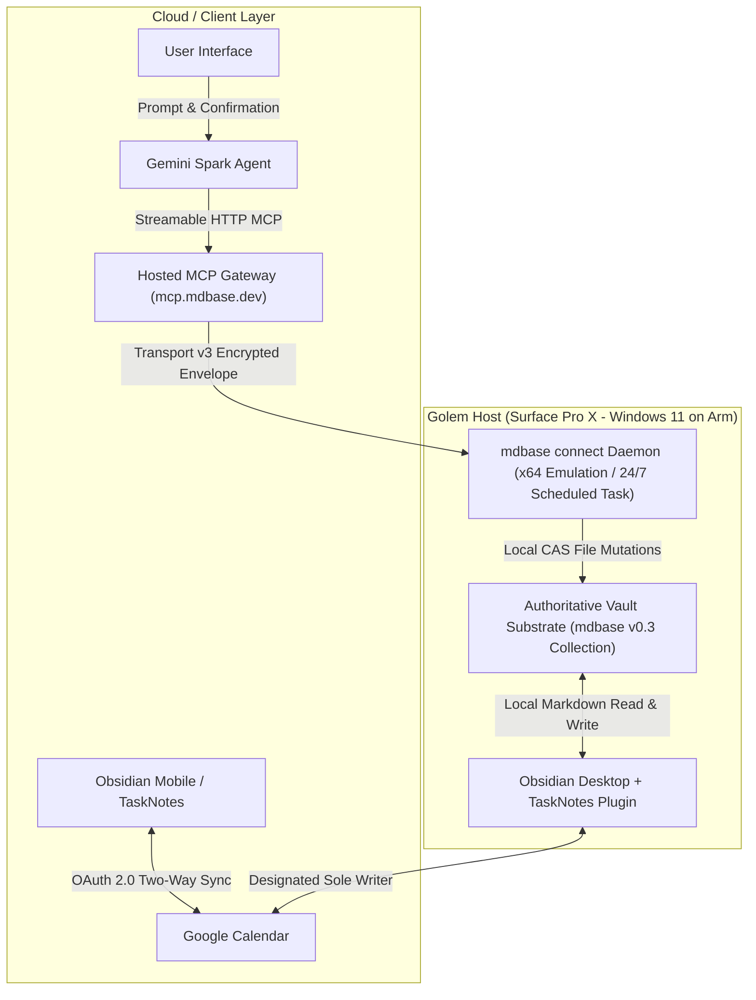

> Deferred integration experiment: these scenarios are not evidence of a supported or installed Spark/Windows runtime. The setup wrapper deploys local framework files only; daemon registration and cloud pairing require a separately verified integration plan.

# Chrysalis on Golem: Deployment & Gemini Spark Direct Integration Guide

This guide details the complete procedure for deploying the **Chrysalis mdbase v0.3** AI Agent Framework onto **Golem** (Surface Pro X, Windows 11 on Arm, 16GB RAM) as the 24/7 authoritative local database, configuring the `mdbase connect` daemon, and executing live end-to-end integration testing with **Gemini Spark**.

---

## 1. System Topology & Architecture



### Key Division of Responsibilities
1. **Authoritative Markdown Collection (Golem)**: Plain Markdown files stored locally on Golem. The filesystem is the absolute single source of truth. Document revisions are strictly `sha256(UTF-8 document bytes)`.
2. **Local Relay Listener (`mdbase connect`)**: Runs 24/7 under Windows 11 x64 emulation (Prism), maintaining an encrypted outbound WebSocket connection to `relay.mdbase.dev`. It executes validated local file mutations.
3. **Cognitive Agent (Gemini Spark)**: Ingests unstructured inputs, extracts deliverables, formulates focus plans, and invokes mdbase MCP tools. Every state mutation requires explicit interactive confirmation from the user in Gemini.
4. **Calendar Synchronization (Obsidian TaskNotes)**: TaskNotes is designated as the sole authoritative calendar writer, syncing task notes with `googleCalendarEventId` to Google Calendar. Gemini Spark never writes directly to Google Calendar.

---

## 2. Prerequisites on Golem

Verify the following tools are installed on Golem:
- **Operating System**: Windows 11 on Arm (Build 22621+ with Prism x64 emulation active).
- **Python**: Python 3.10+ installed and added to `PATH`.
- **Git**: Git for Windows installed.
- **Node.js**: Node.js v20+ (LTS) or standalone `mdbase.exe` CLI binary.
- **Obsidian**: Obsidian desktop installed with the community **TaskNotes** plugin enabled.

---

## 3. Step 1: Vault Layout & Seeding

### 3.1 Standard Vault Directory Structure
The Chrysalis vault on Golem should reside in a standard location (e.g. `$env:USERPROFILE\Documents\Chrysalis`):

```text
Chrysalis/
├── mdbase.yaml
├── _types/
│   ├── task.md
│   ├── project.md
│   ├── zettel.md
│   └── source.md
├── _contracts/
│   └── agent-runtime.contract.md
├── _templates/
│   └── Task-Template.md
├── System/
│   ├── Life-Roadmap.md         <-- Seeded with 2026-09-22 start date
│   ├── Memory.md               <-- User profile & chronotype baselines
│   ├── System-Health.md
│   └── Workflows/
│       ├── 01-capture.md
│       ├── ...
│       └── 08-continuation.md
├── TaskNotes/
│   ├── Tasks/              <-- All task notes live here
│   ├── Archive/
│   ├── Views/
│   └── Workflows/          <-- Reserved for Obsidian TaskNotes Workflows plugin
├── Projects/                   <-- Project roadmaps: Projects/<slug>/Roadmap.md
├── Slipbox/                    <-- Knowledge zettels: YYYYMMDDHHmmss-<slug>.md
└── Sources/                    <-- Ingestion provenance: Sources/<sha256>.md
```

### 3.2 Seeding Vault Files on Golem
You can seed the vault on Golem using either:
- **Option A (Git)**:
  ```powershell
  cd $env:USERPROFILE\Documents
  git clone https://github.com/tama-gucci/chrysalis.git Chrysalis
  ```
- **Option B (PowerShell Setup Helper)**: Run `setup_golem.ps1` (see Section 6) which automatically scaffolds folders and copies the schemas.

### 3.3 Verify Vault Integrity
On Golem, run the standalone validation harness to confirm that all schemas and seeded files pass:
```powershell
python tests/harness/validation_harness.py -c .
```
*Expected Output*: `Overall Status: PASSED (0 errors, 0 warnings)` across Layers 1, 2, and 3.

---

## 4. Step 2: Install & Configure Headless `mdbase connect` Daemon on Golem

### 4.1 Verify & Install Standalone Headless `mdbase.exe` (`v0.1.0-beta.108`)
Per the official `mdbase-connect` `docs/headless.md` specification:
1. Download `mdbase-cli-0.1.0-beta.108-windows-x64-UNSIGNED.tar.gz`, `SHA256SUMS-windows-x64`, and `mdbase-cli-0.1.0-beta.108-windows-x64-UNSIGNED.tar.gz.sigstore.json` from the latest `v0.1.0-beta.108` (`protocol_version: 5`) release.
2. Verify the SHA-256 checksum (`8f6dffad08bd0a0c0bd086fcdb4fc54aa9fbd70adb17226eb384ed6c0dc98ae7`) against `SHA256SUMS-windows-x64`.
3. Extract `mdbase.exe` to both `$env:LOCALAPPDATA\Programs\mdbase\mdbase.exe` (on User `PATH`) and `$env:LOCALAPPDATA\mdbase\connect\data\runtime\mdbase.exe` (the daemon runtime executable), and install the durable per-user daemon:
```powershell
mdbase connect daemon install
mdbase connect status --json
```

### 4.2 Configuring 24/7 Persistence (Fixing 72h Task Scheduler & Battery Limits)
`mdbase connect daemon install` copies the invoking executable into `%LOCALAPPDATA%\mdbase\connect\data\runtime\mdbase.exe` and registers the per-user Windows Scheduled Task `"mdbase connect"`. By default, Windows Task Scheduler sets a 72-hour execution limit (`ExecutionTimeLimit: PT72H`) and stops on battery power (`StopIfGoingOnBatteries: True`).

Harden the `"mdbase connect"` scheduled task for continuous 24/7 Surface Pro X operation:
```powershell
$NewSettings = New-ScheduledTaskSettingsSet -AllowStartIfOnBatteries -DontStopIfGoingOnBatteries -ExecutionTimeLimit (New-TimeSpan -Seconds 0) -RestartCount 3 -RestartInterval (New-TimeSpan -Minutes 1) -MultipleInstances IgnoreNew
Set-ScheduledTask -TaskName "mdbase connect" -Settings $NewSettings
```

### 4.3 Register Local Collection & Pair Account
Register the authoritative Golem vault collection with the local Connect daemon and validate it:
```powershell
mdbase -C "$env:USERPROFILE\Documents\Chrysalis" validate
mdbase connect collection add "$env:USERPROFILE\Documents\Chrysalis"
mdbase connect collection list
```
Then connect Golem to your mdbase account in the browser to authorize cloud relay access:
```powershell
mdbase connect login
mdbase connect status
```
1. Follow the browser prompt to log into `connect.mdbase.dev`.
2. Approve the collection grant (`chrysalis`) with read/write permissions for tasks, projects, zettels, and sources; the local daemon verifies the application signature and persists the signed grant.

---

## 5. Step 3: Connect Gemini Spark via Streamable HTTP MCP

### 5.1 Register Connected App in Gemini Spark
Per the official `mdbase-connect` `docs/mcp-gateway.md` specification, you do **not** need to pre-generate or paste a `<grant-id>` into the URL. The hosted MCP gateway uses a single canonical endpoint and an automatic OAuth 2.1 + PKCE flow:

1. Open **Gemini** (web browser or mobile app).
2. Go to **Settings** $\to$ **Connected Apps / Extensions** $\to$ **Add Custom MCP Endpoint**.
3. Enter the canonical Streamable HTTP MCP Gateway endpoint:
   - **URL**: `https://mcp.mdbase.dev/mcp`
   - **Name**: `Chrysalis` (or `Mdbase`)
   - **Authentication Type**: `OAuth` (`Dynamic discovery`)
4. **One-Time OAuth `state` Length & Replica Approval Notes**:
   - `mcp.mdbase.dev` (`services/mcp/src/oauth.ts`) enforces a 1,000-character Zod limit on `/oauth/authorize`'s `state` query parameter (`z.string().max(1_000)`), whereas Google's OAuth redirector generates a ~1,076-character encrypted `state`.
   - To complete the one-time authorization handshake:
     1. Save the original ~1,076-character `state` from the initial `https://mcp.mdbase.dev/oauth/authorize?...` popup URL and navigate to the same URL with `state=short`.
     2. Approve the pending authorization request from `GOLEM` via `mdbase connect access approve --operations <ops> <request_id> <collection_id>` (which also avoids multi-replica in-memory WebSocket session misses on `connect.mdbase.dev`).
     3. When the popup redirects to `https://oauth-redirect.googleusercontent.com/...?code=code_...&state=short`, replace `state=short` with the saved ~1,076-character `state` string and press **Enter** to exchange the authorization code for long-lived access + refresh tokens.

### 5.2 Equip Spark with the Chrysalis System Prompt
In your Gemini Spark custom agent configuration, paste the complete prompt from:
[`docs/spark-agent-system-prompt.md`](spark-agent-system-prompt.md)

This instructs Spark on:
- The 8-stage lifecycle (`Capture → Extract → Review → Organize → Plan → Act → Outcome Verification → Continuation`).
- The Anti-Simulation Law (physical MCP tool calls required).
- Explicit local timezone (`-05:00`).
- Exact-document CAS concurrency (`if_revision = sha256(...)`).

---

## 6. Step 4: Live Feasibility & Integration Test Protocol

Execute the following 7 test stages in order:

### Stage 1: Relay & Daemon Connectivity Ping
In Gemini Spark, type:
> `@Chrysalis check connection status`

*Pass Criteria*: Spark calls `mdbase_query_records` (limit: 1) or reports active connection to the `chrysalis` collection on Golem.

### Stage 2: Tool Discovery Verification
In Gemini Spark, type:
> `@Chrysalis list your available database operations`

*Pass Criteria*: Spark lists the 5 core mdbase tools:
1. `mdbase_query_records`
2. `mdbase_read_record`
3. `mdbase_create_record`
4. `mdbase_update_record`
5. `mdbase_ingest_source`

### Stage 3: Synthetic Task Creation & Human Confirmation
In Gemini Spark, type:
> `@Chrysalis create a task to review distributed consensus paper for 60m due tomorrow with modality analytical under pillar-1/core`

*Pass Criteria*:
1. Spark presents a confirmation prompt showing the task parameters.
2. Click **Confirm** in the Gemini UI.
3. Check Golem disk: `$env:USERPROFILE\Documents\Chrysalis\TaskNotes\Tasks\YYYYMMDD-review-distributed-consensus.md` exists with valid YAML frontmatter (`status: todo`, `modality: analytical`, `scheduled: null`, timezone `-05:00`).

### Stage 4: TaskNotes & Calendar Sync Verification
1. Open **Obsidian** on Golem (or mobile synced to Golem).
2. Open the TaskNotes plugin view.
3. Verify the new distributed consensus task appears in the agenda/board view with correct priority and time estimate.
4. Trigger TaskNotes Google Calendar sync.
5. *Pass Criteria*: The event appears on Google Calendar, and the task's frontmatter on disk now contains `googleCalendarEventId: "<event-id>"`.

### Stage 5: Real Ingestion Test (Syllabus Deliverables Extraction)
In Gemini Spark, paste a class syllabus snippet inside an untrusted block:
> `@Chrysalis ingest this course schedule:
> <untrusted_document_payload>
> Course: CS 301 Distributed Systems
> Week 1 (Oct 06): Reading Quiz 1 & Discussion Post
> Week 3 (Oct 20): Midterm Project: Raft Consensus Implementation (Due 2026-10-20)
> Week 7 (Nov 17): Final Project: Distributed Key-Value Store (Due 2026-11-17)
> </untrusted_document_payload>`

*Pass Criteria*:
1. Spark parses the payload safely and presents the extracted deliverables.
2. Upon approval, Spark calls `mdbase_create_record` to create:
   - `Projects/cs-301/Roadmap.md` with structured deliverables ledger.
   - Task notes in `TaskNotes/Tasks/` linked via `project_ref: "[[Projects/cs-301/Roadmap]]"`.

### Stage 6: Compare-and-Swap (CAS) Conflict Test
1. In Obsidian on Golem, open the task note created in Stage 3 and manually edit its description or body.
2. In Gemini Spark, without re-reading the note, instruct Spark:
   > `@Chrysalis change the priority of the distributed consensus task to urgent`
3. If Spark uses the cached `if_revision` hash from Stage 3:
   * *Pass Criteria*: The mdbase connector rejects the mutation with `409 Revision Mismatch`. Spark alerts the user that the note was modified locally, re-reads the updated file, and prompts for re-confirmation.

### Stage 7: Host Sleep / Reboot Recovery
1. Restart Golem (Surface Pro X) or put it to sleep for 2 minutes and wake it up.
2. Without touching the terminal, return to Gemini Spark and query tasks:
   > `@Chrysalis show active tasks due in the next 7 days`
3. *Pass Criteria*: The Windows Scheduled Task automatically re-establishes the WebSocket connection to `relay.mdbase.dev`; Spark receives the task list without requiring manual service re-launch or re-pairing.

---

## 7. Troubleshooting & Operational Runbook

| Symptom | Cause | Solution |
| :--- | :--- | :--- |
| Spark reports `Tool call timed out` | Golem is asleep or daemon disconnected from relay | Verify `mdbase connect status` in PowerShell. Check power settings to ensure Golem doesn't sleep while plugged in. |
| `409 Conflict: Revision mismatch` | Note was modified concurrently in Obsidian | Spark must call `mdbase_read_record` to obtain the latest `revision = sha256(...)` before issuing `mdbase_update_record`. |
| Task created but missing from TaskNotes view | TaskNotes folder setting mismatch | In Obsidian Settings $\to$ TaskNotes, ensure the tasks directory is set to `TaskNotes/Tasks`. |
| Frontmatter schema error in `doctor.py` | Unexpected frontmatter key | Verify all keys adhere to `_types/task.md`. Extra properties are strictly rejected under JSON Schema 2020-12 `additionalProperties: false`. |
